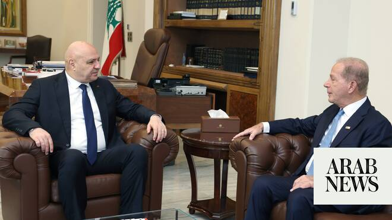

# US ambassador to Lebanon foresees Israeli withdrawal

Source: https://www.arabnews.com/node/2650222/middle-east
Captured source: https://www.arabnews.com/node/2650222/middle-east
Published: 2026-07-09T12:15:10+03:00
Modified: 2026-07-09T12:15:10+03:00
Author: Arab News

## Summary

DUBAI: Lebanon’s President Joseph Aoun met with US Ambassador to Beirut Michel Issa to discuss his upcoming official visit to the United States on the invitation of US President Donald Trump, as well as the current situation in Lebanon and the wider region. During the meeting, President Aoun stressed the importance of reinforcing the ceasefire in southern Lebanon and

## Image

## Video Or Embed URLs

- https://f94f65b67f9c9b4873213be20dbb322f.safeframe.googlesyndication.com/safeframe/1-0-45/html/container.html
- https://static.addtoany.com/menu/sm.25.html
- about:blank
- https://imasdk.googleapis.com/js/core/bridge3.774.0_en.html
- https://www.google.com/recaptcha/api2/aframe
- https://sync.teads.tv/wigo-no-slot
- https://cm.g.doubleclick.net/partnerpixels?gdpr=0&us_privacy=1---&gpp_sid=-1&url=https%3A%2F%2Fwww.arabnews.com%2Fnode%2F2650222%2Fmiddle-east

## Text

https://arab.news/y9t7f

President Aoun stressed the importance of reinforcing the ceasefire in southern Lebanon and increasing pressure on Israel to stop its military operations

DUBAI: Lebanon’s President Joseph Aoun met with US Ambassador to Beirut Michel Issa to discuss his upcoming official visit to the United States on the invitation of US President Donald Trump, as well as the current situation in Lebanon and the wider region. During the meeting, President Aoun stressed the importance of reinforcing the ceasefire in southern Lebanon and increasing pressure on Israel to stop its military operations and comply with the framework agreement announced following the Lebanese-American-Israeli negotiations held in Washington. He also called for an end to the hostilities by Israeli forces in several occupied towns and villages. Following the meeting, Ambassador Issa said President Aoun’s visit to Washington was particularly significant under the current circumstances and reflects the level of attention President Trump is giving to Lebanon, as well as his efforts to promote security and stability in the country and alleviate the suffering of its people. Asked about the planned meeting in Rome on July 14–15, Ambassador Issa explained that the decision to hold the talks in the Italian capital was made solely for technical reasons related to facilitating travel for ambassadors and delegation members. He noted that the Rome meeting will focus on the organizational and implementation aspects of the framework agreement, particularly the formation of specialized working groups responsible for carrying out the arrangements agreed upon in Washington. These teams may include legal or technical experts depending on the issues involved. Issa said the Rome discussions were a continuation of the understandings reached in Washington and added that additional meetings would take place in Rome or other locations to monitor implementation according to agreed stages. On the timeline for launching work in the pilot areas identified during the Washington negotiations, Ambassador Issa said preparations were underway to put the agreement into effect. He noted that a US military delegation is expected in Beirut in the coming days to coordinate and establish implementation mechanisms on the ground. He emphasized the need to prevent any security vacuum following the withdrawal of Israeli forces from the designated areas, adding that the implementation timetable will be determined based on the results of those coordination meetings.
