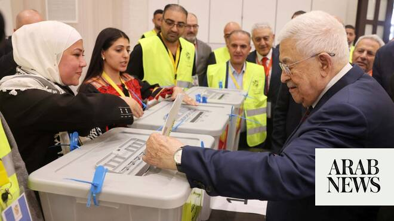

# Abbas declares Nov. 28 for Palestinian legislative elections

Source: https://www.arabnews.com/node/2650267/middle-east
Captured source: https://www.arabnews.com/node/2650267/middle-east
Published: 2026-07-09T17:22:19+03:00
Modified: 2026-07-09T17:24:00+03:00
Author: Arab News

## Summary

LONDON: Mahmoud Abbas, the president of the Palestinian Authority, declared Nov. 28, which falls on a Saturday, as the date for the long-expected Palestinian legislative elections. The vote will take place across the Occupied Palestinian Territories, including the Gaza Strip, the West Bank and East Jerusalem, according to the Palestine News Agency. Palestinians will elect

## Image

## Video Or Embed URLs

- https://aa9c47694d0adeb20ceb17d7a066a8ec.safeframe.googlesyndication.com/safeframe/1-0-45/html/container.html
- https://static.addtoany.com/menu/sm.25.html
- about:blank
- https://www.google.com/recaptcha/api2/aframe
- https://imasdk.googleapis.com/js/core/bridge3.774.0_en.html
- https://cm.g.doubleclick.net/partnerpixels?gdpr=0&us_privacy=1---&gpp_sid=-1&url=https%3A%2F%2Fwww.arabnews.com%2Fnode%2F2650267%2Fmiddle-east

## Text

https://arab.news/43m2u

Vote will take place across the Occupied Palestinian Territories, including the Gaza Strip, the West Bank and East Jerusalem

LONDON: Mahmoud Abbas, the president of the Palestinian Authority, declared Nov. 28, which falls on a Saturday, as the date for the long-expected Palestinian legislative elections.

The vote will take place across the Occupied Palestinian Territories, including the Gaza Strip, the West Bank and East Jerusalem, according to the Palestine News Agency.

Palestinians will elect members of the Legislative Council for the first time in two decades, since January 2006, when Hamas secured a surprise victory over its rival, Fatah.

The presidential elections are expected to be scheduled for the first quarter of 2027. Abbas has led the Palestinian Authority since the former president Yasser Arafat died in 2004. The 90-year-old won the last presidential election in 2005, which gave him a four-year mandate that expired in 2009.

The Palestinian Authority has been under pressure to reform its own political systems as it faces challenges arising from aggressive Israeli policies in the West Bank, over which it has partial control, and the humanitarian crisis in Gaza caused by the war between Israel and Hamas that began in late 2023.

In April, Palestinians voted to elect municipal council heads in the West Bank and only one governorate in the Gaza Strip, with low turnout.

In 2021, Abbas postponed plans for a parliamentary vote after Israeli authorities refused to allow the election to take place in East Jerusalem, which the Palestinian Authority considers its capital.
