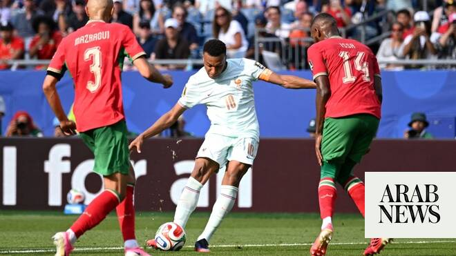

# Mbappe and Dembele too much for Morocco as Atlas Lions bow out of World Cup

Source: https://www.arabnews.com/node/2650334/sport
Captured source: https://www.arabnews.com/node/2650334/sport
Published: 2026-07-10T01:09:04+03:00
Modified: 2026-07-10T08:49:42+03:00
Author: Mohammed Fayad

## Summary

RIYADH: Alas, it was not to be for the Atlas Lions. A repeat of their heroic semifinal appearance in 2022 will not come to pass, having fallen at the same hurdle — and to the same opponents — as last time: France. There is no shame in losing to arguably the most dominant team in the tournament. Goals were always going to come, as France have shown in all their previous

## Image

## Video Or Embed URLs

- blob:https://www.arabnews.com/c9c74ac7-9042-4217-bb38-c5ff4e8426ca
- https://imasdk.googleapis.com/js/core/bridge3.774.0_en.html
- https://f16694b507583911284d89b1914b1e41.safeframe.googlesyndication.com/safeframe/1-0-45/html/container.html
- https://static.addtoany.com/menu/sm.25.html
- about:blank
- https://www.google.com/recaptcha/api2/aframe
- https://cm.g.doubleclick.net/partnerpixels?gdpr=0&us_privacy=1---&gpp_sid=-1&url=https%3A%2F%2Fwww.arabnews.com%2Fnode%2F2650334%2Fsport

## Text

https://arab.news/8gjj2

Yassine Bounou made a heroic penalty save in the 26th minute to keep things level in the first half

Kylian Mbappe and Ousmane Dembele scored within 6 minutes of each other to guarantee a comfortable 2-0 victory for France

RIYADH: Alas, it was not to be for the Atlas Lions. A repeat of their heroic semifinal appearance in 2022 will not come to pass, having fallen at the same hurdle — and to the same opponents — as last time: France.

For the latest updates, follow us @ArabNewsSport

There is no shame in losing to arguably the most dominant team in the tournament. Goals were always going to come, as France have shown in all their previous encounters.

Even a penalty save from Bounou was not enough to keep Morocco in it, as France broke the deadlock in quick succession in the 60th and 66th minutes to put the game beyond doubt.

Limiting the damage against France has proven difficult for every team at the tournament. Keeping up with them means you need to score goals, and with Morocco already struggling to find the net with Ismael Saibari in the side, there was a worry they would come up short in his absence after he pulled his hamstring against Canada in the Round of 16.

Both Chadi Riad and Saibari were unfit coming into this game, which meant the Atlas Lions lined up with a different shape.

Noureddine Mazraoui moved into the heart of defense while Anass Salaheddine started at left-back.

In attack, Brahim Diaz operated as a false nine with the trio of Bilal El-Khannouss, Azzedine Ounahi and Chemsdine Talbi operating behind.

Eighteen-year-old Ayyoub Bouaddi also started in midfield — a prominent occasion for the youngster, who had rejected the opportunity to represent France in favor of Morocco prior to the tournament.

It was Talbi who set the tempo early, showing some deft skill to break past the French midfield.

But moments later, Kylian Mbappe got onto the ball and drove a strike toward Bounou from outside the area, only for the goalkeeper to parry it away for a corner.

That sparked the Bounou show. From that corner, he pushed Dayot Upamecano's header away, before Morocco’s moment of the match arrived in the 25th minute.

The teams appeared headed toward the hydration break after a cautious start, only for Mbappe to win a penalty after being tripped by Mazraoui in the box.

A weak effort from the French talisman was saved by Bounou, sending the Moroccan fans into raptures at Gillette Stadium.

However, the penalty save did not seem to spur Morocco on. France continued to control the game, with their clearest opportunity of the half arriving in the 34th minute when Desire Doue won possession off Bouaddi in Morocco’s half, only for Bounou to make his third save of the half to keep things level.

After a reserved first 45, the Atlas Lions started the second half with more intent. The lack of a recognized striker was evident, with quick transitions carrying the ball past the French defense but finding no final destination near goal.

France, dangerous as ever, threatened on the left flank in the 54th minute, but Doue’s strike was dealt with by Bounou.

Moments later, Michael Olise drove toward the box to slip Mbappe through on goal, only for the French captain to fire wide — though he was later flagged offside.

Les Bleus upped the ante shortly after, and the Mbappe goal felt inevitable. At the hour mark, he received the ball on the edge of the box and curled an effort toward the far corner that proved too good for Bounou, equaling Lionel Messi’s tally of eight goals at the top of the scoring charts.

Morocco head coach Mohamed Ouahbi responded by bringing on Sofyan Amrabat and Soufiane Rahimi for Bouaddi and El-Khannouss.

But within minutes France doubled their lead, with Ousmane Dembele driving through midfield to slice a strike past Bounou from outside the box.

Zakaria El-Ouahdi, Gessime Yassine and Amine Sbai all came on for the Atlas Lions across the next 20 minutes, but the changes did little to sharpen their attacking edge.

Ounahi’s long-range effort in the 83rd minute drew a gasp from the Moroccan fans but was parried away by Mike Maignan, before Neil El-Aynaoui’s header struck the side netting from a corner shortly after. There were moments, but not enough sustained attacking intent to trouble Les Bleus.

France’s victory sends them into the semifinal for the third consecutive time, while Morocco bow out after another historic run to the final eight, becoming the first African nation in history to do so.

World Cup action resumes on Friday, with Spain and Belgium kicking off the second quarterfinal at 10 p.m. KSA time.
