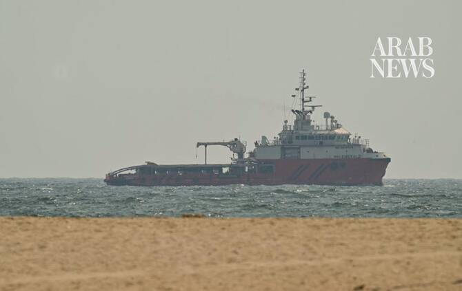

# Tanker traffic slows in Strait of Hormuz after US and Iran clashes

Source: https://www.arabnews.com/node/2650404/middle-east
Captured source: https://www.arabnews.com/node/2650404/middle-east
Published: 2026-07-10T16:47:25+03:00
Modified: 2026-07-10T16:50:14+03:00
Author: Reuters

## Summary

DUBAI: Daily tanker traffic in the Strait of Hormuz appeared to have ​slowed on Friday, after the US and Iran exchanged hostilities this week and renewed their arguments over who was in control of passage through the critical waterway. The attacks renewed concerns about the recovery of global oil supplies and shipping, and highlighted the fragility of an interim truce while

## Image

## Video Or Embed URLs

- https://040de168d6047338b82efbf7ade18589.safeframe.googlesyndication.com/safeframe/1-0-45/html/container.html
- about:blank
- https://static.addtoany.com/menu/sm.25.html
- https://imasdk.googleapis.com/js/core/bridge3.774.0_en.html
- https://www.google.com/recaptcha/api2/aframe
- https://sync.teads.tv/wigo-no-slot
- https://cm.g.doubleclick.net/partnerpixels?gdpr=0&us_privacy=1---&gpp_sid=-1&url=https%3A%2F%2Fwww.arabnews.com%2Fnode%2F2650404%2Fmiddle-east

## Text

https://arab.news/rp8gv

US-Iran clashes have renewed concerns about the recovery of global oil supplies and shipping

Prior to this week’s attacks, daily tanker traffic had risen to its highest since the war began

DUBAI: Daily tanker traffic in the Strait of Hormuz appeared to have ​slowed on Friday, after the US and Iran exchanged hostilities this week and renewed their arguments over who was in control of passage through the critical waterway. The attacks renewed concerns about the recovery of global oil supplies and shipping, and highlighted the fragility of an interim truce while the US and Iran hammer out a lasting agreement. Oil prices eased on Friday but remained on track for weekly gains of 4-5 percent after the flare-up. The International Energy Agency said global oil supply rose by 4.1 million bpd in June as shipping through the strait resumed, but remained 9.4 million bpd below pre-war levels. It warned of tight ‌diesel and gasoline ‌supplies, and said refineries were slower to react to the reopening of the ​strait than ‌crude ⁠prices. The ​Strait of ⁠Hormuz handled about a fifth of global oil supplies before the war. Tehran has since largely taken control of the waterway, forcing a stalemate in its confrontation with the world’s most powerful military. Under the interim deal, the US ended its naval blockade of Iranian ports, and Iran agreed to ensure safe passage of commercial vessels. However, this week Washington accused Iranian forces of attacking three tankers in the area and struck military sites on Iran’s southern coast and eastern provinces in response. While Iran has not claimed responsibility for those attacks, analysts say Tehran uses such actions to gain leverage in ⁠negotiations. Iran then attacked US military sites in Gulf states on Thursday. The US said ‌its action aimed to keep the strait open and that Iran ‌did not control the waterway. Tehran warned however that the strait would ​only be reopened on its terms, and any US ‌intervention would draw a “crushing response.” The attacks on the three Qatari and Saudi shipping vessels prompted US President Donald ‌Trump to declare the truce “over,” but a US official later said Washington was still committed to finding a resolution with Iran and “technical talks continue.” The New York Times reported that Qatar had been in talks with Washington and Tehran to deescalate the crisis. Prior to this week’s attacks, daily tanker traffic had risen to its highest since the war began, averaging 40 ships transiting the ‌strait. That was still far off the pre-conflict average of 125 to 140 daily sailings.
