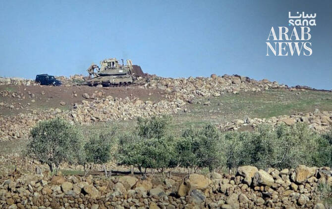

# Syria reports renewed Israeli military incursion in Quneitra

Source: https://www.arabnews.com/node/2650480/middle-east
Captured source: https://www.arabnews.com/node/2650480/middle-east
Published: 2026-07-11T06:07:57+03:00
Modified: 2026-07-11T10:29:46+03:00
Author: Arab News

## Summary

DAMASCUS: Israeli forces raided a village in Syria’s southern Quneitra province overnight, searching several properties before withdrawing, reported the Syrian Arab News Agency on Friday. In the latest of several reported incursions near the Israeli-occupied Golan Heights, more than 15 Israeli military vehicles entered the village of Al-Asha late Thursday, according to SANA’s

## Image

## Video Or Embed URLs

- https://859a63ca502dd34dc8c148bde8c7a61e.safeframe.googlesyndication.com/safeframe/1-0-45/html/container.html
- https://static.addtoany.com/menu/sm.25.html
- about:blank
- https://www.google.com/recaptcha/api2/aframe
- https://imasdk.googleapis.com/js/core/bridge3.774.0_en.html
- https://cm.g.doubleclick.net/partnerpixels?gdpr=0&us_privacy=1---&gpp_sid=-1&url=https%3A%2F%2Fwww.arabnews.com%2Fnode%2F2650480%2Fmiddle-east

## Text

https://arab.news/g28uv

Troops searched properties before withdrawing

Damascus says repeated incursions violate 1974 disengagement accord

DAMASCUS: Israeli forces raided a village in Syria’s southern Quneitra province overnight, searching several properties before withdrawing, reported the Syrian Arab News Agency on Friday.

In the latest of several reported incursions near the Israeli-occupied Golan Heights, more than 15 Israeli military vehicles entered the village of Al-Asha late Thursday, according to SANA’s correspondent in Quneitra.

Troops searched a house and a feed storage facility before leaving the area. No arrests or casualties were reported.

The agency said Israeli forces also entered the nearby village of Saida Al-Golan earlier on Thursday, establishing a temporary checkpoint at the village entrance before later withdrawing.

The reported operations follow similar incursions in recent weeks. Last month, Syrian state media reported that Israeli troops entered the village of Al-Asbah in Quneitra, searched several homes and withdrew without reported casualties.

Damascus has accused Israel of repeatedly violating the 1974 Disengagement Agreement, which established a UN-monitored buffer zone between Syria and the Israeli-occupied Golan Heights following the 1973 Arab-Israeli war.

According to SANA, Syrian authorities say Israeli forces have continued to carry out raids, arrests, land-clearing operations and shelling in southern Syria, and have renewed calls for a full withdrawal of Israeli troops from what they describe as occupied Syrian territory.

Israel captured the Golan Heights from Syria during the 1967 Middle East war and later annexed the territory, a move which was not recognized by the majority of the international community.

Following the collapse of former Syrian president Bashar Assad’s government in late 2024, Israeli forces moved into the UN-patrolled buffer zone adjoining the area. Israel has said the deployment is intended to prevent attacks by armed groups and disrupt weapons transfers to Hezbollah in neighboring Lebanon, while Syria and the UN argue the move breaches the 1974 ceasefire arrangements.

The latest reported incursion comes after Saudi Arabia, the UAE and Turkiye last month strongly condemned Israeli military operations in Syria’s southern provinces of Quneitra and Daraa, describing them as violations of Syria’s sovereignty and international law.

Damascus has repeatedly urged the international community to intervene to halt what it calls continuing violations and ensure the withdrawal of Israeli forces from southern Syria.
