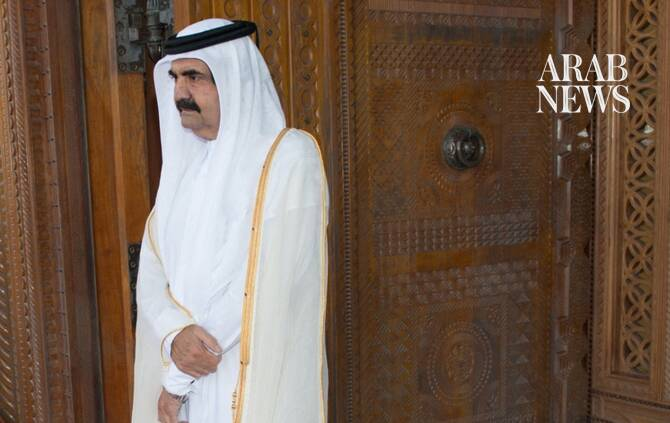

# Former emir of Qatar, Sheikh Hamad bin Khalifa Al Thani, dies at 74

Source: https://www.arabnews.com/node/2650598/middle-east
Captured source: https://www.arabnews.com/node/2650598/middle-east
Published: 2026-07-12T08:15:11+03:00
Modified: 2026-07-12T09:55:49+03:00
Author: Agencies

## Summary

DUBAI: ​Qatari former Emir Sheikh ‌Hamad bin ‌Khalifa ​Al ‌Thani ⁠has ​died ⁠at the ⁠age ‌of ‌74, ​the ‌nation’s Amiri Diwan, ‌its top ‌government body, said ⁠on ⁠Sunday. “With hearts steadfast in faith in God's decree and destiny, the Bureau of the Emir mourns the great loss to the nation of the late -- may God have mercy on him -- His Highness the Father Amir Sheikh Hamad

## Image

## Video Or Embed URLs

- https://b4cc36d01685218b20e9ed49b5041fb3.safeframe.googlesyndication.com/safeframe/1-0-45/html/container.html
- https://static.addtoany.com/menu/sm.25.html
- about:blank
- https://imasdk.googleapis.com/js/core/bridge3.774.0_en.html
- https://www.google.com/recaptcha/api2/aframe
- https://cm.g.doubleclick.net/partnerpixels?gdpr=0&us_privacy=1---&gpp_sid=-1&url=https%3A%2F%2Fwww.arabnews.com%2Fnode%2F2650598%2Fmiddle-east

## Text

https://arab.news/pkxg2

DUBAI: ​Qatari former Emir Sheikh ‌Hamad bin ‌Khalifa ​Al ‌Thani ⁠has ​died ⁠at the ⁠age ‌of ‌74, ​the ‌nation’s Amiri Diwan, ‌its top ‌government body, said ⁠on ⁠Sunday.

“With hearts steadfast in faith in God's decree and destiny, the Bureau of the Emir mourns the great loss to the nation of the late -- may God have mercy on him -- His Highness the Father Amir Sheikh Hamad bin Khalifa Al Thani,” read a statement published by the emir's office on social media.

Sheikh Hamad, who stepped down in June 2013 after 18 years as emir, was the architect of Qatar’s stunning ambitions that turned it into an international crossroads in less than a generation.

Sheikh Hamad attended Britain’s military academy, Sandhurst, and became commander of Qatar’s armed forces and defense minister. He was named crown prince in the late 1970s and gradually broadened his duties to include planning for Qatar’s vast oil and gas reserves.

Sheikh Hamad was responsibe for overseeing the rapid transformation of Qatar into a modern state open to the world.

He pushed Qatar Airways to expand into a major international carrier, trying to rival neighboring carrier Emirates. The country’s international airport in Doha, Qatar’s capital, which cost at least $15 billion to construct, also bears his name.

Sheikh Hamad had wide-ranging visions for Qatar’s role as a diplomatic broker. Over the years, its mediation was brought to bear on the conflict in Sudan’s western Darfur region, Lebanese factional feuding and the rift between the Palestinians’ Hamas and Fatah factions.
