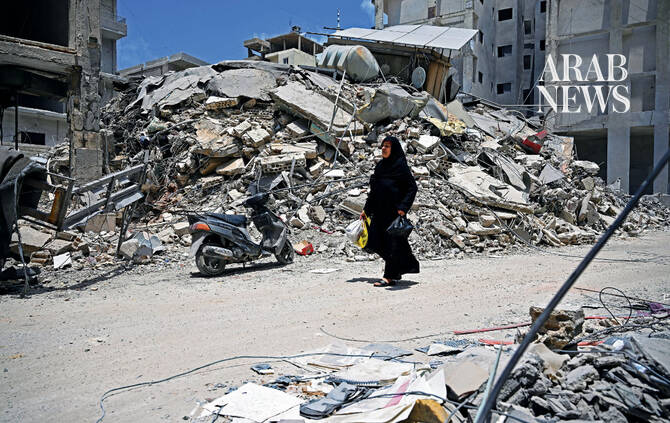

# Will the Israel-Lebanon framework agreement ease the agony of south Lebanon’s displaced?

Source: https://www.arabnews.com/node/2650780/middle-east
Captured source: https://www.arabnews.com/node/2650780/middle-east
Published: 2026-07-14T00:03:14+03:00
Modified: 2026-07-14T00:03:14+03:00
Author: NAJIA HOUSSARI

## Summary

BEIRUT: Hundreds of thousands of Lebanese displaced by months of conflict have begun returning to their homes in the country’s south after Israel and Lebanon signed a framework agreement in Washington on June 26 that brought hostilities between Israel and Hezbollah to a halt. A more limited return had begun nine days earlier in Beirut’s southern suburbs and several villages in

## Image

## Video Or Embed URLs

- https://a4f780939ba1686d4bdaeee31cb565fd.safeframe.googlesyndication.com/safeframe/1-0-45/html/container.html
- https://static.addtoany.com/menu/sm.25.html
- about:blank
- https://imasdk.googleapis.com/js/core/bridge3.776.0_en.html
- https://www.google.com/recaptcha/api2/aframe
- https://cm.g.doubleclick.net/partnerpixels?gdpr=0&us_privacy=1---&gpp_sid=-1&url=https%3A%2F%2Fwww.arabnews.com%2Fnode%2F2650780%2Fmiddle-east

## Text

https://arab.news/cth3y

Hundreds of thousands have returned home, but insecurity, destroyed infrastructure and Israeli restrictions keep many from rebuilding

Aid agencies warn continued strikes, occupation and funding shortfalls are delaying recovery for communities across southern Lebanon

BEIRUT: Hundreds of thousands of Lebanese displaced by months of conflict have begun returning to their homes in the country’s south after Israel and Lebanon signed a framework agreement in Washington on June 26 that brought hostilities between Israel and Hezbollah to a halt.

A more limited return had begun nine days earlier in Beirut’s southern suburbs and several villages in the south, coinciding with the announcement of the Iran-US agreement in Islamabad. Lebanese authorities estimate that some 1.2 million people were displaced during the conflict.

Haneen Sayed, Lebanon’s social affairs minister, said around 400,000 people returned to southern Lebanon within 24 hours of the framework agreement, while the International Organization for Migration said 646,107 had returned, according to its latest assessment.

Around half a million people, however, remain displaced.

Tents that once lined Beirut’s sidewalks, public squares and parks have disappeared. Local authorities have dismantled “unauthorized” encampments and official shelters have gradually emptied, according to Lebanese authorities.

However, the return of displaced civilians does not extend to villages located within the “Yellow Line” security zone established by Israel, which encompasses 64 towns and villages that remain under its control, according to Lebanese figures.

Ali Al-Amine, editor-in-chief of the independent Lebanese news website Janoubia, said he had seen people returning to their homes in his southern town of Shaqra on the edge of the Yellow Line. However, he said many fear being displaced yet again.

Those who have returned still lack basic services such as water and electricity, despite settling in areas that escaped the worst of the destruction.

Al-Amine told Arab News: “Israeli airstrikes caused extensive damage to villages, and many homeowners and shop owners are reluctant to begin repairs or even replace shattered windows.

“Some simply cannot afford it, while others are waiting for lasting stability before trying to rebuild.”

Uncertainty has also been fueled by Iran-backed Hezbollah’s messaging, which he says has cast doubt over the prospects of a lasting return.

Al-Amine added: “The party either lacks the funds to support people or is preparing for another round of conflict.”

Hezbollah did not commit to the ceasefire until the Lebanese-Israeli framework agreement was announced, dismissing it as “null and entirely in Israel’s interest.”

Naim Qassem, Hezbollah’s secretary-general, has affirmed the group’s commitment to the US-Iran negotiations. “This option has proven its value because it represents an additional source of strength for us,” he said.

Civilians who have returned to find their homes destroyed have taken refuge in school buildings, which have turned into collective shelters.

“There is no sense of safety in our village even though it is not under occupation,” Fatima, 55, who visited her family’s home in Tebnine last week before returning to Beirut a few hours later, told the Norwegian Refugee Council.

She has been living in a rented house since the war began and fears she will no longer be able to afford the rent if the conflict drags on. She said families who have returned home have kept their essential belongings packed, fearing another wave of displacement.

Hezbollah launched rockets into Israel on March 2 in retaliation for the US-Israeli attack on Iran, thereby violating the ceasefire agreement reached between Israel and Hezbollah in November 2024.

Afaf, 44, who has returned to her village of Sohmor in the Western Bekaa, said: “Our home was badly damaged, and we cannot afford to repair it.”

Quoted in an NRC report on July 2, she added: “We barely have electricity, and our water tanks were destroyed, so we now have to bring water home in plastic containers.

“Honestly, we don’t feel like there’s a ceasefire. We still hear drones flying overhead all the time, as if nothing has changed.”

Residents of occupied towns in southern Lebanon and communities near the Yellow Line are pinning their hopes on the framework agreement, which calls for Israel to withdraw from designated pilot zones.

Under the plan, the Lebanese army would deploy in place of Israeli forces, assert state authority and enforce the state’s monopoly on arms.

However, no Israeli withdrawal has yet taken place from any of the pilot zones amid continuing disagreements over their designation.

A Lebanese military source said the Israeli military wants the Lebanese army to deploy in areas that are not occupied, and refuses to withdraw from any of the areas it occupies.

The source told Arab News: “Israel cannot force the Lebanese army to enter a geographical area that is not under occupation while continuing to kill civilians, carry out incursions, and blow up villages.”

Lt. Gen. Joseph Clearfield, commander of US Marine Forces Central Command, has been engaged in talks with Lebanon and Israel to help determine the next steps following the handover of the pilot zones, and establish a timetable for Israel’s withdrawal.

Civil society activist Gaby Al-Hajj, from the town of Rmeish, said Israel was preventing displaced civilians from returning to villages south of the Yellow Line.

He told Arab News: “In addition to requiring the names, photographs and vehicle details of residents seeking to enter their villages, Israeli forces have been calling drivers who crossed the Yellow Line on their mobile phones, warning them to turn back immediately or risk being targeted.”

The NRC warned in its July 2 report that despite the signing of the Lebanon-Israel framework agreement, hostilities have continued through Israeli shelling, drone strikes, house demolitions, and military operations.

“Israeli strikes continue to kill civilians in Lebanon,” the NRC said.

It added that Israeli-declared military zones inside Lebanon, unexploded ordnance and access restrictions were keeping many families from returning home safely.

The report added: “Others cannot return because their homes have been destroyed or basic services are unavailable.”

A Lebanese official told Arab News that the framework agreement had delivered one clear benefit, saying: “It enabled 400,000 displaced people to return to their homes in southern Lebanon, and that alone is significant.”

However, the official also voiced concern over the challenges facing its implementation, citing “Israel’s reluctance” to carry out the agreement and Hezbollah’s continued alignment with Iran.

“The framework agreement is at a critical juncture,” the official said.

“Israel appears unwilling to fully implement it or bring the conflict to an end. At the same time, Hezbollah does not seem prepared to stop obstructing its implementation as long as Tehran remains outside the negotiating process between Lebanon and Israel.”

Assessments by Lebanon’s National Council for Scientific Research, and the UN Development Programme estimate direct damage to buildings south of the Litani River alone at $1.38 billion, as of April 29.

According to the World Bank’s Rapid Damage and Needs Assessment for Lebanon, the 2024 war caused an estimated $6.8 billion in physical damage, while reconstruction and recovery needs are estimated at around $11 billion.

The 2026 Lebanon Flash Appeal, which has been extended until August, aims to raise $639.9 million, of which only 37.1 percent has so far been secured.

Sayed, who recently toured southern towns and cities that had suffered damage but remain unoccupied, said the ministry will begin providing cash assistance to 130,000 displaced families.

The minister noted that the government is working to develop a plan for return, recovery, and reconstruction “as quickly as possible, in a way that ensures residents can return to their villages and areas with dignity and safety.”

The plan includes helping families repair homes that sustained minor or moderate damage, providing rental assistance for those unable to return immediately, offering temporary shelter where needed, and reviving economic activity in the affected areas.

According to official figures, more than 137,000 displaced people have been sheltering in around 700 centers across Beirut and other parts of Lebanon, most of them public schools, as well as the Sports City Stadium.

Those staying in collective shelters accounted for less than 13 percent of the total displaced population, with about one-third of them children.

Official statistics show the scale of the destruction, with around 8.5 million cubic meters of rubble and the near-total collapse of water, electricity, and road networks.

Yassine Jaber, the Lebanese minister of finance, has estimated the war’s damage at $20 billion.

Maureen Philippon, NRC’s country director in Lebanon, said: “This is happening in a country still recovering from one of the worst economic and financial crises. Every new attack makes recovery more difficult and more costly.”

In Lebanon today, the question is no longer when displaced residents can return, but under what conditions, in what political and security environment, and at what human and material cost.

Independent MP Melhem Khalaf told Arab News: “Lebanon has entered a dangerous phase. The war continues, and the situation is delicate and perilous.”

He described the return of the displaced as “reluctant.” There are 21 towns that have been completely destroyed in the border region, and dozens of villages damaged.

He added: “While the framework agreement marked a political milestone, it has yet to translate into meaningful progress on the ground.

“We must remain committed to restoring our sovereign rights and preserving political consensus.”

The return of displaced people, he noted, remained tied to security in southern Lebanon, reconstruction efforts, and implementation of the agreement, leaving the process uncertain.

Without implementing the framework’s conditions for recovery, hundreds of thousands will remain trapped between unsafe return, destroyed homes, and continued displacement, Khalaf added.

Tarek Mazraani, spokesperson for the Association of the Residents of Border Villages, said that any agreement that does not guarantee the immediate and complete withdrawal of Israeli forces would only bring further destruction and erase the region’s memory, heritage and identity.

Mazraani said residents’ patience was wearing thin, and told Arab News: “People are living through tragedy and fear, worried they could be forced from their temporary shelters at any moment.

“Hope of returning to their villages is fading as the occupation continues and, in their view, seeks to turn the area into a buffer zone stripped of all signs of life, amid growing fears of a prolonged occupation, annexation or settlement.”

On the ground, the Lebanese army has become an apparatus for regulating the safe return of displaced persons and preventing unregulated returns to dangerous areas.

The Lebanese state faces significant institutional challenges, with limited logistical and financial resources hindering its ability to meet extensive security responsibilities.

Khaldoun Al-Sharif, a political analyst, told Arab News the diplomatic track was yet to bring stability to Lebanon.

“Lebanon is a victim of a regional war,” he said. “The decision of war and peace is not in its hands. The country, currently caught in the middle of the ongoing conflict, is not a priority. Iran is the priority.”
