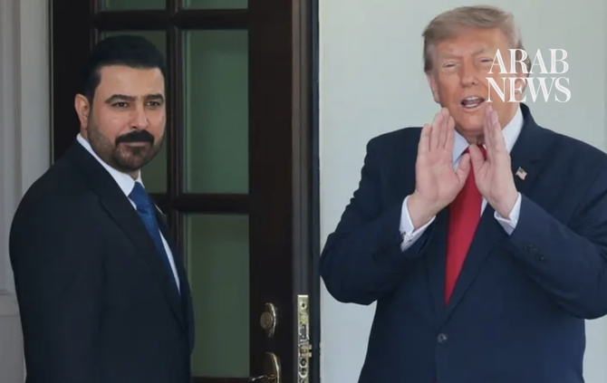

# Iraq PM meets Trump in Washington under pressure over Iran ties

Source: https://www.arabnews.com/node/2650794/middle-east
Captured source: https://www.arabnews.com/node/2650794/middle-east
Published: 2026-07-14T16:18:20+03:00
Modified: 2026-07-14T19:28:27+03:00
Author: ReutersAFP

## Summary

BAGHDAD: Iraq’s new prime minister Ali Al-Zaidi has said he is aiming to secure major US investment in his country’s oil, gas, and power sectors during a visit to the White House this week, after ​the Iran war hammered crude output and state finances. On a visit to the US, he met President Donald Trump in Washington on Tuesday, as the administration piles pressure on Baghdad

## Image

## Video Or Embed URLs

- https://platform.twitter.com/embed/Tweet.html?creatorScreenName=Arab_News&creatorUserId=69172612&dnt=false&embedId=twitter-widget-0&features=eyJ0ZndfdGltZWxpbmVfbGlzdCI6eyJidWNrZXQiOltdLCJ2ZXJzaW9uIjpudWxsfSwidGZ3X2ZvbGxvd2VyX2NvdW50X3N1bnNldCI6eyJidWNrZXQiOnRydWUsInZlcnNpb24iOm51bGx9LCJ0ZndfdHdlZXRfZWRpdF9iYWNrZW5kIjp7ImJ1Y2tldCI6Im9uIiwidmVyc2lvbiI6bnVsbH0sInRmd19yZWZzcmNfc2Vzc2lvbiI6eyJidWNrZXQiOiJvbiIsInZlcnNpb24iOm51bGx9LCJ0ZndfZm9zbnJfc29mdF9pbnRlcnZlbnRpb25zX2VuYWJsZWQiOnsiYnVja2V0Ijoib24iLCJ2ZXJzaW9uIjpudWxsfSwidGZ3X21peGVkX21lZGlhXzE1ODk3Ijp7ImJ1Y2tldCI6InRyZWF0bWVudCIsInZlcnNpb24iOm51bGx9LCJ0ZndfZXhwZXJpbWVudHNfY29va2llX2V4cGlyYXRpb24iOnsiYnVja2V0IjoxMjA5NjAwLCJ2ZXJzaW9uIjpudWxsfSwidGZ3X3Nob3dfYmlyZHdhdGNoX3Bpdm90c19lbmFibGVkIjp7ImJ1Y2tldCI6Im9uIiwidmVyc2lvbiI6bnVsbH0sInRmd19kdXBsaWNhdGVfc2NyaWJlc190b19zZXR0aW5ncyI6eyJidWNrZXQiOiJvbiIsInZlcnNpb24iOm51bGx9LCJ0ZndfdXNlX3Byb2ZpbGVfaW1hZ2Vfc2hhcGVfZW5hYmxlZCI6eyJidWNrZXQiOiJvbiIsInZlcnNpb24iOm51bGx9LCJ0ZndfdmlkZW9faGxzX2R5bmFtaWNfbWFuaWZlc3RzXzE1MDgyIjp7ImJ1Y2tldCI6InRydWVfYml0cmF0ZSIsInZlcnNpb24iOm51bGx9LCJ0ZndfbGVnYWN5X3RpbWVsaW5lX3N1bnNldCI6eyJidWNrZXQiOnRydWUsInZlcnNpb24iOm51bGx9LCJ0ZndfdHdlZXRfZWRpdF9mcm9udGVuZCI6eyJidWNrZXQiOiJvbiIsInZlcnNpb24iOm51bGx9fQ%3D%3D&frame=false&hideCard=false&hideThread=false&id=2076833983782887506&lang=en&origin=https%3A%2F%2Fwww.arabnews.com%2Fnode%2F2650794%2Fmiddle-east&sessionId=b98639661f00d38214178b079f4d62684dd9a987&siteScreenName=Arab_News&siteUserId=69172612&theme=light&widgetsVersion=6a3ad42b224df%3A1778106238597&width=600px
- https://3d3fa7ba13d0dbaa797aafe72b3add51.safeframe.googlesyndication.com/safeframe/1-0-45/html/container.html
- https://static.addtoany.com/menu/sm.25.html
- https://platform.twitter.com/widgets/widget_iframe.1227a5674072e080ffb1ba14ac0c1079.html?origin=https%3A%2F%2Fwww.arabnews.com
- about:blank
- https://imasdk.googleapis.com/js/core/bridge3.776.0_en.html
- https://www.google.com/recaptcha/api2/aframe
- https://cm.g.doubleclick.net/partnerpixels?gdpr=0&us_privacy=1---&gpp_sid=-1&url=https%3A%2F%2Fwww.arabnews.com%2Fnode%2F2650794%2Fmiddle-east

## Text

https://arab.news/46gds

Trump: US ⁠would ​be there ⁠for Iraq if it ⁠needed ‌protection

Zaidi is using Iraq’s energy sector to strengthen ties with Washington and to ‌reverse a perception among some US energy majors that Iraq is a challenging environment for large-scale investment

BAGHDAD: Iraq’s new prime minister Ali Al-Zaidi has said he is aiming to secure major US investment in his country’s oil, gas, and power sectors during a visit to the White House this week, after ​the Iran war hammered crude output and state finances.

On a visit to the US, he met President Donald Trump in Washington on Tuesday, as the administration piles pressure on Baghdad to curb Iranian influence.

Trump told ‌reporters ‌the ​US ⁠would ​be there ⁠for Iraq if it ⁠needed ‌protection, ‌but ​added ‌that he ‌did not think that ‌would be necessary.

Al-Zaidi said that ‌Iraq ⁠needed ​a fair ⁠share within OPEC after ⁠he ‌was ‌asked ​by ‌reporters whether ‌he was ‌considering leaving the oil producer ⁠group.

The Iraqi leader had earlier met Tom Barrack, the US President’s Special Envoy to Iraq, on Monday evening to discuss further cooperation between the countries as well as regional developments and how Baghdad can promote rapprochement and contribute to de-escalation, a statement from the prime minister’s office said.

His visit comes against the backdrop of renewed military escalation between the United States and Iran, Iraq’s main allies.

In an op-ed in the Washington Post ahead of his visit, Zaidi wrote that he leads “a government committed to ensuring that the state possesses the legitimate monopoly on the use of force”.

His government has given armed groups, which Washington designates as terrorist organizations, until September 30 to disarm, coinciding with the end of the US-led anti-militant coalition’s mission.

A senior Iraqi politician told AFP on condition of anonymity that even if the current government adopts a more US-friendly path, prioritizing the economy, “it doesn’t mean that Iraq is turning against Iran”.

Iraq “must maintain the long-standing balance” between its allies, he said.

Last week, Iraq’s holy cities, home to Shia Islam’s most sacred shrines, hosted a massive funeral procession for Iran’s late supreme leader Ali Khamenei, who was killed in a US-Israeli strike on Tehran.

Washington and Tehran’s enmity has long turned Iraq into a proxy battleground and left successive governments struggling to maintain a delicate balance between the two foes.

Iraq’s government is increasingly focused on diversifying international partnerships to better cope with regional instability, analysts say, an agenda expected to take center stage during the July 13 to July 18 visit.

The push represents one of the most explicit attempts in years to bring major US investment into a sector long dominated by Chinese, Russian, and European firms, though Iraqi officials reject suggestions Baghdad is distancing itself from close ally Tehran in favor of deeper ties with Washington.

“The Iran war was a turning point,” said Baghdad-based political analyst Ahmed Younis. “It highlighted the risks of overreliance on any single regional partner.”

“Zaidi views energy as the fastest route to deeper cooperation with Washington,” he said.

The effort includes negotiations with Chevron over major upstream projects, support for US-backed power and liquefied natural gas ventures, security ‌guarantees for American operators ‌in Iraq’s semi-autonomous Kurdistan region, and revived plans for strategic export pipelines linking Iraq to Mediterranean ​markets, ‌according ⁠to Iraqi ​and ⁠US officials. Among recent initiatives approved by Zaidi’s cabinet is an agreement with US-based HKN Energy to develop the Himreen oilfield in northern Iraq. The government has also authorized the Electricity Ministry to finalize a comprehensive cooperation agreement with General Electric aimed at expanding Iraq’s electricity generation and transmission infrastructure.

Zaidi said the government planned to “significantly” increase oil production within three years, according to a statement from his office.

He made the remarks during a meeting in Washington with Iraqi businesspeople and representatives of the Iraqi Christian community, whom he urged to invest in sectors including education, health care and petroleum products. Such deals are expected to be a focus of a meeting between Zaidi, a multimillionaire who took office in May, and US President Donald Trump, who has given ⁠the new Iraqi prime minister strong backing.

“We have directed the Ministries of Oil, Electricity and Communications to ‌give priority to reputable American companies working in energy, telecommunications, technology, and development,” Zaidi said in ‌a statement ahead of the trip.
