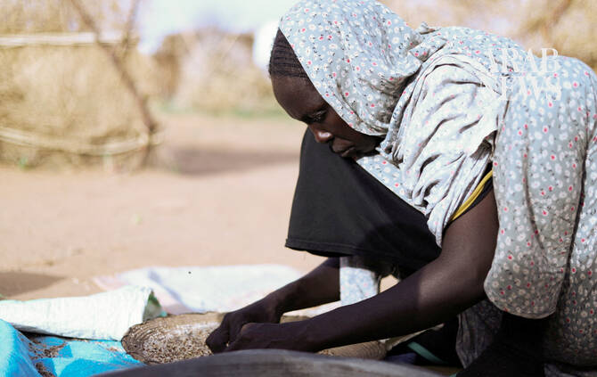

# Sudan risks deeper hunger crisis due to war, aid cuts and Hormuz disruption, says WFP

Source: https://www.arabnews.com/node/2650923/world
Captured source: https://www.arabnews.com/node/2650923/world
Published: 2026-07-15T00:32:22+03:00
Modified: 2026-07-15T00:32:22+03:00
Author: Reuters

## Summary

GENEVA: Sudan risks sliding backwards into deeper hunger as conflict, aid funding cuts and rising agricultural costs driven by disruption linked to the Iran war threaten to reverse gains made after famine took hold in parts of the country, a senior World Food Programme official said on Tuesday. The war between Sudan’s army and the paramilitary Rapid Support Forces, now in its

## Image

## Video Or Embed URLs

- https://cfa39d02b69dd0ddfc67fe14f76eee5a.safeframe.googlesyndication.com/safeframe/1-0-45/html/container.html
- https://static.addtoany.com/menu/sm.25.html
- about:blank
- https://imasdk.googleapis.com/js/core/bridge3.776.0_en.html
- https://www.google.com/recaptcha/api2/aframe
- https://sync.teads.tv/wigo-no-slot
- https://cm.g.doubleclick.net/partnerpixels?gdpr=0&us_privacy=1---&gpp_sid=-1&url=https%3A%2F%2Fwww.arabnews.com%2Fnode%2F2650923%2Fworld

## Text

https://arab.news/w2sf9

The WFP is increasingly concerned about renewed fighting over the past week in Darfur, which has forced the ⁠closure of the Tine ⁠border crossing, a route from Chad into Darfur

GENEVA: Sudan risks sliding backwards into deeper hunger as conflict, aid funding cuts and rising agricultural costs driven by disruption linked to the Iran war threaten to reverse gains made after famine took hold in parts of the country, a senior World Food Programme official said on Tuesday. The war between Sudan’s army and the paramilitary Rapid Support Forces, now in its fourth year, has displaced millions and devastated much of the country. Aid ‌agencies have ‌repeatedly warned of worsening food insecurity and limited humanitarian access. Sudan ​remains ‌the ⁠world’s ​largest humanitarian ⁠crisis, with around 5 million people facing emergency or catastrophic levels of hunger, even after an intensive aid response helped reduce the number of people in famine-like conditions, Carl Skau, the WFP’s acting executive director, told Reuters. “It’s a massive crisis, both in terms of numbers, but also the gravity,” he said, adding that more than 100,000 people were still facing famine-like conditions, placing them in the highest level of the ⁠UN-backed IPC hunger classification. “With these kinds of numbers in ‌IPC (Phase) 5 starvation it is extremely, extremely serious,” ‌he said. Across Sudan, nearly 19.5 million people face ​high levels of acute food insecurity, according ‌to the IPC. Skau said recent fighting around Al-Obeid in North Kordofan ‌had raised fears the city could suffer a fate similar to Al-Fashir in Darfur, where conflict and siege conditions have trapped civilians and hindered aid deliveries. In recent days, however, violence has eased somewhat, raising hopes aid deliveries can be expanded from 100,000 to 250,000 people around ‌al-Obeid. The WFP is also increasingly concerned about renewed fighting over the past week in Darfur, which has forced the ⁠closure of the Tine ⁠border crossing, a route from Chad into Darfur. Throughout the country WFP has reduced the number of people it assists from 5 million a year ago to about 3.5 million and reduced rations in many areas, including in Tawila in Darfur, as it faces a $646 million funding gap after cuts from major donors, including the United States, European countries and Britain. “We’re not heading in the right direction here,” Skau said. “If anything, we are falling backwards.” Skau also warned that soaring diesel prices and fertilizer shortages linked to conflict in the Gulf and the closure of the Strait of Hormuz could further undermine Sudan’s food security during the ​current planting season. Sudan relies heavily ​on fertilizer imports from Gulf countries, while much of its agriculture depends on irrigation pumps, which may be too expensive for farmers to run.
