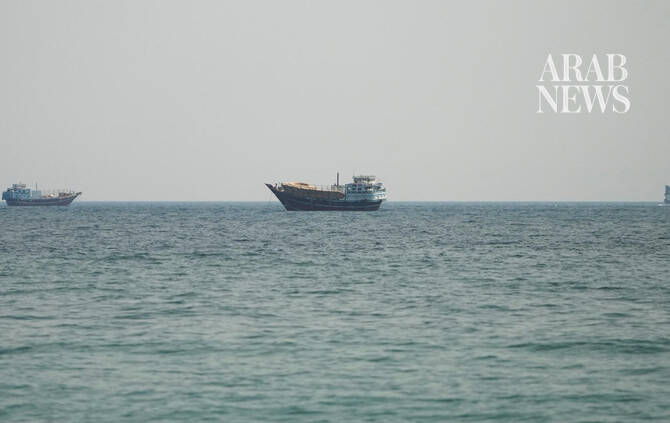

# Iran-linked vessels pass through Hormuz ahead of US blockade

Source: https://www.arabnews.com/node/2650944/middle-east
Captured source: https://www.arabnews.com/node/2650944/middle-east
Published: 2026-07-15T07:41:28+03:00
Modified: 2026-07-15T07:42:37+03:00
Author: Reuters

## Summary

SINGAPORE: The number ‌of vessels transiting through the Strait of Hormuz ticked up on Tuesday, with most of them linked to Iranian trade, before a US blockade took effect on Wednesday, shipping data showed. US President Donald Trump on Tuesday reimposed a naval blockade of all Iranian ports and threatened to hit power plants and bridges next week unless Tehran resumes

## Image

## Video Or Embed URLs

- https://ec3eaea332f0430d3c0a7d1ed3b4034e.safeframe.googlesyndication.com/safeframe/1-0-45/html/container.html
- https://static.addtoany.com/menu/sm.25.html
- about:blank
- https://imasdk.googleapis.com/js/core/bridge3.776.0_en.html
- https://www.google.com/recaptcha/api2/aframe
- https://sync.teads.tv/wigo-no-slot
- https://cm.g.doubleclick.net/partnerpixels?gdpr=0&us_privacy=1---&gpp_sid=-1&url=https%3A%2F%2Fwww.arabnews.com%2Fnode%2F2650944%2Fmiddle-east

## Text

https://arab.news/pdt4v

Nine of the 11 vessels that passed through the strait on Tuesday sailed via the Iranian route — shipping data

There ‌were no visible entries or exits for tankers to load oil and ‌gas from other Gulf producers on Tuesday

SINGAPORE: The number ‌of vessels transiting through the Strait of Hormuz ticked up on Tuesday, with most of them linked to Iranian trade, before a US blockade took effect on Wednesday, shipping data showed. US President Donald Trump on Tuesday reimposed a naval blockade of all Iranian ports and threatened to hit power plants and bridges next week unless Tehran resumes negotiations, in the latest escalation of the US conflict with Iran. Nine of the 11 vessels that passed through the strait on Tuesday sailed via the Iranian route, ship-tracking ‌data on Kpler ‌showed. Of these, three empty oil tankers — one ‌Aframax-sized ⁠vessel and two Very ⁠Large Crude Carriers — entered the strait, the data showed. Vessels that exited the strait with Iranian exports included one VLCC carrying 2 million barrels of crude, a medium-range tanker with refined products, and two tankers carrying liquefied petroleum gas, according to the data. A laden methanol tanker and a dry bulk carrier with iron ore aboard ⁠also made their way out of the ‌Gulf on Tuesday, the data showed. There ‌were no visible entries or exits for tankers to load oil and ‌gas from other Gulf producers on Tuesday. Strikes between the ‌US and Iran in the Middle East intensified this week, leading to a sharp slowdown in shipping through the Strait of Hormuz, where about a fifth of global oil and liquefied natural gas shipments passed ‌through each day before the war began in February. The United States said late on Tuesday ⁠that Iran ⁠had attacked seven commercial ships over the last week, leading to nearly a dozen crew members being killed, missing or injured. Attacks on Emirati supertankers have caused Middle East spot crude prices to strengthen this week, with prompt month prices now higher than those in future months, indicating tight supplies. “The next phase of Gulf flow recovery could be slower than the initial phase even after geopolitical de-escalation,” Goldman Sachs said in a note on Wednesday. The analysts pointed to a sharp drop in flows through Omani and international routes following the recent tanker attacks, saying it showed that “shippers using the non-Iranian Hormuz lane remain risk-averse.”
