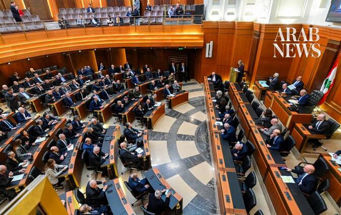

# Lebanon parliament to discuss sweeping amnesty bill

Source: https://www.arabnews.com/node/2650994/middle-east
Captured source: https://www.arabnews.com/node/2650994/middle-east
Published: 2026-07-15T15:01:15+03:00
Modified: 2026-07-15T15:05:23+03:00
Author: AFP

## Summary

BEIRUT: Lebanon’s parliament commenced a legislative session on Wednesday to discuss and vote on several bills, including an amnesty law that could cover swathes of prisoners. More than 40 draft laws will be discussed and voted on in the two-day session, the most prominent being the abolition of the death penalty, which has not been carried out in years, and the amnesty.

## Image

## Video Or Embed URLs

- https://53ab9898ef4822c11febc8bbf05d7c59.safeframe.googlesyndication.com/safeframe/1-0-45/html/container.html
- https://static.addtoany.com/menu/sm.25.html
- about:blank
- https://imasdk.googleapis.com/js/core/bridge3.776.0_en.html
- https://sync.teads.tv/wigo-no-slot
- https://www.google.com/recaptcha/api2/aframe
- https://cm.g.doubleclick.net/partnerpixels?gdpr=0&us_privacy=1---&gpp_sid=-1&url=https%3A%2F%2Fwww.arabnews.com%2Fnode%2F2650994%2Fmiddle-east

## Text

https://arab.news/vpymr

More than 40 draft laws will be discussed and voted on in the two-day session

For years, parliament has been trying to pass a general amnesty bill

BEIRUT: Lebanon’s parliament commenced a legislative session on Wednesday to discuss and vote on several bills, including an amnesty law that could cover swathes of prisoners. More than 40 draft laws will be discussed and voted on in the two-day session, the most prominent being the abolition of the death penalty, which has not been carried out in years, and the amnesty. For years, parliament has been trying to pass a general amnesty bill, whose primary goal is to reduce overcrowding in Lebanon’s prisons, without gaining consensus due to sectarian and political divisions regarding who would benefit from it. Amnesty has been a demand for families of Islamist prisoners, some of them accused of attacking the Lebanese army, participating in clashes in northern Sunni-majority Tripoli and planning bombings. Thousands of families from the eastern Baalbek and Hermel regions, bastions of the Shiite movement Hezbollah and its ally Amal where illicit cannabis cultivation is widespread, have also been demanding amnesty for drug-related offenses and theft. Relatives of those who fled to Israel after its withdrawal from southern Lebanon in 2000, fearing reprisals, particularly from Hezbollah and its supporters, also want their family members covered. Lebanon previously passed a general amnesty law in the wake of its 1975-90 civil war, allowing former warlords to transition into politics without facing trial for crimes committed during the conflict. Parliament will also vote on the abolition of the death penalty, last carried out in Lebanon in 2004. Capital punishment prevents Lebanon from extraditing criminals who have fled to countries that have abolished the penalty. Wednesday’s legislative session is the first held by parliament since it postponed elections by two years in March due to the Israel-Hezbollah war.
