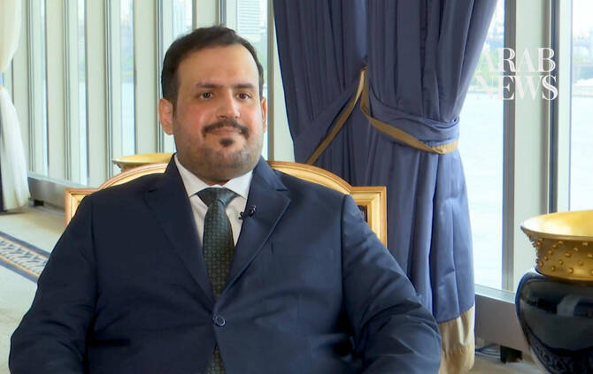

# How Saudi Arabia is promoting the waqf to help finance global development

Source: https://www.arabnews.com/node/2651070/saudi-arabia
Captured source: https://www.arabnews.com/node/2651070/saudi-arabia
Published: 2026-07-15T22:56:23+03:00
Modified: 2026-07-16T03:01:39+03:00
Author: Ephrem Kossaify

## Summary

NEW YORK CITY: As governments scramble to close a multitrillion-dollar funding gap threatening the UN’s Sustainable Development Goals, Saudi Arabia is promoting a solution rooted not in modern finance but in a 1,400-year-old Islamic tradition. Presenting its third Voluntary National Review at the UN High-Level Political Forum on Sustainable Development this week, the Kingdom’s

## Image

## Video Or Embed URLs

- https://f9b92b0ae994dd16e11af818205f17ae.safeframe.googlesyndication.com/safeframe/1-0-45/html/container.html
- https://static.addtoany.com/menu/sm.25.html
- about:blank
- https://www.google.com/recaptcha/api2/aframe
- https://imasdk.googleapis.com/js/core/bridge3.777.0_en.html
- https://cm.g.doubleclick.net/partnerpixels?gdpr=0&us_privacy=1---&gpp_sid=-1&url=https%3A%2F%2Fwww.arabnews.com%2Fnode%2F2651070%2Fsaudi-arabia

## Text

https://arab.news/b3qxf

General Authority for Awqaf presents 1,400-year-old Islamic endowment model as a tool for closing the UN Sustainable Development Goals funding gap

Tufeeq Alghamdi says reforms, transparency and international partnerships are transforming awqaf into a scalable development financing mechanism

NEW YORK CITY: As governments scramble to close a multitrillion-dollar funding gap threatening the UN’s Sustainable Development Goals, Saudi Arabia is promoting a solution rooted not in modern finance but in a 1,400-year-old Islamic tradition.

Presenting its third Voluntary National Review at the UN High-Level Political Forum on Sustainable Development this week, the Kingdom’s General Authority for Awqaf argued that the waqf — the Islamic charitable endowment — could become a powerful tool for financing sustainable development.

The authority participated as part of the Saudi delegation to the forum, running July 7-15 in New York, where 36 countries presented their VNRs this year.

For the first time, the role of endowments and their contribution to sustainable development has been included in the Kingdom’s national review, according to Tufeeq Alghamdi, general manager of empowerment and development at the General Authority for Awqaf.

“This participation gains significance as it is the first time that the role of endowments and their contribution to sustainable development have been highlighted within the Kingdom’s VNRs,” Alghamdi told Arab News.

The authority organized a roundtable at the headquarters of the UN Development Programme to present the Saudi endowment experience. Alghamdi described the event as an extension of a partnership between the UNDP and the General Authority for Awqaf to develop what he called the Endowment Excellence Index, or Waqf Excellence Index.

He said that the roundtable was designed to showcase the transformation that the sector has undergone in the Kingdom “in terms of governance, development, technological transformation, and enhancing transparency,” as well as the integration of endowments into the national development framework.

The index, Alghamdi said, is a tool to measure the maturity of endowment institutions that was developed domestically but built to international standards, allowing it to be adapted elsewhere.

He described it as the first tool of its kind to assess endowment practices against international benchmarks, saying it establishes “a common language among endowment institutions for measuring their performance, their level of maturity, and their efficiency,” while linking their outputs to the 17 Sustainable Development Goals and national priorities.

He traced the waqf concept to the earliest centuries of Islamic history, calling it “the first model of sustainability known to history, predating the contemporary concept of sustainability and sustainable development.”

Endowments historically financed schools, hospitals and other infrastructure, he said, and today can help address funding shortfalls facing charitable organizations, particularly in countries with fragile economies, because of the model’s defining feature; preserving a principal asset while sustaining the benefits it generates.

Alghamdi linked the sector’s growth to Saudi Vision 2030, which set a target for the non-profit sector to contribute 5 percent of the Kingdom’s gross domestic product.

The General Authority for Awqaf, he said, was established as an independent government body to develop legislation reconciling the historical and Shariah-based dimensions of waqf with modern governance practices.

He said that the Kingdom was now positioned to share its expertise with counterparts in the Organization of Islamic Cooperation and through broader UN partnerships such as the one with UNDP.

“Our message is that, at a time when many countries are facing challenges in financing development projects … the endowment model stands out as one of the models capable of playing an important role in bridging the global financing gap,” Alghamdi said.

The practice has a “proven record of success” across the Islamic world that had not always received the attention it deserved, he added.

In remarks delivered at the roundtable, Alghamdi laid out the scale of the sector, saying the assets of Saudi awqaf now exceed SR460 billion ($122.6 billion), with more than 30,000 registered endowments — including more than 600 registered in the past month alone.

He said that the Kingdom records one of the highest levels of waqf assets per capita globally, at an estimated SR12,647 per person.

He described governance as the first pillar of the sector’s institutional transformation, saying the authority has strengthened regulatory frameworks and compliance standards, safeguarding waqf assets valued at about SR100 billion and recovering nearly SR1.5 billion.

Digital transformation was the second pillar, he said, citing electronic registration and recognition of the waqf’s legal personality as improvements to transparency and data quality.

The third pillar, institutional development, is supported through the authority’s Riyadah Center, which builds professional standards for custodians and leadership in governance, investment and risk management.

Alghamdi said that studies have identified more than 35,000 endower conditions spanning 27 fields, with total spending exceeding SR1.8 billion on areas including education, healthcare, orphan care, mosque services, and Hajj and Umrah support.

He pointed to contemporary applications including the Health Endowment Fund, the Environmental Initiatives Endowment Fund, Al-Salam Endowment Hospital, university endowments, and housing initiatives such as Jood Housing.

The sector contributed an estimated SR48 billion, or 1.2 percent, to Saudi GDP in 2023, Alghamdi said, with ambitions to raise that to SR78 billion.

He said that waqf investment funds achieved an average return of about 9.74 percent in 2024, rising to 12.83 percent when excluding underperforming cases, while initiatives and agreements exceeding SR6 billion have been launched covering financing, guarantees, pooled waqf funds and qard Al-hasan — interest-free lending — products.

Alghamdi said that the inclusion of awqaf in this year’s VNR for the first time reflects their recognition as part of the Kingdom’s national development framework and as a contributor to the UN SDGs.

“This sends a clear message; awqaf are not merely a traditional form of giving, but a modern, governable and scalable instrument for financing sustainable development,” he said.

He concluded by describing the Saudi experience as “a platform for cooperation” rather than a closed model, saying that the authority is committed to working with governments, international organizations and other waqf institutions on governance, impact measurement and financial innovation.

“We believe the future of awqaf lies in partnerships, transforming national experiences into shared knowledge and scalable solutions that serve communities across regions.”
