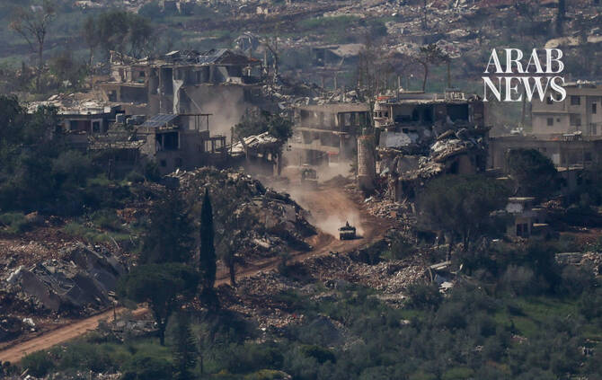

# Israel tells Pentagon chief will keep troops in Lebanon, Syria, Gaza ‘security zones’

Source: https://www.arabnews.com/node/2651105/middle-east
Captured source: https://www.arabnews.com/node/2651105/middle-east
Published: 2026-07-16T09:14:04+03:00
Modified: 2026-07-16T12:11:57+03:00
Author: AFP

## Summary

JERUSALEM: Israel’s Defense Minister Israel Katz told his US counterpart Pete Hegseth early Thursday that Israel is determined to keep its forces in “security zones” it has carved out inside Lebanon, Syria and the Gaza Strip.

## Image

## Video Or Embed URLs

- https://62d5f3503bf3d1c6c3e2f98d75005d5f.safeframe.googlesyndication.com/safeframe/1-0-45/html/container.html
- https://static.addtoany.com/menu/sm.25.html
- about:blank
- https://imasdk.googleapis.com/js/core/bridge3.777.0_en.html
- https://www.google.com/recaptcha/api2/aframe
- https://sync.teads.tv/wigo-no-slot
- https://cm.g.doubleclick.net/partnerpixels?gdpr=0&us_privacy=1---&gpp_sid=-1&url=https%3A%2F%2Fwww.arabnews.com%2Fnode%2F2651105%2Fmiddle-east

## Text

https://arab.news/cw7eq

Israel determined to keep its forces in “security zones” it has carved out inside Lebanon, Syria and the Gaza Strip

JERUSALEM: Israel’s Defense Minister Israel Katz told his US counterpart Pete Hegseth early Thursday that Israel is determined to keep its forces in “security zones” it has carved out inside Lebanon, Syria and the Gaza Strip. In a statement, Katz’s office said the two men spoke overnight and the minister “emphasized Israel’s determination to remain in the security zones in Syria, Gaza, and Lebanon in order to protect Israel’s borders and the communities near the border from the threats posed by jihadist forces.”

Seperatly, Israel’s Prime Minister’s ⁠Office said ⁠on Thursday that Prime ​Minister Benjamin Netanyahu will not travel ‌to ‌the ​United ‌States ⁠next ​week because the funeral ⁠of US Senator ⁠Lindsey ‌Graham has ‌been ​postponed until ‌the ‌end of the month.
