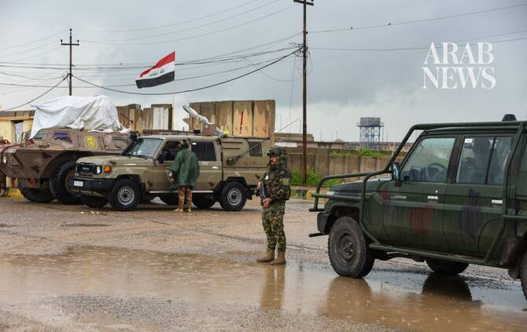

# Syria foils attempt to smuggle weapons to Hezbollah from Iraq, state news agency says

Source: https://www.arabnews.com/node/2651120/middle-east
Captured source: https://www.arabnews.com/node/2651120/middle-east
Published: 2026-07-16T11:24:23+03:00
Modified: 2026-07-16T15:43:57+03:00
Author: Reuters

## Summary

DUBAI: Syrian authorities said on Thursday they had foiled an attempt to smuggle advanced weapons and missiles across the border from Iraq, with state news agency SANA citing an Interior Ministry source as saying the shipment appeared destined for militant group Hezbollah.

## Image

## Video Or Embed URLs

- https://5942daf1b649400099205c2c6d66ef66.safeframe.googlesyndication.com/safeframe/1-0-45/html/container.html
- https://static.addtoany.com/menu/sm.25.html
- about:blank
- https://www.google.com/recaptcha/api2/aframe
- https://imasdk.googleapis.com/js/core/bridge3.777.0_en.html
- https://sync.teads.tv/wigo-no-slot
- https://cm.g.doubleclick.net/partnerpixels?gdpr=0&us_privacy=1---&gpp_sid=-1&url=https%3A%2F%2Fwww.arabnews.com%2Fnode%2F2651120%2Fmiddle-east

## Text

https://arab.news/r8tus

Syria’s General Authority of Ports and Customs said the rocket and drone shipment was concealed inside “one of the oil tanker-trucks headed to the city of Baniyas“

Following the seizure, Iraq said it would form a high-level committee to investigate the incident

DUBAI: Syrian authorities said on Thursday they had foiled an attempt to smuggle advanced weapons and missiles across the border from Iraq, with state news agency SANA citing an Interior Ministry source as saying the shipment appeared destined for militant group Hezbollah. Syria’s General Authority of Ports and Customs said the rocket and drone shipment was concealed inside “one of the oil tanker-trucks headed to the city of Baniyas.” It was discovered during routine inspection ‌procedures at ‌the Al-Tanf border crossing between Syria and ‌Iraq ⁠after customs officers ⁠subjected the suspected vehicle to a more thorough search. Following the seizure, Iraq said it would form a high-level committee to investigate the incident. The military’s Joint Operations Command said Baghdad would coordinate with Syrian authorities to establish the full circumstances of the attempted smuggling, hold those responsible ⁠to account, and strengthen security along the shared ‌border to prevent similar ‌incidents. Hezbollah did not immediately respond to a request for comment. The ‌Baniyas route has become an increasingly important corridor for ‌fuel movements between Iraq and Syria. Reuters reported last month that Iraq was preparing to expand exports through Syria to include crude oil and naphtha, building on an existing arrangement under ‌which fuel oil is transported overland to Baniyas for onward export. Iraqi officials have said ⁠the initiative ⁠is part of a government strategy to diversify export routes beyond the Gulf. US President Donald Trump said in June he had spoken to Syrian President Ahmed Al-Sharaa about combating Hezbollah, which is fighting Israel in Lebanon. The former rebels who now run Syria fought against Hezbollah for years as it was sending fighters to support Syria’s then-president, Bashar Assad, in a civil war. Lebanese President Joseph Aoun’s office said Sharaa had assured him Syria would not take sides in Lebanon’s internal affairs.
