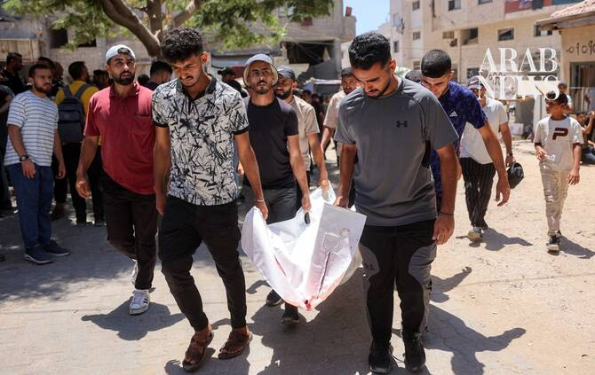

# Escalating Israeli strikes kill five people in Gaza, medics say

Source: https://www.arabnews.com/node/2651141/middle-east
Captured source: https://www.arabnews.com/node/2651141/middle-east
Published: 2026-07-16T13:54:04+03:00
Modified: 2026-07-16T13:55:48+03:00
Author: Reuters

## Summary

CAIRO: Israeli strikes killed at least five Palestinians in the Gaza Strip on Thursday, Palestinian health officials said, as a US-based research group reported a surge in Israeli attacks to levels not seen since the latest truce took effect in October. Medics said an Israeli airstrike killed two people near the Tuffah neighborhood in the north of the enclave, ‌while a third

## Image

## Video Or Embed URLs

- https://941124acc97065739bdcdeb54c803dbc.safeframe.googlesyndication.com/safeframe/1-0-45/html/container.html
- https://static.addtoany.com/menu/sm.25.html
- about:blank
- https://www.google.com/recaptcha/api2/aframe
- https://imasdk.googleapis.com/js/core/bridge3.777.0_en.html
- https://sync.teads.tv/wigo-no-slot
- https://cm.g.doubleclick.net/partnerpixels?gdpr=0&us_privacy=1---&gpp_sid=-1&url=https%3A%2F%2Fwww.arabnews.com%2Fnode%2F2651141%2Fmiddle-east

## Text

https://arab.news/nej97

The deaths add to a ‌toll of more than 1,100 Palestinians, ‌mostly civilians, killed by Israeli attacks since an ​October ceasefire between Israel and Hamas ‌to end the war took effect

CAIRO: Israeli strikes killed at least five Palestinians in the Gaza Strip on Thursday, Palestinian health officials said, as a US-based research group reported a surge in Israeli attacks to levels not seen since the latest truce took effect in October. Medics said an Israeli airstrike killed two people near the Tuffah neighborhood in the north of the enclave, ‌while a third person ‌was killed in Israeli tank shelling ​in ‌the ⁠Zeitoun suburb in ​eastern ⁠Gaza City. Another airstrike at a tent encampment for displaced people in western Gaza City killed one person and wounded several, while an attack on a vehicle in Khan Younis, in the south, killed another, medics said. Witnesses also reported that an airstrike hit a residential building in Deir Al-Balah in central Gaza. The Israeli military had no immediate comment on ⁠any of the incidents. The deaths add to a ‌toll of more than 1,100 Palestinians, ‌mostly civilians, killed by Israeli attacks since an ​October ceasefire between Israel and Hamas ‌to end the war took effect, according to Gazan health officials. ‌Hamas does not usually disclose its losses. The truce halted major fighting, but has failed to stop near daily Israeli strikes. Four Israeli soldiers have been killed by militants in Gaza over the same period. Conflict monitor ACLED, which tracks ‌Israeli attacks in Gaza, said air- and drone strikes against Hamas and other militants increased to more than ⁠40 in June, ⁠the highest monthly total since the ceasefire. “With polls showing the opposition in the lead, Israeli Prime Minister Benjamin Netanyahu is facing growing domestic pressure to take a tougher security position against Hamas,” ACLED Middle East Assistant Research Manager Nasser Khdour said, referring to Israel’s legislative election in October. Israel says its strikes aim to thwart attacks by Gaza militants. Nearly all of Gaza’s 2 million people now live on a tiny strip of land along the coast, mainly in makeshift tents or damaged buildings, under Hamas control. Hamas-led fighters killed 1,200 people during ​their cross-border attack into Israel ​on October 7, 2023, according to Israeli tallies. The Gazan health ministry said Israel’s subsequent offensive killed more than 73,000 Palestinians.
