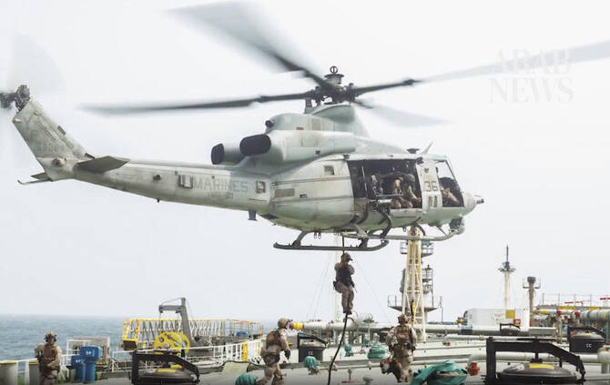

# US forces board ship to ensure ‘compliance’ with Iran blockade

Source: https://www.arabnews.com/node/2651222/middle-east
Captured source: https://www.arabnews.com/node/2651222/middle-east
Published: 2026-07-17T01:05:59+03:00
Modified: 2026-07-17T01:28:19+03:00
Author: AFP

## Summary

WASHINGTON: American forces boarded a ship in the Gulf of Oman on Thursday as part of the renewed blockade of Iran’s ports that began earlier this week, the US military said. US Marines boarded the M/T Wen Yao “to ensure full compliance with the ongoing US naval blockade,” US Central Command (CENTCOM) said in a post on X. The previous day, a US aircraft fired on and disabled

## Image

## Video Or Embed URLs

- https://imasdk.googleapis.com/js/core/bridge3.777.0_en.html
- https://7ac4f78c92a5c5ff015a206968481bc3.safeframe.googlesyndication.com/safeframe/1-0-45/html/container.html
- https://static.addtoany.com/menu/sm.25.html
- about:blank
- https://www.google.com/recaptcha/api2/aframe
- https://sync.teads.tv/wigo-no-slot
- https://cm.g.doubleclick.net/partnerpixels?gdpr=0&us_privacy=1---&gpp_sid=-1&url=https%3A%2F%2Fwww.arabnews.com%2Fnode%2F2651222%2Fmiddle-east

## Text

https://arab.news/j634x

WASHINGTON: American forces boarded a ship in the Gulf of Oman on Thursday as part of the renewed blockade of Iran’s ports that began earlier this week, the US military said. US Marines boarded the M/T Wen Yao “to ensure full compliance with the ongoing US naval blockade,” US Central Command (CENTCOM) said in a post on X. The previous day, a US aircraft fired on and disabled an unladen oil tanker that tried to break the blockade. The military command also said Thursday it had “redirected 3 commercial vessels trying to run the blockade” since it took effect at 2000 GMT on Tuesday. US forces previously blockaded Iranian ports from April 13 to June 18, during which time they disabled nine ships and redirected more than 140, according to CENTCOM.
