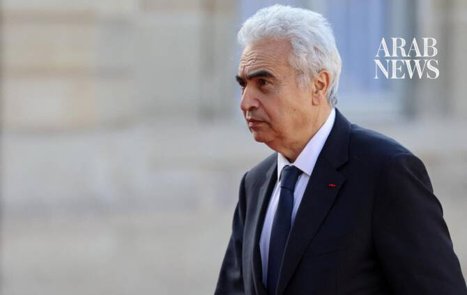

# Global energy security at risk if Strait of Hormuz does not open in weeks, IEA chief says

Source: https://www.arabnews.com/node/2651230/world
Captured source: https://www.arabnews.com/node/2651230/world
Published: 2026-07-17T03:45:23+03:00
Modified: 2026-07-17T03:49:08+03:00
Author: Reuters

## Summary

WASHINGTON: ​If the US and Iran do not increase oil flowing through the Strait of Hormuz soon, the world should worry about energy security, International Energy Agency Executive Director Fatih Birol said on Thursday. “Oil security is still a critical issue,” Birol told a Council on Foreign Relations event.

## Image

## Video Or Embed URLs

- https://a93d9fd9027475d72228d8f58fadb582.safeframe.googlesyndication.com/safeframe/1-0-45/html/container.html
- https://static.addtoany.com/menu/sm.25.html
- about:blank
- https://imasdk.googleapis.com/js/core/bridge3.777.0_en.html
- https://www.google.com/recaptcha/api2/aframe
- https://sync.teads.tv/wigo-no-slot
- https://cm.g.doubleclick.net/partnerpixels?gdpr=0&us_privacy=1---&gpp_sid=-1&url=https%3A%2F%2Fwww.arabnews.com%2Fnode%2F2651230%2Fworld

## Text

https://arab.news/m5ac9

Oil shipments need to flow in the ‌next few weeks

Factors that have moderated price rise ‘can’t last forever’

WASHINGTON: ​If the US and Iran do not increase oil flowing through the Strait of Hormuz soon, the world should worry about energy security, International Energy Agency Executive Director Fatih Birol said on Thursday. “Oil security is still a critical issue,” Birol told a Council on Foreign Relations event. “We should be worried, and I am worried, if the situation does not improve in the next few weeks.” The Strait of Hormuz, a narrow waterway ‌between Iran ‌and Oman that normally carries about one-fifth of ​the ‌world’s ⁠energy shipments, has ​been ⁠mostly blocked since the conflict began on February 28 with US and Israeli strikes on Iran. Despite sharp energy price increases, Birol said several factors have moderated the rise. These include China’s stockpile, which totaled more than 1 billion barrels of oil before the war, its oil conservation through increased use of electric vehicles and public transport and an IEA-coordinated release of up to ⁠400 million barrels of oil. But those fixes “can’t last ‌forever,” said Birol, who has said the ‌Iran war is the worst energy disruption ​in history. Birol said a boost in ‌production by the United States, the world’s top oil and gas ‌producer, has helped. “The US increase in production is very good ... The US increased 1 million, 2 million but it cannot increase 10 million,” barrels per day of crude oil output, he said. The oil and gas supply crisis has hurt economies ‌around the world, but in an asymmetric way, he said. “It is mainly Asia, because Asia was getting 80 ⁠to 90 percent ⁠of this energy from the Strait of Hormuz,” he said. Japan and South Korea have suffered, but developing countries including Pakistan, Bangladesh and India have been hit hardest, he said. Birol highlighted potential health risks for people in developing countries, especially women, who have turned to alternative cooking fuels including dung and wood with more hazardous emissions as petroleum products have become unaffordable. Oil prices fell about $20 a barrel after the coordinated IEA release in March, and the action signaled to markets that the organization representing more than 30 countries could tap reserves again if things get worse. “Even though ​it was huge,” Birol said of ​the up to 400-million-barrel release, “It was only 20 percent of the stocks we have, 80 percent is still in the pocket.”
