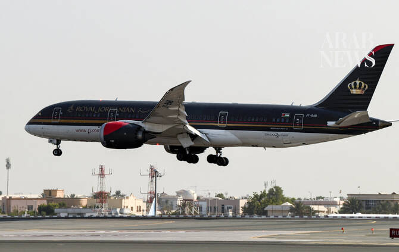

# Saudi Arabia welcomes introduction of regular commercial flights between Amman and Sanaa

Source: https://www.arabnews.com/node/2651355/saudi-arabia
Captured source: https://www.arabnews.com/node/2651355/saudi-arabia
Published: 2026-07-18T01:27:37+03:00
Modified: 2026-07-18T01:27:37+03:00
Author: Arab News

## Summary

RIYADH: Saudi authorities welcomed the announcement on Friday by Jordan of regular commercial flights between Amman and the Yemeni capital Sanaa. Jordan’s Foreign Ministry said Royal Jordanian Airlines would operate the route and work is underway to complete the necessary technical and logistical procedures for them to begin. The Saudi Foreign Ministry said the Kingdom

## Image

## Video Or Embed URLs

- https://fa95dbb062dbcfab28cc2bc042844343.safeframe.googlesyndication.com/safeframe/1-0-45/html/container.html
- https://static.addtoany.com/menu/sm.25.html
- about:blank
- https://imasdk.googleapis.com/js/core/bridge3.777.0_en.html
- https://www.google.com/recaptcha/api2/aframe
- https://sync.teads.tv/wigo-no-slot
- https://cm.g.doubleclick.net/partnerpixels?gdpr=0&us_privacy=1---&gpp_sid=-1&url=https%3A%2F%2Fwww.arabnews.com%2Fnode%2F2651355%2Fsaudi-arabia

## Text

https://arab.news/rgs4v

Jordan’s Foreign Ministry said Royal Jordanian Airlines would operate the route and work is underway to complete the necessary technical and logistical procedures for them to begin

RIYADH: Saudi authorities welcomed the announcement on Friday by Jordan of regular commercial flights between Amman and the Yemeni capital Sanaa.

Jordan’s Foreign Ministry said Royal Jordanian Airlines would operate the route and work is underway to complete the necessary technical and logistical procedures for them to begin.

The Saudi Foreign Ministry said the Kingdom welcomes the introduction of the flights, which aim to help meet the humanitarian needs of the Yemeni people. Yemen’s government also hailed the announcement.
