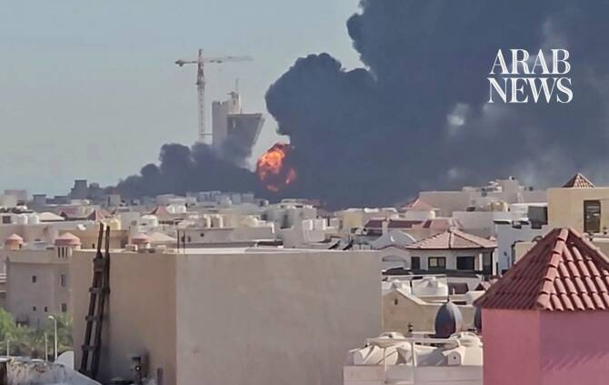

# Kuwait military says responding to Iran missile, drone attacks

Source: https://www.arabnews.com/node/2651473/middle-east
Captured source: https://www.arabnews.com/node/2651473/middle-east
Published: 2026-07-19T09:55:39+03:00
Modified: 2026-07-19T09:56:38+03:00
Author: AFP

## Summary

KUWAIT CITY: Kuwait’s military said on Sunday it was responding to aerial salvos fired by Iran a day after the Gulf state faced barrages from the Islamic republic that struck a power plant and oil facility. “Kuwaiti air defenses are currently confronting hostile missile and drone attacks, following the sinful Iranian aggression,” the army said in a statement, as an AFP

## Image

## Video Or Embed URLs

- https://imasdk.googleapis.com/js/core/bridge3.777.0_en.html
- https://ce8c02349888d1da1c304bbe4b8aaf50.safeframe.googlesyndication.com/safeframe/1-0-45/html/container.html
- https://static.addtoany.com/menu/sm.25.html
- about:blank
- https://www.google.com/recaptcha/api2/aframe
- https://sync.teads.tv/wigo-no-slot
- https://cm.g.doubleclick.net/partnerpixels?gdpr=0&us_privacy=1---&gpp_sid=-1&url=https%3A%2F%2Fwww.arabnews.com%2Fnode%2F2651473%2Fmiddle-east

## Text

https://arab.news/jz9m9

KUWAIT CITY: Kuwait’s military said on Sunday it was responding to aerial salvos fired by Iran a day after the Gulf state faced barrages from the Islamic republic that struck a power plant and oil facility. “Kuwaiti air defenses are currently confronting hostile missile and drone attacks, following the sinful Iranian aggression,” the army said in a statement, as an AFP journalist reported warning sirens sounding in Kuwait City.
