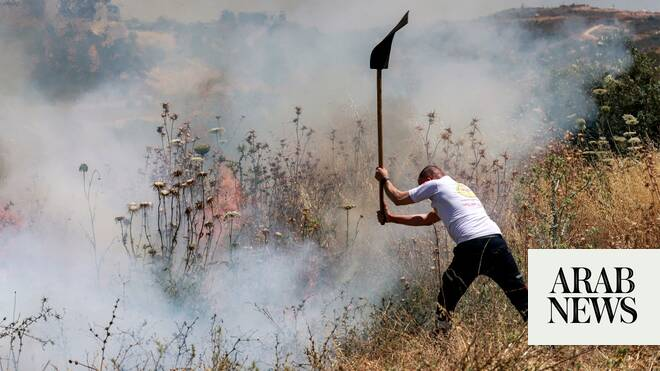

# UN reports record levels of settler violence in the West Bank

Source: https://www.arabnews.com/node/2646837/middle-east
Captured source: https://www.arabnews.com/node/2646837/middle-east
Published: 2026-06-11T23:15:56+03:00
Modified: 2026-06-11T23:23:05+03:00
Author: AFP

## Summary

Violence by Israeli settlers in the occupied West Bank has reached record levels, with an average of six attacks daily causing casualties or damage, the UN said Thursday. The number of such attacks this year has surpassed 1,000, said Stephane Dujarric, spokesman for the UN chief, citing the UN’s Office for the Coordination of Humanitarian Affairs (OCHA). “Just last week,

## Image

## Video Or Embed URLs

- https://static.addtoany.com/menu/sm.25.html
- about:blank
- https://www.google.com/recaptcha/api2/aframe
- https://cm.g.doubleclick.net/partnerpixels?gdpr=0&us_privacy=1---&gpp_sid=-1&url=https%3A%2F%2Fwww.arabnews.com%2Fnode%2F2646837%2Fmiddle-east

## Text

https://arab.news/y8jya

The number of Israeli attacks in West Bank this year has surpassed 1,000

More than 2,200 Palestinians have been displaced this year due to settler violence

Violence by Israeli settlers in the occupied West Bank has reached record levels, with an average of six attacks daily causing casualties or damage, the UN said Thursday. The number of such attacks this year has surpassed 1,000, said Stephane Dujarric, spokesman for the UN chief, citing the UN’s Office for the Coordination of Humanitarian Affairs (OCHA). “Just last week, settler attacks resulted in the injury of more than 30 Palestinians and widespread damage to property, central infrastructure as well as livelihoods,” Dujarric said. “The current pace of settler attacks causing casualties or property damage, with an average of six incidents per day, is higher than any year on record,” he said. More than 2,200 Palestinians have been displaced this year due to settler violence or access restrictions, while hundreds more have been displaced due to home demolitions by Israeli authorities, he said. More than a half million Israelis live in the West Bank — excluding East Jerusalem, which has been annexed by Israel — in settlements deemed illegal by the United Nations under international law. Three million Palestinians also live there. Israel has occupied the West Bank since 1967. Violence has escalated in the West Bank during and since the Gaza war, which was triggered by an unprecedented attack on Israel by the Palestinian Islamist movement Hamas on October 7, 2023.
