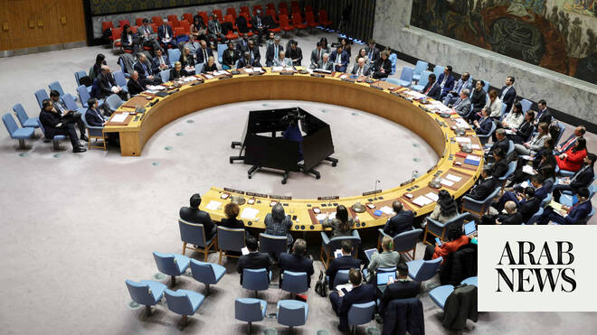

# Denmark and Pakistan push for end to impunity for violence against UN peacekeepers

Source: https://www.arabnews.com/node/2646986/world
Captured source: https://www.arabnews.com/node/2646986/world
Published: 2026-06-13T02:01:16+03:00
Modified: 2026-06-13T02:01:16+03:00
Author: Ephrem Kossaify

## Summary

NEW YORK CITY: Denmark and Pakistan have tabled a UN Security Council resolution calling for an end to the near-total impunity that perpetrators of attacks against UN peacekeepers have long enjoyed. It is expected to be put to a vote imminently. The draft resolution, seen by Arab News, is framed as a direct challenge to what the council itself acknowledges has become a culture

## Image

## Video Or Embed URLs

- https://static.addtoany.com/menu/sm.25.html
- about:blank
- https://www.google.com/recaptcha/api2/aframe
- https://imasdk.googleapis.com/js/core/bridge3.770.1_en.html
- https://sync.teads.tv/wigo-no-slot
- https://cm.g.doubleclick.net/partnerpixels?gdpr=0&us_privacy=1---&gpp_sid=-1&url=https%3A%2F%2Fwww.arabnews.com%2Fnode%2F2646986%2Fworld

## Text

https://arab.news/wawjg

Their draft Security Council resolution, seen by Arab News, challenges culture of impunity that has ‘undermined the safety and security’ of UN personnel in world’s most dangerous environments

7 peacekeepers from the UN Interim Force in Lebanon have been killed since the start of the most recent conflict between Israel and Hezbollah in early March

NEW YORK CITY: Denmark and Pakistan have tabled a UN Security Council resolution calling for an end to the near-total impunity that perpetrators of attacks against UN peacekeepers have long enjoyed. It is expected to be put to a vote imminently. The draft resolution, seen by Arab News, is framed as a direct challenge to what the council itself acknowledges has become a culture of impunity. The text of the document says that this has “undermined the safety and security” of UN personnel deployed in some of the world’s most dangerous environments. The rate of prosecution for crimes against peacekeepers, the resolution notes, “has remained very low.” It comes at a time when seven peacekeepers working with the UN Interim Force in Lebanon have been killed since the start of the most recent conflict between Israel and Hezbollah in early March. And on on Thursday morning, two Malaysian members of the force were slightly injured by broken glass from a vehicle during an airstrike about a kilometer from a UN position in Tibnin. The push comes from two elected members of the Security Council who have made peacekeeping a defining priority of their two-year tenure. Denmark and Pakistan have been promoting peacekeeping as a key shared priority since taking their seats on the council in January 2025, forming part of a “peacekeeping trio,” alongside South Korea, that has sought to inject fresh momentum into a long-neglected agenda. At its heart, the resolution represents a demand for accountability, placing the burden to investigate and prosecute those responsible for killing or attacking UN peacekeepers squarely on host states, and calling on all relevant parties to cooperate with the UN “to facilitate the identification, investigation and prosecution of perpetrators without delay.” The text of the resolution makes it clear that this is not optional; it insists host states take “all necessary measures” consistent with their obligations under international humanitarian law and international human rights law. The resolution also takes aim at a gap that has long frustrated troop-contributing countries: the absence of any dedicated institutional machinery within the UN system to pursue such cases. It calls for the designation of a senior focal point that can drive coordination across the organization, and encourages countries whose peacekeepers have been victimized to voluntarily deploy trained investigators to assist host states on the ground. The language of the resolution regarding the severity of the threat to UN peacekeepers, also known as “blue helmets” in reference to their protective headgear, is notably stark. The text expresses grave concern about what it describes as an escalation in the “number, scope and sophistication” of attacks, including the use of shelling, improvised explosive devices and unmanned aerial systems, highlighting the evolving arsenal that is increasingly deployed against peacekeeping missions in Africa and the Middle East. The resolution reaffirms the council’s determination to take further steps to address the issue if necessary Since 2013, at least 251 peacekeepers have been killed in the Central African Republic, the Democratic Republic of the Congo and Mali alone — 80 percent of all peacekeeper deaths caused by malicious acts during that time. Very few of those responsible were brought to justice.
