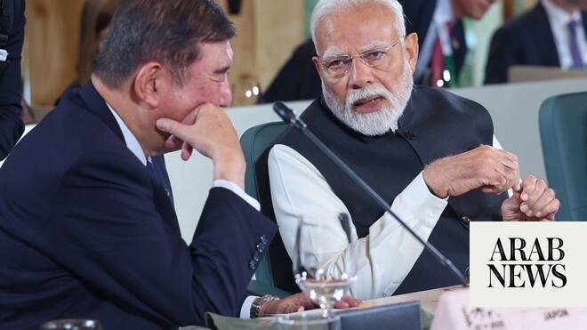

# Modi to raise Hormuz issue at G7 after US strike kills 3 Indian seafarers

Source: https://www.arabnews.com/node/2647017/world
Captured source: https://www.arabnews.com/node/2647017/world
Published: 2026-06-13T13:04:19+03:00
Modified: 2026-06-13T13:04:19+03:00
Author: Sanjay Kumar

## Summary

NEW DELHI: Prime Minister Narendra Modi departed for Europe on Saturday to participate in the Group of Seven Summit, where India is expected to call for unrestricted navigation through the Strait of Hormuz following US attacks on vessels carrying Indian seafarers. Modi will be visiting France and Slovakia to meet leaders of the two countries before attending the G7 Summit in

## Image

## Video Or Embed URLs

- https://static.addtoany.com/menu/sm.25.html
- about:blank
- https://imasdk.googleapis.com/js/core/bridge3.770.1_en.html
- https://www.google.com/recaptcha/api2/aframe
- https://cm.g.doubleclick.net/partnerpixels?gdpr=0&us_privacy=1---&gpp_sid=-1&url=https%3A%2F%2Fwww.arabnews.com%2Fnode%2F2647017%2Fworld

## Text

https://arab.news/gz2kp

US attacks on ships carrying Indian seafarers ‘changed calculus’ for India

G7 Summit also offers chance for India to hold talks with invited Gulf countries

NEW DELHI: Prime Minister Narendra Modi departed for Europe on Saturday to participate in the Group of Seven Summit, where India is expected to call for unrestricted navigation through the Strait of Hormuz following US attacks on vessels carrying Indian seafarers.

Modi will be visiting France and Slovakia to meet leaders of the two countries before attending the G7 Summit in the French town of Evian, which would mark India’s 13th participation as a partner country at the forum of the world’s richest countries. Core members are Canada, France, Germany, Italy, Japan, the UK and the US.

The trip comes days after three Indian seafarers were killed in a US strike near the Strait of Hormuz, an attack the US Central Command said was launched because the motor tanker was “attempting to transport oil from Iran.”

India will present its position on the situation on the Hormuz strait at the G7 Summit, said Randhir Jaiswal, a spokesperson for the Indian Ministry of External Affairs.

“We want and we have urged that there be unimpeded and safe navigation through the Strait of Hormuz in keeping with international law. So, that is our position. This is a topic which will come up for discussion and we’ll put our points across. Also, other concerns that we have arising out of the West Asia situation and developments there,” he told reporters in a briefing.

“Looking after our seafaring community — their welfare and well-being — is extremely important to us. We will continue to reiterate this point and keep working for their welfare and security.”

There are more than 320,000 Indians working as mariners, making it the second-largest group of seafarers globally.

At least 20,000 of them are currently working aboard commercial vessels in the Strait of Hormuz region, according to data from the Forward Seamen’s Union of India.

Three ships staffed by Indians in the Gulf have been attacked by American forces this week alone, according to the Indian Embassy in Oman.

Modi, who has not commented publicly on the deaths of the Indian seafarers, is also expected to meet US President Donald Trump on the sidelines of the G7 Summit in France, amid pressure from unions to denounce the attacks.

Such a meeting will “allow India to directly confront Trump on the rules of engagement, demanding to know how the US plans to enforce its blockade without affecting unarmed Indian mariners and broader civilian infrastructure,” said Vanshika Saraf, a research analyst at the Takshashila Institution.

The G7 Summit is a “premier platform for voicing India’s concerns” about the US war on Iran, as the incidents off the coast of Oman “have changed the calculus” for India.

“It showcases that even vessels that have crossed or are avoiding the immediate chokepoint, remain vulnerable. So India now needs to seek safe passage across the entire maritime corridor,” she told Arab News.

“If we look back, the G7 primarily emerged in the 1970s after the global oil shock and economic turbulence of that decade. Its entire raison d’etre is to coordinate economic policy and manage global crises.”

The G7 Summit in France, which will start on Monday, will also be a chance for India to hold talks with Gulf countries.

“France has also invited Saudi Arabia, the UAE, Qatar and Egypt,” Saraf said. “So this will give India another opportunity to participate in a conversation with its Gulf partners.”
