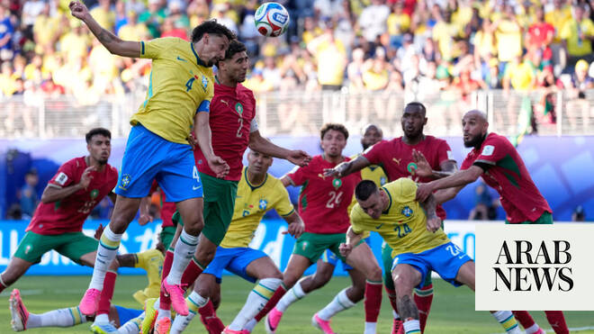

# Brazil and Morocco share the spoils in blockbuster World Cup clash

Source: https://www.arabnews.com/node/2647083/football
Captured source: https://www.arabnews.com/node/2647083/football
Published: 2026-06-14T03:52:10+03:00
Modified: 2026-06-14T04:26:48+03:00
Author: Mohammed Fayad

## Summary

RIYADH: One of the most anticipated matches of the 2026 FIFA World Cup group stage came to a close with neither side able to find a winner. Brazil and Morocco played out a 1-1 draw in front of a sell-out crowd at the MetLife Stadium, with Ismael Saibari and Vinicius Junior canceling each other out in the first half. But the frantic opening period left much to be desired in the

## Image

## Video Or Embed URLs

- https://static.addtoany.com/menu/sm.25.html
- about:blank
- https://imasdk.googleapis.com/js/core/bridge3.770.1_en.html
- https://www.google.com/recaptcha/api2/aframe
- https://cm.g.doubleclick.net/partnerpixels?gdpr=0&us_privacy=1---&gpp_sid=-1&url=https%3A%2F%2Fwww.arabnews.com%2Fnode%2F2647083%2Ffootball

## Text

https://arab.news/jwtkq

2022 semi-finalists kick off their campaign with a 1-1 draw

Blistering first half followed by a more cautious second from both sides

RIYADH: One of the most anticipated matches of the 2026 FIFA World Cup group stage came to a close with neither side able to find a winner.

Brazil and Morocco played out a 1-1 draw in front of a sell-out crowd at the MetLife Stadium, with Ismael Saibari and Vinicius Junior canceling each other out in the first half. But the frantic opening period left much to be desired in the second.

Morocco kicked off the Mohamed Ouahbi era at a blistering pace. For long spells of the opening exchanges, it looked as though the five-time world champions were not wearing yellow and blue, but red and green.

The Atlas Lions gave Brazil little room to breathe and almost capitalized on their early pressure, if not for a series of blocks from Gabriel Magalhaes.

After their energetic start, Morocco dropped into a 4-4-2 shape and allowed Brazil to enjoy more of the ball.

It was then that Vinicius Junior began to emerge, narrowly getting the better of Achraf Hakimi down the left flank before delivering a cross toward Igor Thiago, who could not direct his header on target.

But that shift in momentum ultimately led to the opening goal. In the 21st minute, Brahim Diaz threaded a pass through the Brazilian defense for Ismael Saibari, who caught Alisson off his line with a chip and calmly finished for the opener.

A hydration break immediately followed, but it did not halt Morocco’s momentum. Hakimi grew into a more attacking role, driving deep into Brazil’s half before unleashing a shot that went wide of Alisson’s goal.

Vinicius Junior had other plans, however. Just five minutes later, he received a pass from Bruno Guimaraes on the left flank before beating Neil El-Aynaoui and curling a crisp finish beyond Yassine Bounou to level the score. Morocco switched off for a brief moment and the Selecao immediately capitalized.

If the first half was played at a blistering pace, the second was the complete opposite. Morocco were content to allow Brazil, who introduced Danilo and Fabinho in place of Roger Ibanez and Casemiro, more time on the ball.

The Atlas Lions appeared content to settle for a point — the contrast in their attacking output between the two halves was striking.

Morocco registered 12 attempts before the break, but failed to muster another shot until stoppage time.

Brazil threatened from time to time, but their attacking output was largely muted by Morocco’s disciplined low block.

They found a gap in the 77th minute when Vinicius Junior burst forward on the counterattack and picked out Raphinha inside the box, but the Barcelona winger’s effort was comfortably saved by Bounou.

The Selecao almost found a late winner in the 83rd minute when Issa Diop misjudged a back pass to Bounou, allowing Raphinha to nearly latch onto the loose ball. The Moroccan goalkeeper reacted quickly, however, racing off his line to clear the danger.

In the eighth minute of stoppage time, the Atlas Lions almost found a winner themselves. El-Aynaoui unleashed a powerful effort from distance that Alisson could only parry into the path of substitute Ayoube Amaimouni.

The forward looked destined to snatch a dramatic winner, but the Brazilian goalkeeper reacted brilliantly to produce a stunning point-blank save.

In the end, neither side was able to find a breakthrough. Morocco will likely be the happier of the two teams after frustrating Carlo Ancelotti’s side, while Brazil were left to reflect on a match in which they struggled to consistently break down a well-organized Atlas Lions defense.

Beyond the result, one of Morocco’s brightest positives on the night was the performance of 18-year-old Ayyoub Bouaddi.

The midfielder, who switched his international allegiance to Morocco just last month, looked completely at ease on his World Cup debut.

His composure in possession and ability to progress the ball under pressure provided the Atlas Lions with a valuable outlet throughout the contest.
