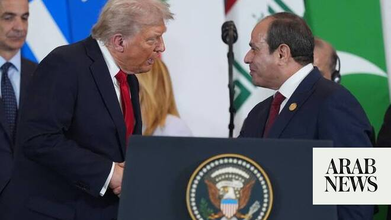

# Trump to meet El-Sisi at G7 summit in France: Egyptian presidency

Source: https://www.arabnews.com/node/2647134/middle-east
Captured source: https://www.arabnews.com/node/2647134/middle-east
Published: 2026-06-14T16:40:56+03:00
Modified: 2026-06-14T17:06:08+03:00
Author: AFP

## Summary

CAIRO: US President Donald Trump is set to hold talks with Egypt’s President Abdel Fattah El-Sisi on the sidelines of the G7 summit in France this month, the Egyptian presidency said on Sunday.

## Image

## Video Or Embed URLs

- https://static.addtoany.com/menu/sm.25.html
- about:blank
- https://imasdk.googleapis.com/js/core/bridge3.770.1_en.html
- https://www.google.com/recaptcha/api2/aframe
- https://sync.teads.tv/wigo-no-slot
- https://cm.g.doubleclick.net/partnerpixels?gdpr=0&us_privacy=1---&gpp_sid=-1&url=https%3A%2F%2Fwww.arabnews.com%2Fnode%2F2647134%2Fmiddle-east

## Text

https://arab.news/grvtu

Egyptian presidency says El-Sisi’s meetings would focus on resolving geopolitical crises and their repercussions on trade, energy and supply chains

French-hosted summit takes place in the city of Evian on June 15-17

CAIRO: US President Donald Trump is set to hold talks with Egypt’s President Abdel Fattah El-Sisi on the sidelines of the G7 summit in France this month, the Egyptian presidency said on Sunday. In a statement, the presidency said El-Sisi is expected to hold a series of meetings with world leaders during the summit, “including a bilateral meeting with US President Donald Trump.” It added that El-Sisi’s meetings would focus on “discussing ways to resolve international geopolitical crises and address their repercussions on trade, energy and supply chains.” The G7 summit will be one of the first major international gatherings since the United States and Israel launched a war against Iran in late February, upending the Middle East and widening transatlantic tensions. French President Emmanuel Macron, who is hosting the summit in the city of Evian on June 15-17, said that leaders from Egypt, Saudi Arabia, Qatar and the United Arab Emirates had been invited to discuss the Middle East war, according to the French presidency. Saudi Crown Prince Mohammed bin Salman said he would not attend the summit due to “prior commitments,” the Saudi Press Agency (SPA) reported on Thursday. The G7 brings together the leaders of Britain, Canada, France, Germany, Italy, Japan and the United States, along with invited leaders from several other countries, including Brazil and India. Macron is due to arrive in Evian on Sunday evening, with other leaders, including Trump, expected on Monday. Leaders are set to have a packed agenda of potentially explosive issues, including efforts to end the war in Iran and re-open the key Strait of Hormuz shipping bottleneck.
