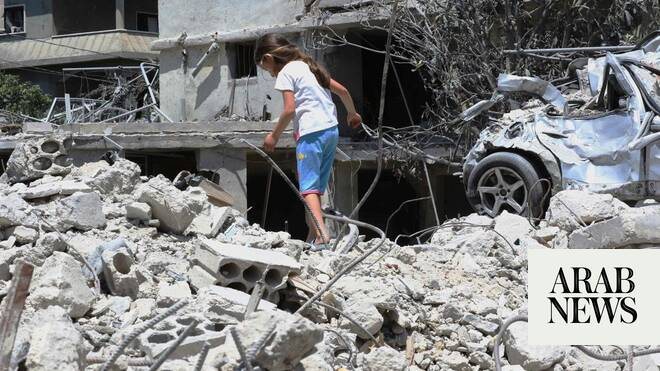

# One dead in Israeli strike on car in south Lebanon

Source: https://www.arabnews.com/node/2647275/middle-east
Captured source: https://www.arabnews.com/node/2647275/middle-east
Published: 2026-06-15T18:18:41+03:00
Modified: 2026-06-15T21:46:41+03:00
Author: AFP

## Summary

BEIRUT: An Israeli strike in the south of Lebanon on Monday killed one person, state media said, the first reported deadly strike since the announcement of a deal to end the Middle East war on all fronts. “Enemy drone aircraft targeted a car at the Kfar Tibnit roundabout, leading to the death of its driver,” the National News Agency (NNA) said, referring to a village near the

## Image

## Video Or Embed URLs

- about:blank
- https://static.addtoany.com/menu/sm.25.html
- https://imasdk.googleapis.com/js/core/bridge3.771.2_en.html
- https://www.google.com/recaptcha/api2/aframe
- https://sync.teads.tv/wigo-no-slot
- https://cm.g.doubleclick.net/partnerpixels?gdpr=0&us_privacy=1---&gpp_sid=-1&url=https%3A%2F%2Fwww.arabnews.com%2Fnode%2F2647275%2Fmiddle-east

## Text

https://arab.news/vhu2c

Attack is the first deadly strike since the announcement of a deal to end the Iran war, which includes Lebanon

Hezbollah later said it had repelled an Israeli force that was trying to “advance” in southern Lebanon

BEIRUT: An Israeli strike in the south of Lebanon on Monday killed one person, state media said, the first reported deadly strike since the announcement of a deal to end the Middle East war on all fronts. “Enemy drone aircraft targeted a car at the Kfar Tibnit roundabout, leading to the death of its driver,” the National News Agency (NNA) said, referring to a village near the city of Nabatieh.

Later on Monday, Lebanese militant group Hezbollah said it had repelled an Israeli force that was trying to “advance” in southern Lebanon, despite the US-Iran agreement to end the Middle East war on all fronts including in Lebanon. Fighters from the group “using rockets and drones” blocked an Israeli force consisting of an excavator and two Merkava tanks that was “advancing” in the vicinity of Kfar Tebnit town near the southern city of Nabatieh, Hezbollah said in a statement.

Meanwhile, Lebanese President Joseph Aoun welcomed the announced US-Iran deal to end the Middle East war during a call from Tehran’s top diplomat and foreign minister Abbas Araghchi, the Lebanese presidency said in a statement. The Lebanese leader said he hoped the agreement would be a “positive step toward reducing tensions and opening the door to diplomatic solutions,” while Araghchi emphasized “the importance of respecting Lebanon’s sovereignty,” the statement said.
