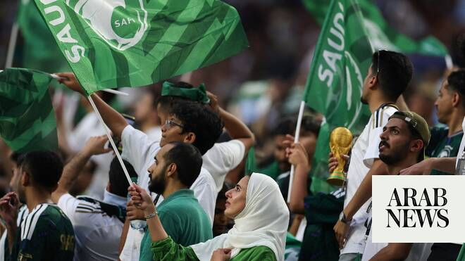

# Arab teams at 2026 World Cup: Saudi Arabia hold Uruguay, Egypt raise hopes in strong World Cup showing

Source: https://www.arabnews.com/node/2647339/sport
Captured source: https://www.arabnews.com/node/2647339/sport
Published: 2026-06-16T08:27:42+03:00
Modified: 2026-06-16T09:27:00+03:00
Author: Agencies

## Summary

DUBAI: Uruguay dominated but had to settle for a 1-1 draw against Saudi Arabia in the sweltering heat of Miami on Monday to leave an intriguing Group H wide open. The stalemate came hours after one of the biggest shocks in World Cup history when European champions Spain were held 0-0 by debutants Cape Verde in the same group. After the first round of games in the pool all four

## Image

## Video Or Embed URLs

- https://static.addtoany.com/menu/sm.25.html
- about:blank
- https://www.google.com/recaptcha/api2/aframe
- https://imasdk.googleapis.com/js/core/bridge3.771.2_en.html
- https://cm.g.doubleclick.net/partnerpixels?gdpr=0&us_privacy=1---&gpp_sid=-1&url=https%3A%2F%2Fwww.arabnews.com%2Fnode%2F2647339%2Fsport

## Text

https://arab.news/63wua

DUBAI: Uruguay dominated but had to settle for a 1-1 draw against Saudi Arabia in the sweltering heat of Miami on Monday to leave an intriguing Group H wide open.

For the latest updates, follow us @ArabNewsSport

The stalemate came hours after one of the biggest shocks in World Cup history when European champions Spain were held 0-0 by debutants Cape Verde in the same group.

After the first round of games in the pool all four teams have one point.

Defender Abdulelah Al-Amri gave the Saudis a surprise lead near the end of the first half only for Uruguay’s second-half pressure to pay off with 10 minutes left through Maxi Araujo.

Marcelo Bielsa’s Uruguay racked up 22 shots in the second period but the Saudi defense and goalkeeper Mohammed Al-Owais doggedly held firm.

In evening temperatures of more than 30C and energy-sapping humidity, both teams struggled to create much in front of goal early on.

Just after the half-hour mark the Saudi stopper Owais was called into action for a second time to parry a diving header from close range by Federico Vinas.

The Saudis, who stunned eventual champions Argentina 2-1 to start their campaign at the Qatar 2022 World Cup, looked to hit their opponents on the break.

They had their first real opportunity shortly before half-time when Amri forced Fernando Muslera to palm away his fizzing shot.

Four minutes before the break the defender did score, reacting fastest to poke home from close range after Muslera spilled a header from a corner.

Meanwhile, Egypt were ultimately held to a 1-1 draw by one of Europe’s most respected footballing nations, but the performance lifted spirits across the country and renewed belief that a near-century wait for a World Cup breakthrough may finally be within reach.

Much of that hope has centred on Mohamed Salah, Egypt’s talisman who turned 34 on Monday and may be playing his final World Cup.
