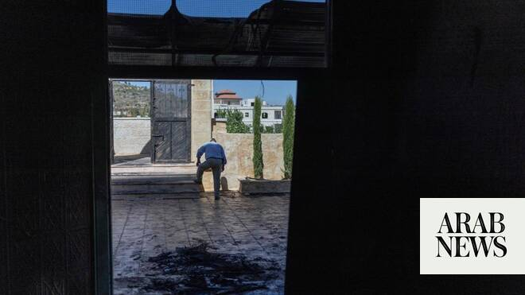

# Israeli settlers torch two West Bank mosques

Source: https://www.arabnews.com/node/2647524/middle-east
Captured source: https://www.arabnews.com/node/2647524/middle-east
Published: 2026-06-17T12:15:36+03:00
Modified: 2026-06-17T19:59:10+03:00
Author: AFP

## Summary

JILJILIYA, Palestinian Territories: Israeli settlers set fire to mosques in two West Bank villages on Wednesday, the local mayors said, while AFP journalists at the site saw signs of arson and vandalism. Israel’s military confirmed to AFP the arson and graffiti on the mosques, but did not identify the perpetrators. “The forces searched the area for suspects and located two

## Image

## Video Or Embed URLs

- blob:https://www.arabnews.com/795e4548-64f0-46ad-b174-927cbf922f53
- https://imasdk.googleapis.com/js/core/bridge3.771.2_en.html
- https://static.addtoany.com/menu/sm.25.html
- about:blank
- https://sync.teads.tv/wigo-no-slot
- https://www.google.com/recaptcha/api2/aframe
- https://cm.g.doubleclick.net/partnerpixels?gdpr=0&us_privacy=1---&gpp_sid=-1&url=https%3A%2F%2Fwww.arabnews.com%2Fnode%2F2647524%2Fmiddle-east

## Text

https://arab.news/wkdkj

Incidents come amid an increase in attacks against Palestinian communities by settlers in the occupied West Bank

The Hilltop Youth are a group of Israelis in the West Bank who are regularly accused of violence toward Palestinians

JILJILIYA, Palestinian Territories: Israeli settlers set fire to mosques in two West Bank villages on Wednesday, the local mayors said, while AFP journalists at the site saw signs of arson and vandalism. Israel’s military confirmed to AFP the arson and graffiti on the mosques, but did not identify the perpetrators. “The forces searched the area for suspects and located two burned mosques, as well as graffiti on the walls. The suspects had fled prior to the arrival of the forces,” it said in a statement. The incident comes amid an increase in attacks against Palestinian communities by settlers in the Israeli-occupied West Bank since the start of the Gaza war in 2023. Osama Abdullah, head of the village council in Jiljiliya, north of Ramallah, told AFP that “settlers set fire to the ablution room, caused damage to the village’s main mosque, and scrawled hostile slogans on the outer walls.” AFP journalists who visited the mosque on Wednesday reported that the ceiling, walls and floors were blackened by smoke and flames. They said graffiti in Hebrew had been scrawled on the walls, including some reading “vengeance” and “hi from the Hilltop Youth.”

The Hilltop Youth are a group of Israelis in the West Bank who are regularly accused of violence toward Palestinians they seek to evict from areas they wish to take over. Mayor Abdullah said settlers arrived to burn down the mosque between 2am and 3am but found its door was locked, so instead set fire to a room dedicated to ablutions on a lower floor. He said Palestinian civil defense crews, along with young men from the village and neighboring areas, extinguished the blaze. In the neighboring village of Mazari an-Nubani, settlers came to torch another mosque overnight, the head of the village council, Saad Dagher, told AFP. Dagher said settlers arrived to burn one of the village’s three mosques around 3am using Molotov cocktails, before running away while residents put out the fire. The Palestinian ministry of religious affairs condemned “dangerous aggressions” in a statement that also called on the international community to intervene. Israel has occupied the West Bank since 1967. More than 500,000 Israeli settlers live in the territory, excluding east Jerusalem, among some three million Palestinians. Settlements, which are illegal under international law, have sprouted all over the West Bank since the right-wing government of Prime Minister Benjamin Netanyahu took office, which contains many pro-settlement ministers in its ranks. The United Nations recently warned that settler violence in the West Bank has reached record levels, with an average of six attacks daily causing casualties or damage. Locals allege that Israelis act outside the law with impunity.
