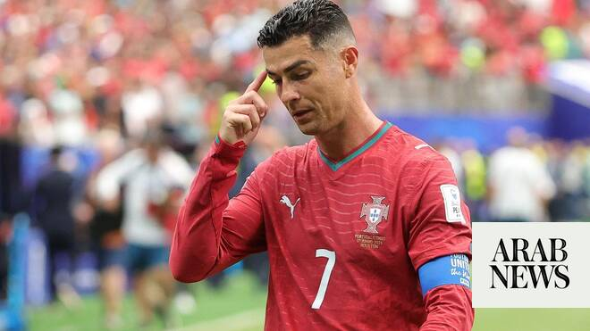

# Kane double fires England World Cup bid as Ronaldo’s Portugal stumble

Source: https://www.arabnews.com/node/2647651/sport
Captured source: https://www.arabnews.com/node/2647651/sport
Published: 2026-06-18T10:08:26+03:00
Modified: 2026-06-18T10:09:43+03:00
Author: AFP

## Summary

LOS ANGELES, United States: England launched their World Cup bid with a rollercoaster 4-2 win against Croatia on Wednesday as Cristiano Ronaldo and Portugal stumbled to a draw against the Democratic Republic of Congo. In an enthralling Group L game at the Texas home of the Dallas Cowboys NFL team, Harry Kane scored twice before goals from Jude Bellingham and Marcus Rashford

## Image

## Video Or Embed URLs

- https://static.addtoany.com/menu/sm.25.html
- about:blank
- https://imasdk.googleapis.com/js/core/bridge3.771.2_en.html
- https://www.google.com/recaptcha/api2/aframe
- https://sync.teads.tv/wigo-no-slot
- https://cm.g.doubleclick.net/partnerpixels?gdpr=0&us_privacy=1---&gpp_sid=-1&url=https%3A%2F%2Fwww.arabnews.com%2Fnode%2F2647651%2Fsport

## Text

https://arab.news/bjhw2

Harry Kane scores twice before goals from Jude Bellingham and Marcus Rashford made the game safe

Portuguese great Ronaldo finds the going tough against a resolute Congolese defense in Houston

LOS ANGELES, United States: England launched their World Cup bid with a rollercoaster 4-2 win against Croatia on Wednesday as Cristiano Ronaldo and Portugal stumbled to a draw against the Democratic Republic of Congo. For the latest updates, follow us @ArabNewsSport In an enthralling Group L game at the Texas home of the Dallas Cowboys NFL team, Harry Kane scored twice before goals from Jude Bellingham and Marcus Rashford made the game safe as England began their bid to end a 60-year wait for a major trophy. Kane got the ball rolling by slotting home a penalty at the second attempt after the referee ordered him to re-take it when Croatian ‘keeper Dominik Livakovic was adjudged to have been off his line. Croatia fought back and Martin Baturina brought them level after 36 minutes before unmarked Kane equalled Gary Lineker’s England record of 10 World Cup goals with a thumping header. But the English defensive frailties were on show when Petar Musa equalized for Croatia in first-half stoppage time. Only in the second half did England impose their will. Bellingham scored a classy goal after outrunning his defender before substitute Rashford took his time before slotting the ball into the net on 85 minutes. Kane revealed that England’s German coach Thomas Tuchel had told his players at half-time to throw caution to the wind. “The manager gave us a speech at half-time just to say, look, if we lose, we lose. We’re losing our way,” Kane said. “And I think you saw that, the way we come out in the second half. We went full gas. And they couldn’t live with it.” Struggling Ronaldo Earlier, Portuguese great Ronaldo, 41, equaled the record of appearing in six World Cups set on Tuesday by his old nemesis Lionel Messi but his side were held to an upset 1-1 draw by DR Congo. Ronaldo found the going tough against a resolute Congolese defense in Houston. Joao Neves opened the scoring for the Portuguese in the first half but Yoane Wissa equalized with a headed goal in first-half injury time to give his nation their first ever World Cup point. The result once again renewed scrutiny of Portugal coach Roberto Martinez’s insistence on starting the aging Ronaldo. But Martinez defended the veteran’s selection despite an ineffective performance. “It makes no sense to take off the best goal scorer in world football in a game that you need goals,” Martinez said. Ronaldo left the field without speaking to reporters but later posted on Instagram: “It’s not the start we wanted, but it’s a long road and it’s not finished.” DR Congo’s achievement was even greater given that their preparations have been disrupted by the Ebola outbreak in their country. “It is a tremendous source of pride to have earned DR Congo’s first-ever point at the FIFA World Cup, as well as its first goal,” their coach Sebastien Desabre said. “I am very proud of my players because they represented the Congo in a very positive way and the entire country deserves it.” Several Portugal players meanwhile wore wrist bands in tribute to late team-mate Diogo Jota, who was killed in a car crash last year. In other games Wednesday, Ghana snatched a 1-0 victory over Panama with an injury-time winner in Toronto to join England on three points in Group L. An attritional battle looked destined to finish in a goalless draw until Caleb Yirenkyi bundled in the winning goal in the fifth minute of stoppage time for the Black Stars. Ghana reached the quarter-finals of the 2010 World Cup but have been eliminated in the group stage at their two most recent appearances in the tournament in 2022 and 2014. The African side will play England in their second Group L game in Boston on June 23. In Wednesday’s late game, Colombia defeated debutants Uzkbekistan 3-1 in an entertaining Group K game at Mexico City’s Estadio Azteca. Bayern Munich star Luis Diaz set up an opening volleyed goal for Daniel Munoz and then scored Colombia’s second in the 65th minute before Jaminton Campaz added a third with a header in stoppage time. Abbosbek Fayzullaev claimed a sliver of history by scoring Uzkekistan’s first ever goal in a World Cup match.

For the latest updates, follow us @ArabNewsSport
