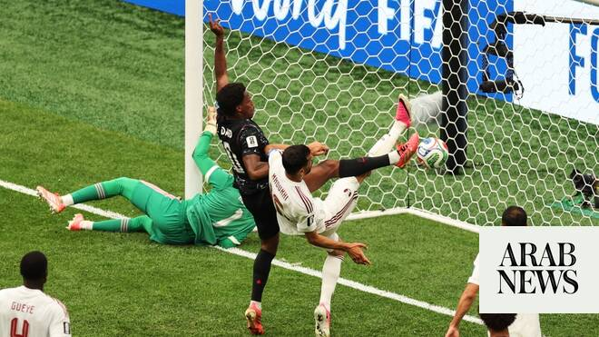

# Arab teams at 2026 World Cup: Qatar suffer tough 6-0 loss to Canada

Source: https://www.arabnews.com/node/2647778/sport
Captured source: https://www.arabnews.com/node/2647778/sport
Published: 2026-06-19T06:12:08+03:00
Modified: 2026-06-19T06:58:39+03:00
Author: AFP

## Summary

LOS ANGELES: Canada thrashed nine-man Qatar 6-0 to secure their first ever World Cup victory on Thursday as Switzerland reignited their campaign with a resounding defeat of Bosnia-Herzegovina. Tournament co-hosts Canada had lost all six of their previous matches at the World Cup, at the 1986 and 2022 finals, but brought that run of losses to a halt in spectacular fashion at

## Image

## Video Or Embed URLs

- https://static.addtoany.com/menu/sm.25.html
- about:blank
- https://www.google.com/recaptcha/api2/aframe
- https://imasdk.googleapis.com/js/core/bridge3.772.0_en.html
- https://cm.g.doubleclick.net/partnerpixels?gdpr=0&us_privacy=1---&gpp_sid=-1&url=https%3A%2F%2Fwww.arabnews.com%2Fnode%2F2647778%2Fsport

## Text

https://arab.news/j8qaw

Qatar side down to nine as Homam El-Amin and Assim Madibo sent off

In other matches, Switzerland reignited their campaign with a resounding defeat of Bosnia-Herzegovina

LOS ANGELES: Canada thrashed nine-man Qatar 6-0 to secure their first ever World Cup victory on Thursday as Switzerland reignited their campaign with a resounding defeat of Bosnia-Herzegovina.

For the latest updates, follow us @ArabNewsSport

Tournament co-hosts Canada had lost all six of their previous matches at the World Cup, at the 1986 and 2022 finals, but brought that run of losses to a halt in spectacular fashion at Vancouver’s BC Place Stadium.

With Canadian Prime Minister Mark Carney — wearing a replica Canada shirt — among a fired-up crowd, Jesse Marsch’s side ran riot to secure a win that leaves them needing only a point against Switzerland to finish top of Group B.

A hat-trick from Juventus striker Jonathan David, one goal apiece from Cyle Larin and Nathan Saliba, and a Mohammad Manai own goal sealed Canada’s win.

The victory was marred though by a serious left leg injury to midfielder Ismael Kone, who was stretchered off after being clumsily upended by Qatar’s Assim Madibo in the 51st minute.

Madibo was initially shown a yellow card for the challenge which was subsequently upgraded to red. The stricken Kone was given oxygen as he was carried off the field, waving to fans.

Canada coach Jesse Marsch revealed afterwards Kone was being treated in hospital for a suspected broken leg, adding that his staff had understood the severity of the injury immediately.

“It was right in front of us, and everyone could hear the bone snap,” Marsch said. “I haven’t spoken to Ismael yet, but he’s at the hospital. He will prepare for a surgery.

“Everybody’s a little shaken by the whole experience because of the nature of the injury, and also because Ismael is a big part of the heart of our team. It will be a big loss for us.”

Madibo’s dismissal left Qatar down to nine men after Homam El-Amin was also sent off in the first half for denying a goalscoring opportunity.

Canada duly made their numerical advantage count, scoring three times in the second half to crucially boost their goal difference.

The Canadians are level with Switzerland on four points at the top of the group, but their superior goal difference means they will win Group B if they draw when the two sides meet in Vancouver on June 24.

Switzerland on track

Earlier Thursday, Switzerland got their campaign back on track with a 4-1 drubbing of Bosnia-Herzegovina at the SoFi Stadium in Los Angeles.

Johan Manzambi scored twice while Ruben Vargas and Granit Xhaka were on target in a late flurry of goals for the Swiss, who are dreaming of advancing beyond the last 16 for the first time at this World Cup.

Bosnia, who upset Italy in a playoff to reach this this year’s tournament, are on the brink after a damaging loss that leaves them with one point from two games.

In other games on Thursday, South Africa, who had two men sent off in an abject 2-0 defeat to Mexico in Group A last week, resurrected their slender qualification hopes with a 1-1 draw against the Czech Republic in Atlanta.

Teboho Mokoena’s penalty earned a point for South Africa after Michal Sadilek opened the scoring for the Czechs.

But Mokoena’s late spot-kick kept both teams in the hunt for the last 32, although they will almost certainly have to win their final Group A fixture to advance.

Both sides move onto one point, two behind co-hosts Mexico and South Korea, who face off later on Thursday.

Both South Korea and Mexico won their opening group games last week, and meet in a potential group decider in Guadalajara that has been shrouded in intrigue after Mexican authorities brought down a drone that was spotted hovering over the South Korean training camp earlier this week.
