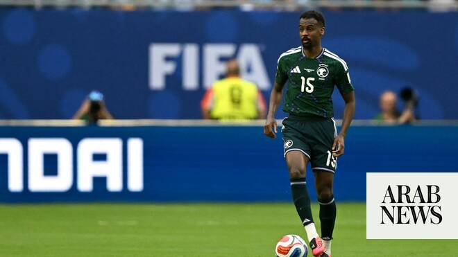

# ‘Dangerous’: Spain wary of Saudi threat as two fight for World Cup Group H supremacy

Source: https://www.arabnews.com/node/2647914/sport
Captured source: https://www.arabnews.com/node/2647914/sport
Published: 2026-06-20T11:40:57+03:00
Modified: 2026-06-20T11:40:57+03:00
Author: John Duerden

## Summary

LONDON: Spanish knowhow is helping Saudi Arabian football to develop and at the same time using that inside knowledge to warn their countrymen to expect a tough test in Sunday’s crucial 2026 World Cup clash in Atlanta. Before the 48-team tournament kicked off, few predicted that these two teams would be level on points after the opening games in Group H as Saudi Arabia drew

## Image

## Video Or Embed URLs

- https://static.addtoany.com/menu/sm.25.html
- about:blank
- https://www.google.com/recaptcha/api2/aframe
- https://imasdk.googleapis.com/js/core/bridge3.772.0_en.html
- https://cm.g.doubleclick.net/partnerpixels?gdpr=0&us_privacy=1---&gpp_sid=-1&url=https%3A%2F%2Fwww.arabnews.com%2Fnode%2F2647914%2Fsport

## Text

https://arab.news/vb36t

Ramon Planes, who spent the past two years as sports director of Al-Ittihad, has warned his countrymen this version of the Green Falcons is better than the one that beat Argentina 2-1 at the 2022 World Cup

LONDON: Spanish knowhow is helping Saudi Arabian football to develop and at the same time using that inside knowledge to warn their countrymen to expect a tough test in Sunday’s crucial 2026 World Cup clash in Atlanta.

For the latest updates, follow us @ArabNewsSport

Before the 48-team tournament kicked off, few predicted that these two teams would be level on points after the opening games in Group H as Saudi Arabia drew 1-1 with Uruguay, and Spain were, much more surprisingly, held to a 0-0 draw by debutants Cape Verde.

That result has led to a lot of criticism coming the way of the coach Luis de la Fuente in the Spanish media. It has also brought a renewed determination not to slip up against a Saudi Arabian side that is looking to reach the knockout stages for the second time in their seventh appearance.

Indeed, Ramon Planes, who spent the past two years as sports director of Jeddah giants Al-Ittihad, has warned his countrymen that this current version of the Asian team is better than the one that beat Argentina 2-1 at the 2022 World Cup.

“There is a team that is a mix between that (2022) generation, which is nearing its end, and the new one,” Planes said. “It is a team with much more experience, evidently, but also with young players who will form the base for the 2034 World Cup to be held in Saudi Arabia. I believe it is slightly more dangerous because it has more experience.”

The Spanish official also warned that the Green Falcons will present Spain with a tougher challenge than their opening game opponents from Africa. “They have a slightly higher tactical understanding than Cape Verde and are technically superior. They will face an opponent that can cause more offensive damage than Cape Verde did.”

Planes has also seen Georgios Donis in action as a head coach in the Saudi Pro League and has backed the Greek tactician, appointed to replace Herve Renard in April, to make a difference.

“Saudi Arabia is a well-coached team with a manager who knows Saudi football very well due to his experience in this field,” Planes added. “I know him, and he works very well tactically; he will have the team very organized, and Spain will face a tough opponent where the fact that Spain can open the first half will determine the course of the match. Against teams that concede possession, one must be more vertical, swift, and have a higher offensive intensity.”

Such comments have been echoed by Jason Remeseiro. The former Valencia winger joined Al-Fayha in 2025. “They are very passionate about football and have a winning mentality; in the long term, I know they will organize one of the best World Cups in history, but in the short term ... Spain shouldn’t get complacent,” Remeseiro said.

Saudi Arabia are also looking for a result that will put the knockout stages within touching distance. “The Saudi mentality does not conceive of going as a mere participant,” Planes said. “They are here to compete, to gain experience with young players for the 2034 World Cup, but to compete.

“Otherwise, they would not have changed the coach a month and a half before starting because they thought that with the previous one, they might not have that level of competitiveness that the new one brings.”

Sunday may show if the decision was the right one after the good result in the opening game. “From what I hear, they are very confident. They gained it from their good performance against Uruguay,” Planes said. “I think they can advance. They drew with a direct rival like Uruguay, and I sincerely believe they have a chance to progress.”
