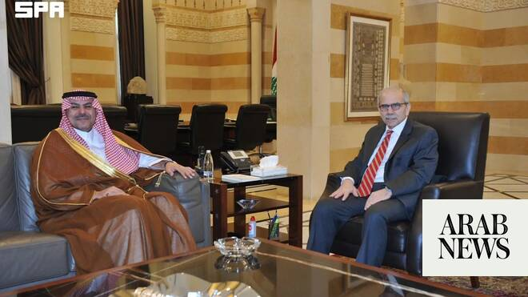

# Saudi ambassador to Lebanon meets Lebanese PM in Beirut, oversees resumption of exports to Kingdom

Source: https://www.arabnews.com/node/2647940/saudi-arabia
Captured source: https://www.arabnews.com/node/2647940/saudi-arabia
Published: 2026-06-20T17:05:00+03:00
Modified: 2026-06-20T21:30:28+03:00
Author: Arab News

## Summary

BEIRUT: Lebanese Prime Minister Nawaf Salam met with Fahd bin Abdulrahman Al-Dosari, Saudi Arabia’s newly accredited ambassador to Lebanon, in Beirut on Saturday. During the meeting, Al-Dosari conveyed the greetings of King Salman and Crown Prince Mohammed bin Salman to the Lebanese premier, the Saudi Press Agency reported. Salam wished the ambassador success in his new role,

## Image

## Video Or Embed URLs

- blob:https://www.arabnews.com/c43e01a3-3d25-475d-9fde-a46f80409fb5
- https://imasdk.googleapis.com/js/core/bridge3.772.0_en.html
- https://static.addtoany.com/menu/sm.25.html
- about:blank
- https://www.google.com/recaptcha/api2/aframe
- https://cm.g.doubleclick.net/partnerpixels?gdpr=0&us_privacy=1---&gpp_sid=-1&url=https%3A%2F%2Fwww.arabnews.com%2Fnode%2F2647940%2Fsaudi-arabia

## Text

https://arab.news/59b5d

Salam wished the ambassador success in his new role

BEIRUT: Lebanese Prime Minister Nawaf Salam met with Fahd bin Abdulrahman Al-Dosari, Saudi Arabia’s newly accredited ambassador to Lebanon, in Beirut on Saturday.

During the meeting, Al-Dosari conveyed the greetings of King Salman and Crown Prince Mohammed bin Salman to the Lebanese premier, the Saudi Press Agency reported.

Salam wished the ambassador success in his new role, and stressed the importance of continuing efforts to strengthen the longstanding ties between Lebanon and Saudi Arabia.

The meeting came as the two countries seek to deepen cooperation and reinforce their relations, SPA added.

Also on Saturday, Beirut port began shipping its first containers to Saudi Arabia’s Jeddah port following the Kingdom’s decision to lift its ban on Lebanese exports.

Speaking on Saturday, Al-Dossari said that the Kingdom’s decision to resume Lebanese exports affirms its support for Lebanon’s stability and sovereignty over all its territory.

Saudi Crown Prince Mohammed bin Salman had directed the resumption of Lebanese exports to the Kingdom “in accordance with the positive steps taken by the Lebanese government towards rebuilding state institutions.”

Meanwhile, Saudi Ambassador to Romania Khalid Al-Shammari recently presented a copy of his credentials to Minister of Foreign Affairs of Romania Oana-Silvia Toiu at the ministry’s headquarters in Bucharest.

They reviewed the distinguished bilateral relations between the two countries and ways to strengthen and develop them across various fields.
