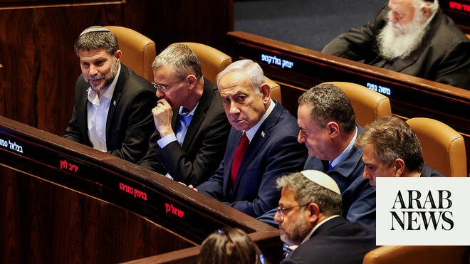

# Poll finds Israelis believe Iran won Middle East war

Source: https://www.arabnews.com/node/2648033/middle-east
Captured source: https://www.arabnews.com/node/2648033/middle-east
Published: 2026-06-21T16:52:49+03:00
Modified: 2026-06-21T16:53:26+03:00
Author: AFP

## Summary

JERUSALEM: Israelis overwhelmingly believe that Iran emerged stronger from the Middle East war and its subsequent deal with the United States, a poll released on Sunday found. The poll of 3,644 respondents, conducted between June 17 and 20 by the Hebrew University of Jerusalem in collaboration with the Agam Institute, paints a stark picture of public sentiment following the

## Image

## Video Or Embed URLs

- https://static.addtoany.com/menu/sm.25.html
- about:blank
- https://imasdk.googleapis.com/js/core/bridge3.772.0_en.html
- https://www.google.com/recaptcha/api2/aframe
- https://cm.g.doubleclick.net/partnerpixels?gdpr=0&us_privacy=1---&gpp_sid=-1&url=https%3A%2F%2Fwww.arabnews.com%2Fnode%2F2648033%2Fmiddle-east

## Text

https://arab.news/9wgde

The findings pointed to a broader crisis of confidence in Israel’s leadership

JERUSALEM: Israelis overwhelmingly believe that Iran emerged stronger from the Middle East war and its subsequent deal with the United States, a poll released on Sunday found.

The poll of 3,644 respondents, conducted between June 17 and 20 by the Hebrew University of Jerusalem in collaboration with the Agam Institute, paints a stark picture of public sentiment following the US-Iran deal.

Of those surveyed, 92.1 percent said Iran had won or gained more from the conflict, while 82.9 percent felt that Israel’s long-term security had been weakened.

The survey found that even among voters who support the right-wing bloc, the electoral base of Prime Minister Benjamin Netanyahu, 93.1 percent believed Iran had won.

Opposition to the US-Iran agreement was widespread, with 63.2 percent of respondents opposing it compared with just 12.1 percent expressing support.

The findings pointed to a broader crisis of confidence in Israel’s leadership.

Nearly three-quarters of those surveyed, 72.5 percent, said they did not believe Netanyahu’s claims about the military campaign’s achievements, while 56.4 percent rated his management of the campaign as “failed” or “poor.”

The poll also pointed to the political price paid by Netanyahu, with support for his premiership plummeting from 40.5 percent in early March to 29.4 percent in June.

Despite this, the survey found ongoing support for military action against Hezbollah in Lebanon.

Nearly half of respondents, 48.2 percent, backed renewed major military action against Hezbollah in Lebanon, even if it risked confrontation with Washington, while only 21 percent opposed such a move.

Negotiations to turn the temporary Iran-US agreement into a more permanent deal were to take place in Switzerland on Sunday, despite the conflict in Lebanon threatening negotiations.

Washington announced a renewed ceasefire there on Friday after Israeli troops clashed with Hezbollah fighters in southern Lebanon, with each side accusing the other of breaking the truce.
