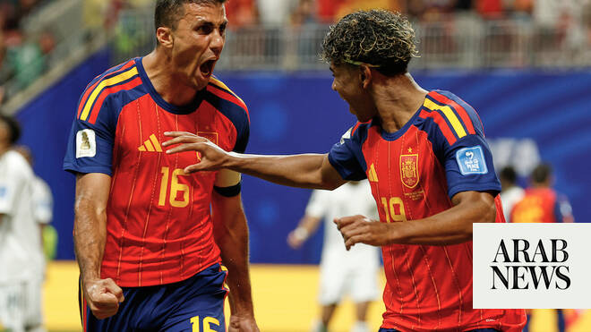

# Saudi World Cup progress in balance after heavy loss to Spain

Source: https://www.arabnews.com/node/2648050/sport
Captured source: https://www.arabnews.com/node/2648050/sport
Published: 2026-06-21T21:14:36+03:00
Modified: 2026-06-21T21:14:54+03:00
Author: Ali Khaled

## Summary

DUBAi: European champions Spain comprehensively beat Saudi Arabia 4-0 at Atlanta Stadium on Sunday night to leave the Green Falcons’ hopes of progress to the Round of 32 of the 2026 World Cup hanging in the balance. The result leaves Spain top of Group H with four points while Saudi are stuck on one point in third place. They will need a positive result in their last match if

## Image

## Video Or Embed URLs

- https://static.addtoany.com/menu/sm.25.html
- about:blank
- https://www.google.com/recaptcha/api2/aframe
- https://imasdk.googleapis.com/js/core/bridge3.772.0_en.html
- https://sync.teads.tv/iframe?pid=253554&gdprIab=%7B%22type%22%3A%22AddEventListenerDoesNotApply%22%2C%22reason%22%3A0%2C%22status%22%3A0%2C%22consent%22%3A%22%22%2C%22apiVersion%22%3A2%2C%22cmpId%22%3A300%7D&fromFormat=true&env=js-web&auctid=f7b96c3f-dad6-4fea-813c-a52ce21b48da&us_privacy=1---&1782068962753=
- https://cm.g.doubleclick.net/partnerpixels?gdpr=0&us_privacy=1---&gpp_sid=-1&url=https%3A%2F%2Fwww.arabnews.com%2Fnode%2F2648050%2Fsport

## Text

https://arab.news/wcuc7

The result leaves Spain top of Group H with four points while Saudi are stuck on one point in third place

DUBAi: European champions Spain comprehensively beat Saudi Arabia 4-0 at Atlanta Stadium on Sunday night to leave the Green Falcons’ hopes of progress to the Round of 32 of the 2026 World Cup hanging in the balance.

For the latest updates, follow us @ArabNewsSport

The result leaves Spain top of Group H with four points while Saudi are stuck on one point in third place. They will need a positive result in their last match if they are to get out of the group stages.

Spain had opted to start with Lamine Yamal after the 18-year-old superstar had started the opening match against Cape Verde on the bench. It was decision that almost paid immediate dividends as he went about attacking the left side of the Saudi defence from the start. A dangerous cross in the opening moments almost caused panic in the Green Falcons defence but was cleared to safety. A shot after 4 minutes was high and wide.

Saudi’s early game plan was clear, with almost two banks of five in front of goalkeeper Mohammed Al- Owais, inviting the Spanish team to break them down while hoping to retaliate on the break. It was an understandable policy considering the European Champions had failed to breach Cape Verde’s packed defence in Match Day 1.

Yamal’s big moment arrived on 11 minutes, tapping in a Mikel Oyarzabal cross from close range to give Spain the early lead they desperately craved. Saudi’s defending, however, left a lot to be desired.

Two minute later, Al-Owais stopped a second Spanish goal in quick succession by saving at Oyarzabal’s feet. After 15 minutes, Saudi’s front two of Feras Al-Buraikan and Salem Al-Dawsari had barely featured in the game.

Oyarzabal, who had not toucher the ball in the first half hour against Cape Verde, was much livelier here, and a long range shot after 17 minutes forced Al-Owais to save low to his right.

There was inevitability about Spain’s second, the busy Oyarzabal tapping home on 21 minutes after the Saudi defence had failed to clear the ball adequately. Georgios Donis and his men now had mountain to climb if they were to get anything from the game.

Three minutes later, Oyarzabal made it 3-0 - yet another yap in - and Saudi thoughts were already turning to simply avoiding further humiliation.

After 35 minutes Abdulelah Al-Amri - goal-scoring hero against Uruguay - tried his luck from distance but the ball bounced safely to Unai Simon. It barely qualified as an effort.

Oyarzabal almost grabbed his hat trick seconds later but his clipped short from a tight angle struck the bar.

Donis brought on Mohamed Kanno for Abdullah Al-Khaibari and Abdullah Al-Hamddan for Musab Al-Juwayr in an effort to turn the tide. It made little difference, even with Yamal also being hooked off.

From a 49th-minute corner, Marc Cucurella’s volley was deflected into his own net by Hassan Al-Tambakti to give Spain a four-goal lead.

Substitute Ferran Torres poked his shot wide when put through and almost made amends when tapping in Pedro Porro’s cross in stoppage time but the goal was rule out for offside.

In the last Match Day of Group H, Spain will face Uruguay while Saudi will take on Cape Verde.
