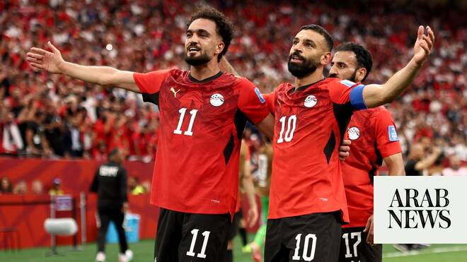

# Arab teams at 2026 World Cup: Egypt makes history as Saudi Arabia, Tunisia falter

Source: https://www.arabnews.com/node/2648087/sport
Captured source: https://www.arabnews.com/node/2648087/sport
Published: 2026-06-22T07:36:34+03:00
Modified: 2026-06-22T07:42:39+03:00
Author: Agencies

## Summary

Egypt beat New Zealand 3-1 for their first World Cup win in history Egypt earned the first World Cup win in their history by beating New Zealand 3-1 on Sunday, putting them on track to reach the knockout round for the first time. Mohamed Salah, Mostafa Zico and Trezeguet were Egypt’s scorers after Finn Surman had given New Zealand the lead after 15 minutes of the Group G match

## Image

## Video Or Embed URLs

- https://static.addtoany.com/menu/sm.25.html
- about:blank
- https://imasdk.googleapis.com/js/core/bridge3.772.0_en.html
- https://www.google.com/recaptcha/api2/aframe
- https://cm.g.doubleclick.net/partnerpixels?gdpr=0&us_privacy=1---&gpp_sid=-1&url=https%3A%2F%2Fwww.arabnews.com%2Fnode%2F2648087%2Fsport

## Text

https://arab.news/9cu8d

Egypt makes history with first World Cup win

Saudi and Tunisia fail to hit the mark and suffered losses on Sunday

Egypt beat New Zealand 3-1 for their first World Cup win in history

Egypt earned the first World Cup win in their history by beating New Zealand 3-1 on Sunday, putting them on track to reach the knockout round for the first time. For the latest updates, follow us @ArabNewsSport Mohamed Salah, Mostafa Zico and Trezeguet were Egypt’s scorers after Finn Surman had given New Zealand the lead after 15 minutes of the Group G match in Vancouver. The victory puts Egypt top of Group G on four points and needing just a draw against Iran in Seattle on Friday to move into the last 32. Salah’s goal came after he exchanged passes with Zico — named after the Brazilian legend — and then curled in a shot with his left foot in the 67th minute. Salah then provided the assist for substitute Trezeguet — who himself is named after former France forward David Trezeguet — to make the game safe with a low header. “In years to come we will remember that this was one of the achievements in history,” Salah said. He praised the large Egyptian contingent in the crowd, saying: “It feels like we are playing in Egypt. It’s a great win and great vibe.” Egypt had trailed the Kiwis, who opened the scoring through Surman’s towering header after 15 minutes. But Zico equalized when he headed in a cross from Mohamed Hany.

For the latest updates, follow us @ArabNewsSport

Yamal off the mark at World Cup in Spain rout as Iran hold Belgium

Lamine Yamal made a goalscoring return for Spain as the European champions got their World Cup campaign back on track with a 4-0 drubbing of Saudi Arabia on Sunday. Yamal, 18, opened the scoring after just 10 minutes of the Group H game in Atlanta to put La Roja on course for a comfortable victory against an outclassed Saudi team. Spain had been determined to bounce back after being held to a shock 0-0 draw by lowly Cape Verde in their opening game last week, when their much-vaunted attack drew a blank. But with teenaged starlet Yamal making his first start in two months since recovering from a hamstring problem, Spain launched an early onslaught that left the Saudis reeling. Yamal ghosted in at the back post to tuck away Mikel Oyarzabal’s low cross before Oyarzabal scored twice in three minutes to leave Spain 3-0 up after just 24 minutes. Spain bagged their fourth goal on 49 minutes, when Marc Cucurella’s shot was saved by Saudi goalkeeper Mohammed Al-Owais only to bounce off defender Hassan Al-Tambakti into the net. Spain coach Luis De la Fuente said his squad had been fueled by criticism of their opening performance. “When someone questions your work, it is only human that anyone with courage and pride reacts to prove people wrong,” said De la Fuente. The win leaves Spain on top of Group H with four points after two matches. Cape Verde will attempt to join the Spaniards on four points later Sunday when they face Uruguay in Miami, with coach Pedro Leitao Brito, known as “Bubista,” vowing his team will play “without fear.” “We didn’t come just to take part. We want to play all the matches and to be able to show that we have the level to take on the best teams in the world,” he added. “Our aim is to play all the games with courage, in an organized way but also without fear.”

- Belgium frustrated by Iran -

In Los Angeles, meanwhile, Belgium are still waiting for their first win after being held to a 0-0 draw by Iran in Group G. The Red Devils, who also drew with Egypt in their opening game, finished the game with 10 men and struggled to break down a resolute Iranian side despite dominating possession. For the second Iran game running, protesters from Los Angeles’ large Persian exile community gathered at the stadium to chant against the country’s hard-line regime. Inside the stadium, Iran’s anthem again drew a chorus of boos and whistles — a reception at odds with the response to the players themselves, who were loudly cheered. Iran’s Mehdi Taremi had the ball in the net from a clever first-half free-kick that was ruled out by VAR, while Belgium’s Nathan Ngoy was sent off after the break for hauling down the striker following a mis-hit backpass. The result means all three games so far in Group G have ended in draws. With just two points from two games, Belgium will be targeting a big win against the World Cup’s lowest-ranked team, New Zealand, in their final group game in Vancouver on Friday.

Japan coach Moriyasu praises Kamada after standout performance in new role

Japan ‌coach Hajjime Moriyasu was delighted with the performance of his side after their 4-0 ​victory over Tunisia on Saturday in Monterrey. Japan were dominant throughout despite the absence of injured playmaker Takefusa Kubo. The victory took Japan one step closer to qualifying for the knockout rounds, while eliminating Tunisia. “It was our ‌second game of ‌the World Cup, ​a ‌match ⁠of ​high tension, ⁠and one that people all over the world were watching. I am very happy that we were able to secure a victory in such a game,” he said. “As a team, seeing ⁠players pick up injuries is, ‌of course, highly ‌regrettable and a painful blow. ​However, we have ‌built this squad around the concept ‌of whoever steps onto the pitch can win, and whoever partners up can function effectively.”
