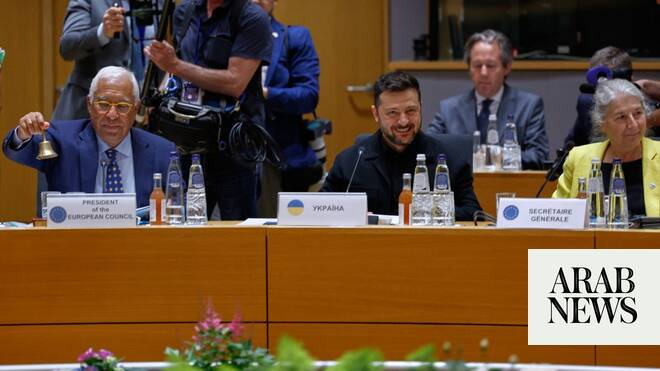

# Leaders of European powers to meet for Ukraine talks

Source: https://www.arabnews.com/node/2648119/world
Captured source: https://www.arabnews.com/node/2648119/world
Published: 2026-06-22T12:04:29+03:00
Modified: 2026-06-22T12:06:41+03:00
Author: AFP

## Summary

ROME: The leaders of Europe’s top military powers will meet Wednesday in Berlin, Italy said on Monday, as Europe aims to play a bigger role in trying to end the Ukraine war. The government said Prime Minister Giorgia Meloni would attend the meeting with her British, French, German and Polish counterparts. The announcement came just before British Prime Minister Keir Starmer

## Image

## Video Or Embed URLs

- https://static.addtoany.com/menu/sm.25.html
- about:blank
- https://www.google.com/recaptcha/api2/aframe
- https://imasdk.googleapis.com/js/core/bridge3.773.0_en.html
- https://sync.teads.tv/wigo-no-slot
- https://cm.g.doubleclick.net/partnerpixels?gdpr=0&us_privacy=1---&gpp_sid=-1&url=https%3A%2F%2Fwww.arabnews.com%2Fnode%2F2648119%2Fworld

## Text

https://arab.news/5fu48

The government said Prime Minister Giorgia Meloni would attend the meeting with her British, French, German and Polish counterparts

ROME: The leaders of Europe’s top military powers will meet Wednesday in Berlin, Italy said on Monday, as Europe aims to play a bigger role in trying to end the Ukraine war. The government said Prime Minister Giorgia Meloni would attend the meeting with her British, French, German and Polish counterparts. The announcement came just before British Prime Minister Keir Starmer said he would resign but remain in office until a new leader is chosen, meaning he could still attend the meeting. The E5 group was formed in 2024 following increasing calls for European rearmament and to improve coordination to support Ukraine against the Russian invasion. German Chancellor Friedrich Merz had said the meeting would take place this week without specifying a date. At last week’s G7 summit attended by Ukrainian President Volodymyr Zelensky, leaders agreed to increase supplies of air defense equipment to Ukraine and boost sanctions on Russia. The G7 leaders also agreed to grant licenses for Ukraine-based companies to produce long-range missiles and air defense systems, a diplomatic source said. But Zelensky has called for Europe to do more as US efforts to end the fighting have faded. A European Union official said EU chief Antonio Costa’s office had made “brief contacts at diplomatic level” with Moscow aimed at opening communication channels. But some EU states have been wary about reaching out to Kremlin, with diplomats saying several leaders pushed backed against Costa’s efforts at last week’s EU summit in Brussels.
