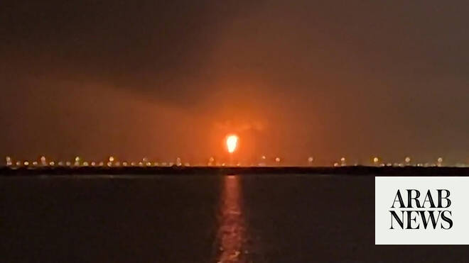

# Qatar gas plant blast kills 13, injures dozens, says energy minister

Source: https://www.arabnews.com/node/2648155/middle-east
Captured source: https://www.arabnews.com/node/2648155/middle-east
Published: 2026-06-22T17:30:49+03:00
Modified: 2026-06-22T17:33:07+03:00
Author: AFP

## Summary

DOHA: A huge blast at a Qatar gas hub killed 13 people and injured 66 others, the Gulf state’s energy minister said on Monday, one of the deadliest accidents at a Gulf energy facility. Authorities are investigating the cause of the incident, which Saad Al-Kaabi said was “an accident and not sabotage or hostile in nature,” after Iranian attacks targeted energy facilities in the

## Image

## Video Or Embed URLs

- https://859fdcf87c45c48601acc6f8dee84812.safeframe.googlesyndication.com/safeframe/1-0-45/html/container.html
- https://static.addtoany.com/menu/sm.25.html
- about:blank
- https://imasdk.googleapis.com/js/core/bridge3.773.0_en.html
- https://www.google.com/recaptcha/api2/aframe
- https://cm.g.doubleclick.net/partnerpixels?gdpr=0&us_privacy=1---&gpp_sid=-1&url=https%3A%2F%2Fwww.arabnews.com%2Fnode%2F2648155%2Fmiddle-east

## Text

https://arab.news/wf2hw

Saad Al-Kaabi said incident was “accident and not sabotage or hostile in nature”

Qatar’s interior ministry described Sunday’s incident as an “internal explosion”

DOHA: A huge blast at a Qatar gas hub killed 13 people and injured 66 others, the Gulf state’s energy minister said on Monday, one of the deadliest accidents at a Gulf energy facility.

Authorities are investigating the cause of the incident, which Saad Al-Kaabi said was “an accident and not sabotage or hostile in nature,” after Iranian attacks targeted energy facilities in the Gulf during the Middle East war.

He announced “the tragic loss of 13 lives of our people who hold Indian and Pakistani nationalities. 66 people have been reported injured and are receiving medical treatment, none of whom are in life-threatening condition.”

Earlier, the interior ministry had said a “technical incident” caused the explosion late on Sunday in the Gulf emirate’s Ras Laffan industrial zone.

The blast took place at a unit supplying gas to local firms and reverberated across the capital Doha.

“It will not affect anything regarding export. It will not affect anything regarding our local requirements,” Kaabi said, adding the explosion had “no environmental impact.”

An AFP journalist 20 kilometers (12 miles) away saw bright orange flames and a plume of smoke rising from the area, home to the world’s largest liquefied natural gas hub.

- ‘Internal explosion’ -

Qatar’s state-owned energy company said the blast occurred “during the start-up of operations at Ras Laffan Industrial City, which resulted in an explosion and fire at Barzan local gas supply facility.”

Late Sunday, QatarEnergy said the fire had been brought under control after emergency response teams were deployed.

Ras Laffan had already been badly damaged in the US-Iran war as Iranian strikes targeted Gulf energy infrastructure and forced Qatar to halt gas production.

Kaabi said the status of the Strait of Hormuz and attacks on Gulf nations remained a “geopolitical, military issue” drawing a line between Sunday’s explosion which he said was “different.”

“We have to take it in stride and move on and learn from it,” the minister added.

Earlier Qatar’s interior ministry described Sunday’s incident as an “internal explosion,” adding in a later statement that a “technical malfunction” was to blame.

At the time of the explosion, AFP journalists in the Qatari capital heard the blast at the facility on the country’s northern coast, 64 kilometers (40 miles) to the north.
