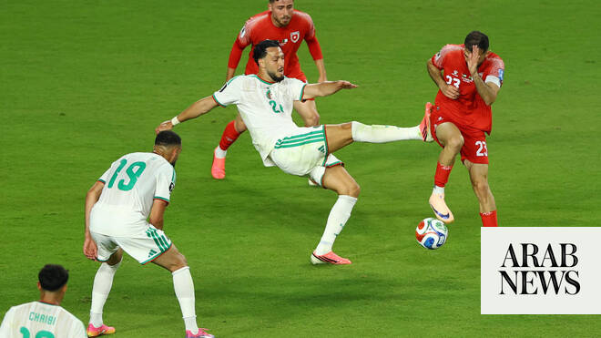

# Arab teams at 2026 World Cup: Algeria wins over Jordan while Iraq concedes against France

Source: https://www.arabnews.com/node/2648211/sport
Captured source: https://www.arabnews.com/node/2648211/sport
Published: 2026-06-23T08:03:38+03:00
Modified: 2026-06-23T08:05:03+03:00
Author: Agencies

## Summary

PHILADELPHIA: Jordan failed to secure a win in its second World Cup game in California against Algeria on Tuesday. After dominating the first half of the game with a goal by Nizar Al Rashdan in minute 36, Jordan conceded two goals to Algeria. With one game left, Jordan is set to face off reigning champions Argentina and Algeria is set to play Austria on Sunday. Meanwhile,

## Image

## Video Or Embed URLs

- https://static.addtoany.com/menu/sm.25.html
- about:blank
- https://www.google.com/recaptcha/api2/aframe
- https://imasdk.googleapis.com/js/core/bridge3.773.0_en.html
- https://sync.teads.tv/wigo-no-slot
- https://cm.g.doubleclick.net/partnerpixels?gdpr=0&us_privacy=1---&gpp_sid=-1&url=https%3A%2F%2Fwww.arabnews.com%2Fnode%2F2648211%2Fsport

## Text

https://arab.news/vee7u

PHILADELPHIA: Jordan failed to secure a win in its second World Cup game in California against Algeria on Tuesday. For the latest updates, follow us @ArabNewsSport After dominating the first half of the game with a goal by Nizar Al Rashdan in minute 36, Jordan conceded two goals to Algeria. With one game left, Jordan is set to face off reigning champions Argentina and Algeria is set to play Austria on Sunday. Meanwhile, Kylian Mbappe scored his second brace in as many matches as France eased ‌into the last 32 with a 3-0 victory over Iraq on Monday in the first match of this World Cup beset by a lengthy weather stoppage. The goals for Mbappe, in his 100th cap, came nearly three hours apart after thunderstorms ​in the region delayed the second-half kickoff by approximately two hours. “The first half was good,” French manager Didier Deschamps said. “In the second half, we picked up where we left off, bearing in mind that it wasn’t easy given what happened, and we managed to put the game beyond reach. That’s a very good thing.” Mbappe now sits on 16 all-time World Cup goals, pulling level with the former record-holder, Germany’s Miroslav Klose. Earlier on Monday, Lionel Messi set a new benchmark of 18 World Cup goals with a brace in Argentina’s 2-0 win over Austria. Mbappe’s four goals also put him one behind Messi in the Golden Boot ‌race. Reigning Ballon d’Or ‌winner Ousmane Dembele also scored after halftime for two-time champions France, ​who ‌will ⁠face Norway ​on ⁠Saturday with the Group I title on the line. Norway defeated Senegal 3-2 later Monday night to also move to 2-0-0 in the event. Because of their superior goal difference, France need only a draw against Norway on Friday in Foxborough, Mass., to top the group. Dembele had faced criticism for what some regarded as a poor performance in France’s 3-1 opening win over Senegal. “There’s no issue,” Deschamps said. “Ousmane is confident in himself. He can sometimes get people talking, but I have complete faith in him. He’s still finding his bearings because his role is ⁠different from the one he has at his club.” Iraq remain alive for one ‌of the eight third-place spots that will qualify for the round ‌of 32. They probably would need a win in their group finale ​against Senegal and help elsewhere. They could be without ‌Aymen Hussein, who scored in their 4-1 opening defeat by Norway but came off in the ‌26th minute on Monday with an apparent injury. “You have one moment of excellence from one of the best players in the world,” Ali Al-Hamadi, who came on for Hussein, said of Mbappe’s first-half goal. “And then we have to go inside and wait for an hour and a half. You know, it’s really difficult to come out and keep the same ‌intensity against these great players. And in the end I think we made too many mistakes again.” France dominated the early stages and Mbappe capitalized ⁠in the 14th minute. After ⁠an innocent-looking sequence on the right, Mbappe received Michael Olize’s pass, took one touch to his left, and with defenders affording him space, unfurled a powerful strike from the edge of the area that sailed beyond Ahmed Basil’s dive. The 20-yard blast came off his weaker left foot. The weather delay could have served as a recovery period for Iraq, who spent most of the first half chasing the ball. Instead, they gifted France and Mbappe a second in the 54th minute after a dreadful mistake from a goal kick. Dembele was the provider for Mbappe’s tap-in. Dembele scored himself 12 minutes later after controlling Olize’s incisive pass and finishing low past Basil. With the outcome never in doubt, the weather provided most of the drama. After referee Drew Fischer blew his halftime whistle as the storms were already beginning, the skies opened further ​and spectators were told to seek shelter in the ​stadium concourses. The players finally re-emerged for warm-ups about 1 hour, 40 minutes later, and even then, the restart was delayed further as stadium personnel used squeegees to shuttle standing water off the east side of the pitch.

For the latest updates, follow us @ArabNewsSport
