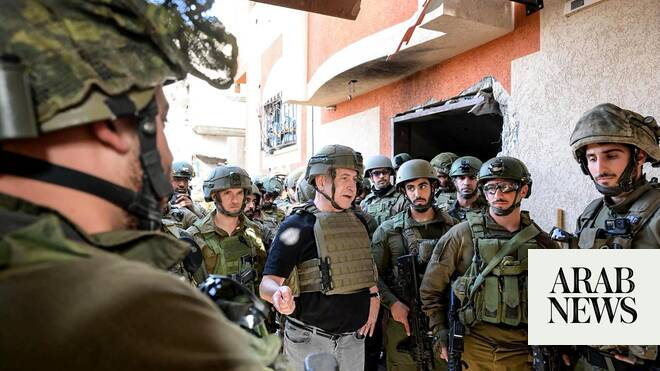

# Netanyahu vows to break free from dependency, pledges to manufacture own arms

Source: https://www.arabnews.com/node/2648249/middle-east
Captured source: https://www.arabnews.com/node/2648249/middle-east
Published: 2026-06-23T13:13:01+03:00
Modified: 2026-06-23T13:42:56+03:00
Author: Arab News

## Summary

DUBAI: Israeli Prime Minister Benjamin Netanyahu said Tuesday that Israel must develop an independent defense industry and reduce its reliance on foreign weapons supplies, while praising support from the United States. Speaking during a meeting with a reserve combat officers’ course at Kibbutz Migdal Oz in Gush Etzion, Netanyahu said Israel’s future security depended on

## Image

## Video Or Embed URLs

- blob:https://www.arabnews.com/12b69b68-3cd9-4537-baff-35773f60ee23
- https://imasdk.googleapis.com/js/core/bridge3.773.0_en.html
- https://platform.twitter.com/embed/Tweet.html?creatorScreenName=Arab_News&creatorUserId=69172612&dnt=false&embedId=twitter-widget-0&features=eyJ0ZndfdGltZWxpbmVfbGlzdCI6eyJidWNrZXQiOltdLCJ2ZXJzaW9uIjpudWxsfSwidGZ3X2ZvbGxvd2VyX2NvdW50X3N1bnNldCI6eyJidWNrZXQiOnRydWUsInZlcnNpb24iOm51bGx9LCJ0ZndfdHdlZXRfZWRpdF9iYWNrZW5kIjp7ImJ1Y2tldCI6Im9uIiwidmVyc2lvbiI6bnVsbH0sInRmd19yZWZzcmNfc2Vzc2lvbiI6eyJidWNrZXQiOiJvbiIsInZlcnNpb24iOm51bGx9LCJ0ZndfZm9zbnJfc29mdF9pbnRlcnZlbnRpb25zX2VuYWJsZWQiOnsiYnVja2V0Ijoib24iLCJ2ZXJzaW9uIjpudWxsfSwidGZ3X21peGVkX21lZGlhXzE1ODk3Ijp7ImJ1Y2tldCI6InRyZWF0bWVudCIsInZlcnNpb24iOm51bGx9LCJ0ZndfZXhwZXJpbWVudHNfY29va2llX2V4cGlyYXRpb24iOnsiYnVja2V0IjoxMjA5NjAwLCJ2ZXJzaW9uIjpudWxsfSwidGZ3X3Nob3dfYmlyZHdhdGNoX3Bpdm90c19lbmFibGVkIjp7ImJ1Y2tldCI6Im9uIiwidmVyc2lvbiI6bnVsbH0sInRmd19kdXBsaWNhdGVfc2NyaWJlc190b19zZXR0aW5ncyI6eyJidWNrZXQiOiJvbiIsInZlcnNpb24iOm51bGx9LCJ0ZndfdXNlX3Byb2ZpbGVfaW1hZ2Vfc2hhcGVfZW5hYmxlZCI6eyJidWNrZXQiOiJvbiIsInZlcnNpb24iOm51bGx9LCJ0ZndfdmlkZW9faGxzX2R5bmFtaWNfbWFuaWZlc3RzXzE1MDgyIjp7ImJ1Y2tldCI6InRydWVfYml0cmF0ZSIsInZlcnNpb24iOm51bGx9LCJ0ZndfbGVnYWN5X3RpbWVsaW5lX3N1bnNldCI6eyJidWNrZXQiOnRydWUsInZlcnNpb24iOm51bGx9LCJ0ZndfdHdlZXRfZWRpdF9mcm9udGVuZCI6eyJidWNrZXQiOiJvbiIsInZlcnNpb24iOm51bGx9fQ%3D%3D&frame=false&hideCard=false&hideThread=false&id=2069358137778331686&lang=en&origin=https%3A%2F%2Fwww.arabnews.com%2Fnode%2F2648249%2Fmiddle-east&sessionId=e758088009328e214201072d33a88478f26498d5&siteScreenName=Arab_News&siteUserId=69172612&theme=light&widgetsVersion=6a3ad42b224df%3A1778106238597&width=550px
- https://static.addtoany.com/menu/sm.25.html
- https://platform.twitter.com/widgets/widget_iframe.1227a5674072e080ffb1ba14ac0c1079.html?origin=https%3A%2F%2Fwww.arabnews.com
- about:blank
- https://www.google.com/recaptcha/api2/aframe
- https://cm.g.doubleclick.net/partnerpixels?gdpr=0&us_privacy=1---&gpp_sid=-1&url=https%3A%2F%2Fwww.arabnews.com%2Fnode%2F2648249%2Fmiddle-east

## Text

https://arab.news/8sxjc

DUBAI: Israeli Prime Minister Benjamin Netanyahu said Tuesday that Israel must develop an independent defense industry and reduce its reliance on foreign weapons supplies, while praising support from the United States.

Speaking during a meeting with a reserve combat officers’ course at Kibbutz Migdal Oz in Gush Etzion, Netanyahu said Israel’s future security depended on building its own military capabilities.

“I deeply appreciate the support we have received, and which I have also brought over the years, from our American friends,” Netanyahu said. “But today I say: We need our own independent armaments network. We must manufacture our own armaments.”

Netanyahu said Israel was facing threats from Iran and its regional allies, adding that while Israel had “dealt them blows,” the conflict was not over.

“Where we will be 30 years from now depends on our strength,” he said, stressing the need to expand military production, integrate technology and train future generations of commanders.
