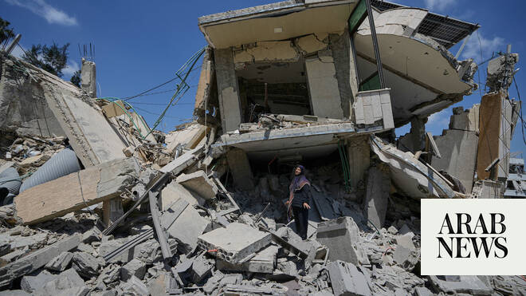

# Israel, Lebanon discuss pilot scheme to hand over territory

Source: https://www.arabnews.com/node/2648375/middle-east
Captured source: https://www.arabnews.com/node/2648375/middle-east
Published: 2026-06-24T11:43:50+03:00
Modified: 2026-06-24T20:23:55+03:00
Author: Reuters

## Summary

JERUSALEM/BEIRUT: Lebanon and Israel are discussing a US-backed proposal for Israeli forces to transfer some of the Lebanese territory ​invaded in their war with Hezbollah to Lebanon’s military, officials on both sides said. The proposed pilot project is part of the latest round of Israeli-Lebanese talks in Washington, which are going ahead even after they appear to have been

## Image

## Video Or Embed URLs

- https://static.addtoany.com/menu/sm.25.html
- about:blank
- https://imasdk.googleapis.com/js/core/bridge3.773.0_en.html
- https://www.google.com/recaptcha/api2/aframe
- https://cm.g.doubleclick.net/partnerpixels?gdpr=0&us_privacy=1---&gpp_sid=-1&url=https%3A%2F%2Fwww.arabnews.com%2Fnode%2F2648375%2Fmiddle-east

## Text

https://arab.news/jc54v

Lebanese ‌troops involved ‌would undergo US training and vetting to ‌ensure they are not linked to ⁠Hezbollah

President Joseph Aoun confirms that discussion on the plan were ongoing and awaiting Israeli approval

JERUSALEM/BEIRUT: Lebanon and Israel are discussing a US-backed proposal for Israeli forces to transfer some of the Lebanese territory ​invaded in their war with Hezbollah to Lebanon’s military, officials on both sides said. The proposed pilot project is part of the latest round of Israeli-Lebanese talks in Washington, which are going ahead even after they appear to have been eclipsed by Iran’s move to make Lebanon central to its talks with the United States. An Israeli drone strike on a car in southern Lebanon on Wednesday killed at least two people, Lebanese security and medical sources told Reuters, despite a new ceasefire. The Israeli military told Reuters it was checking the reports. Earlier, it said its air force had struck two armed Hezbollah fighters near the zone controlled by Israeli troops in southern Lebanon in a separate incident. Israeli forces have seized a swathe of southern Lebanon during the war that was ignited when Hezbollah opened fire ‌at Israel in support ‌of Tehran, days after the US and Israel launched strikes on Iran. A ceasefire has ​largely ‌held ⁠since Sunday, ​but ⁠Israeli forces are still deployed deep inside southern Lebanon, citing the need to shield northern Israel from Hezbollah attack. Facing an election by late October, Prime Minister Benjamin Netanyahu said on Wednesday that Israel will keep its “buffer zone” in southern Lebanon as long as he remains prime minister. Israel’s ambassador to the United Nations, Danny Danon, told reporters in New York that Israel was looking to hand over some of the territory it was occupying to the Lebanese military, although it was unclear how much land Israel would withdraw from.

“Eventually, we want to pull back to the river and to allow the Lebanese military to take over those positions,” said Danon, referring to the Litani River about 30km north of the ⁠border with Israel. Lebanon has said one of its key goals in the talks would be ‌securing a full Israeli military withdrawal.

The Israeli ‌officials said the Lebanese troops involved in the US-backed proposal would undergo US ​training and vetting to ensure they are not linked to Hezbollah, ‌while Israel would maintain a military presence in a buffer zone along the border. Asked about the Israeli officials’ comments, a senior Lebanese ‌security official said discussions were ongoing in Washington and that specific military-to-military talks, including on the pilot zones, would take place on Wednesday. The Lebanese official said the discussions would focus on a timeline for Israeli withdrawal and that any plan would emerge only after the final day of talks on Thursday. The official did not respond to a request for comment on the Israeli officials’ account of US vetting of Lebanese troops. Lebanese President Joseph Aoun ‌told a British-German delegation that discussions on the proposed “pilot areas” were ongoing and awaiting Israeli approval, the Lebanese presidency said. Lebanon’s army, which recruits from across the country’s sectarian mosaic, has long received US ⁠military aid, part of US policy ⁠to bolster government security institutions in a country where critics say Hezbollah has undermined the state. Hezbollah, a Lebanese Shiite Muslim group established by Iran’s Revolutionary Guards in 1982, has consistently demanded the Lebanese government withdraw from the US-backed talks with Israel — Beirut’s highest-level contacts with Israel in decades.

Prime Minister Nawaf Salam meanwhile said the negotiations with Israel were the least costly option for Lebanon.

“This is the shortest path toward ending the occupation and enabling our people in the south to return to their towns and villages, especially when all efforts are united under the authority of the state,” he said on Wednesday.

While Salam acknowledged a proposal to establish a deconfliction cell aimed at halting military operations and maintaining the ceasefire in the country, he noted that “we are not restraining weapons in order to please Israel. This is an independent Lebanese matter that has been agreed upon, and we have been delayed for a long time in implementing it.”

He insisted that the Lebanese government wanted the negotiations to lead to a complete Israeli withdrawal.

“We also demand the release of the prisoners and the resolution of the remaining disputed points along the border,” Salam said.
