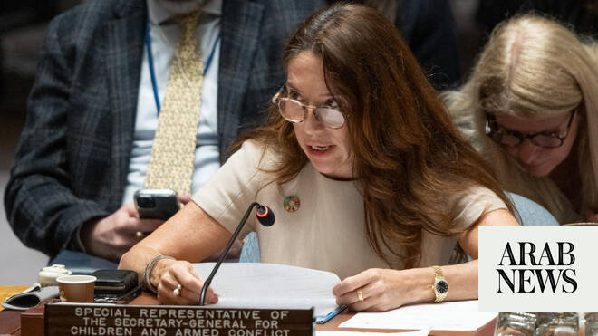

# UN child rights chief slams ‘increased impunity toward international law’ in interview with Arab News

Source: https://www.arabnews.com/node/2648489/world
Captured source: https://www.arabnews.com/node/2648489/world
Published: 2026-06-25T01:02:27+03:00
Modified: 2026-06-25T05:46:06+03:00
Author: Ephrem Kossaify

## Summary

NEW YORK: “When I’m talking about them, I’m counting those numbers, reciting the numbers in the council. I have images of children in my mind,” Vanessa Frazier, the UN special representative for children and armed conflict, told Arab News, describing how she carries the toll of her own report — 38,558 grave violations against 24,174 children in 2025 — into the Security Council

## Image

## Video Or Embed URLs

- https://9ff21d359ce32ba2021f4b89f54de818.safeframe.googlesyndication.com/safeframe/1-0-45/html/container.html
- https://static.addtoany.com/menu/sm.25.html
- about:blank
- https://imasdk.googleapis.com/js/core/bridge3.773.0_en.html
- https://www.google.com/recaptcha/api2/aframe
- https://cm.g.doubleclick.net/partnerpixels?gdpr=0&us_privacy=1---&gpp_sid=-1&url=https%3A%2F%2Fwww.arabnews.com%2Fnode%2F2648489%2Fworld

## Text

https://arab.news/gtj3s

For first time govts, not armed groups, are top perpetrators of violations against children

‘These aren’t tragic accidents of war, but the foreseeable and avoidable consequences of political and military strategic choices’

NEW YORK: “When I’m talking about them, I’m counting those numbers, reciting the numbers in the council. I have images of children in my mind,” Vanessa Frazier, the UN special representative for children and armed conflict, told Arab News, describing how she carries the toll of her own report — 38,558 grave violations against 24,174 children in 2025 — into the Security Council chamber.

Frazier briefed the council on Wednesday on her office’s annual report, which found that government forces, not armed terror groups, are now the leading perpetrators of grave violations against children for the first time in the three-decade history of the mandate.

“This report isn’t a wake-up call,” she told members. “After decades of evidence, warnings and appeals, the international community can’t claim ignorance of what’s happening to children in armed conflict.

“If we’re still not awake after all that millions of children have and continue to endure, then we must confront a far more troubling truth — that inaction isn’t the result of ignorance. It’s a conscious political choice.”

When Arab News asked her why the situation for children keeps worsening even though governments are aware of what is happening, Frazier said: “There’s this increased impunity toward international law, and there are many reasons for this happening … Children can be protected. Tools are there to enforce the protection.”

She stressed that her office’s role is not to assign blame after the fact, but to get parties to change course.

“We aren’t an accountability mechanism. We’re a protection-of-civilians mechanism,” she said. “It’s important that the actors that are listed on our report are forced, literally forced with the tools that are available, to enter into action plans with us, because through these action plans we protect children, and that’s how we end and prevent grave violations.”

The secretary-general’s report verified 38,558 grave violations against 24,174 children in 2025, the highest figure since the mandate’s creation in 1996.

Killing and maiming topped the list of violations, affecting 14,224 children, including 6,266 killed.

Denial of humanitarian access was recorded in 8,322 incidents, while 6,607 children were recruited and used by parties to conflict, 5,129 were abducted, and 1,783 were raped or subjected to other sexual violence.

In her speech, Frazier cited an April 9 Israeli airstrike on Gaza City that killed 21 members of one family, including 12 children, among the incidents verified by the UN.

“These aren’t tragic accidents of war,” she told the council, “but the foreseeable and avoidable consequences of political and military strategic choices.”

She also warned of a “dangerous transformation” in how wars are fought, with the growing use of unmanned systems and artificial intelligence risking greater harm to children unless paired with “meaningful human oversight.”

She said: “Technology mustn’t outpace responsibility. No technological advancement can justify a retreat from our duty to protect children in armed conflict.”

In her interview with Arab News, Frazier said what shocked her most in compiling the report was not the data.

“What shocks me is when I actually go on the ground and meet with victims and with the children, with survivors. That’s what shocks me, because it humanizes these numbers.”

She said she was encouraged by the response inside the chamber, adding: “I’m very heartened by the immense support for my mandate and for my office, so I hope that the support translates into action.”

But she was unsparing about what the findings say about the state of international law, drawing on her own years sitting on the council as a permanent representative before taking up her current post.

“It shows that they’re increasingly getting away with violations of international law and international humanitarian law, and it must be stopped,” she said.

In her council address, Frazier said half of the harm done to children in conflict today “could be avoided if member states were to act with resolve,” pressing the nine state-armed and security forces listed in her report’s annexes to change how they wage war and to engage with her office on action plans.

She noted that her office is negotiating such plans with parties in Colombia, Myanmar, Sudan and the Syrian Arab Republic, and that roughly 40 commitments had been made by conflict parties over the past year, alongside the release or reintegration of 13,112 children formerly associated with armed forces or groups.

“Let me be clear: We don’t face a vacuum of international humanitarian law,” she told the council. “The rules exist. The principles are clear. What’s missing is political will.”

She closed her briefing by reading a message from a child, conveyed through her office’s “Prove It Matters” campaign: “Dear World Leaders, I wish that you can open your eyes and see what is happening in the world ... If you really want to help, you don’t need to just talk, you also need to take action.” Her own message to world leaders, she told Arab News, is simpler still: “Do your duty.”

Frazier’s briefing came against the backdrop of an escalating dispute with Israel’s ambassador to the UN, Danny Danon.

Israel topped the list countries responsible for violations, followed by the Democratic Republic of the Congo, Nigeria, Myanmar and Somalia, as well as Sudan.

In Israel and the Palestinian territories, the UN verified 12,445 grave violations committed against 5,663 children, 9,465 of which were attributed to Israeli armed and security forces.

The organization verified the killing of 57 Palestinian children in the West Bank, including East Jerusalem, as well as the maiming of 2,921 across that territory and Gaza, mostly from explosive weapons used in populated areas.

The report documented 828 attacks on Palestinian schools and hospitals, and nearly 6,000 incidents of denial of humanitarian access, as well as the killing of 184 humanitarian workers in Gaza during 2025 alone.

The dispute erupted when he criticized UN reports that blacklisted Israel, and when Frazier attempted to interject with a point of order, objecting to Danon’s “personal attacks” and defending the findings as based on “verified evidence.”

Danon shot back forcefully, telling her: “We’re a member state, and you work for the UN, and you’ll be quiet now.”

He later accused Frazier on social media of engaging with an antisemitic account that had shared an image comparing Israel to Nazi Germany.

She told Arab News: “It’s fake news. It’s a manipulated photo. You can put it through your verifications and see. There’s nothing that you’ll find on me that’s antisemitic.”

On Wednesday, ahead of the Security Council session, Danon repeated his accusations against Frazier and submitted a letter to the council formally calling for a review of her “continued tenure.”

In the letter, he accused her of using her position to “advance a political agenda” and disseminating “false allegations against Israel without proper verification” through her social media accounts.

Frazier told Arab News: “Unfortunately, this is to distract from what the aim of today is, and I don’t want to give it too much attention, because the aim is to focus on protecting children, not on protecting myself or my dignity or my reputation, which is very much intact.”
