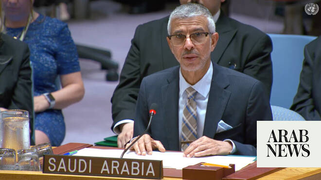

# Saudi UN envoy slams ‘flagrant violation of international humanitarian law’ in Gaza

Source: https://www.arabnews.com/node/2648490/middle-east
Captured source: https://www.arabnews.com/node/2648490/middle-east
Published: 2026-06-25T01:17:59+03:00
Modified: 2026-06-25T01:24:37+03:00
Author: Ephrem Kossaify

## Summary

NEW YORK: Saudi Arabia’s permanent representative to the UN, Abdulaziz Alwasil, told the Security Council on Wednesday that the protection of children in armed conflict “is not simply a legal obligation imposed by international humanitarian law” but “primarily a collective humanitarian responsibility.” The council reviewed the UN secretary-general’s latest annual report on

## Image

## Video Or Embed URLs

- https://4c02abfb005040cf4198fbb796d51c7b.safeframe.googlesyndication.com/safeframe/1-0-45/html/container.html
- https://static.addtoany.com/menu/sm.25.html
- about:blank
- https://imasdk.googleapis.com/js/core/bridge3.773.0_en.html
- https://www.google.com/recaptcha/api2/aframe
- https://cm.g.doubleclick.net/partnerpixels?gdpr=0&us_privacy=1---&gpp_sid=-1&url=https%3A%2F%2Fwww.arabnews.com%2Fnode%2F2648490%2Fmiddle-east

## Text

https://arab.news/p9as7

Abdulaziz Alwasil: Protection of children in armed conflict ‘a collective humanitarian responsibility’

Security Council reviews secretary-general’s latest annual report on children and armed conflict

NEW YORK: Saudi Arabia’s permanent representative to the UN, Abdulaziz Alwasil, told the Security Council on Wednesday that the protection of children in armed conflict “is not simply a legal obligation imposed by international humanitarian law” but “primarily a collective humanitarian responsibility.”

The council reviewed the UN secretary-general’s latest annual report on children and armed conflict, which found for the first time in three decades that government forces, not non-state armed groups, were responsible for the highest number of child casualties.

Speaking during the open debate, Alwasil noted that more than two decades had passed since the council adopted resolution 1612, which established the framework to monitor and report violations against children in conflict.

He said the international community must act with “extreme care” to achieve two goals: breaking the cycle of violence affecting children and remedying its effects, and preventing the creation of environments that incubate extremism.

Alwasil said Saudi Arabia had joined international frameworks including the Convention on the Rights of the Child and its optional protocol on children in armed conflict, adding that the Kingdom’s leadership has affirmed its commitment to international humanitarian and human rights law “stemming from its legal obligations and humanitarian and moral responsibilities.”

He said the Kingdom also upholds the Geneva Conventions and called for strengthened mechanisms to implement international humanitarian law, while condemning “all violations against children and civilians in general” and demanding accountability for perpetrators and unimpeded humanitarian access.

The envoy pointed to Saudi aid agency KSrelief’s work across more than 90 countries as an example of the Kingdom’s humanitarian engagement.

He stressed that international law affords special protection to the most vulnerable — women, children, the elderly, the extremely poor and internally displaced persons — and strictly prohibits forced displacement through violence, intimidation or deprivation of basic necessities.

Alwasil said what is happening in Gaza “is a flagrant violation of international humanitarian law and common human values,” calling for urgent international action to end what he described as an ongoing tragedy and to ensure protection of children and accountability for those responsible for grave violations.

He closed by describing the protection of civilians in conflict as “a legal obligation that can’t be evaded” and “a moral responsibility that can’t be ignored.”

He also called for enhanced international cooperation to prevent and address children’s suffering in conflict zones worldwide.
