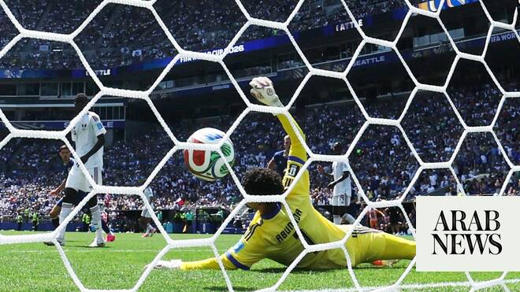

# Arab teams at 2026 World Cup: Morocco advances as Qatar bows out

Source: https://www.arabnews.com/node/2648501/sport
Captured source: https://www.arabnews.com/node/2648501/sport
Published: 2026-06-25T06:36:02+03:00
Modified: 2026-06-25T07:40:52+03:00
Author: Agencies

## Summary

SEATTLE: Bosnia-Herzegovina reached the knockout stages of the World Cup for the first time after beating 2022 hosts Qatar 3-1 in their final Group B match on Wednesday. Bosnia finished on four points and hours after their game had completed, FIFA announced they will be one of the best eight third-placed teams to progress to the last 32. Qatar meanwhile exit at the group

## Image

## Video Or Embed URLs

- about:blank
- https://static.addtoany.com/menu/sm.25.html
- https://imasdk.googleapis.com/js/core/bridge3.773.0_en.html
- https://sync.teads.tv/wigo-no-slot
- https://www.google.com/recaptcha/api2/aframe
- https://cm.g.doubleclick.net/partnerpixels?gdpr=0&us_privacy=1---&gpp_sid=-1&url=https%3A%2F%2Fwww.arabnews.com%2Fnode%2F2648501%2Fsport

## Text

https://arab.news/852ct

SEATTLE: Bosnia-Herzegovina reached the knockout stages of the World Cup for the first time after beating 2022 hosts Qatar 3-1 in their final Group B match on Wednesday. For the latest updates, follow us @ArabNewsSport Bosnia finished on four points and hours after their game had completed, FIFA announced they will be one of the best eight third-placed teams to progress to the last 32. Qatar meanwhile exit at the group stage, just as they did four years ago, but return home with the meagre consolation of having garnered a point this time as opposed to 2022 when they finished with none. Goals from Bosnia’s youngest ever World Cup player, 18-year-old Kerim Alajbegovic, and an own goal by Qatar goalkeeper Mahmoud Abunada looked to have put the European side in the box seat. However, Qatar made a game of it when 35-year-old Hassan Al-Haydos, their most capped player, pulled one back late in the first-half. Ermin Mahmic then put the game beyond the Qataris when he scored for the second successive match in the 80th minute. Bosnia flew out of the blocks as soon as the whistle went, testing Abunada twice inside the first four minutes. First Abunada denied Ermedin Demirovic’s fierce drive and then he tipped away Ivan Sunjic’s shot. Bosnia’s dominance finally paid off but it was not to be 40-year-old talisman Edin Dzeko who broke the deadlock but the sublimely-talented teenage left wing. Abunada was unable to do anything about Alajbegovic’s screamer from outside the area, after he had beaten two players. The youngster was mobbed by his team-mates and once they had trotted back to the halfway line he stood and milked the moment, putting a finger to his lips. Dzeko, winning his 150th cap, came more and more into the game and not wishing to have his thunder stolen by the new kid on the block he played an integral role in their second five minutes later. His shot took a wicked deflection off Al-Brake and then Abunada on its way into the net. Dzeko was well into his stride now and he broke clear a few minutes later, his shot beating Abunada but rebounding off the post. Bosnia’s earlier sprightliness dipped in the heat and it was the doyen of Qatari football Al-Haydos who repaid coach Julen Lopetegui’s faith in slotting home in the 42nd minute. The Bosnian defense failed to learn from that and in time added on they had the far post to thank for keeping their noses in front as Pedro Miguel’s shot came back off it. Al-Haydos’s World Cup, and perhaps his distinguished international career, ended in tears as he trudged disconsolately off the pitch injured in the 55th minute. Chances were few and far between until Esmir stole in from the right wing and came close to emulating Alajbegovic’s effort but Abunada turned it away for a corner. Bosnian frustration gave way to ecstasy when Mahmic prodded the ball home — the scorer ripping his shirt off in celebration and the 21-year-old paid little notice to being booked for it.

For the latest updates, follow us @ArabNewsSport

Morocco rally past Haiti, book round of 32 spot

Soufiane Rahimi’s 78th-minute goal on a corner kick ‌sequence lifted Morocco to a come-from-behind 4-2 victory over Haiti on the final Group C matchday Wednesday in Atlanta. Rahimi, who was subbed on eight minutes earlier, headed a ​cross from Chadi Riad across the box with a stellar right-foot touch. His next touch deflected off a defender past Haiti goalkeeper Johny Placide and into the net. Achraf Hakimi, who took the corner kick, didn’t get an assist on the play but scored Morocco’s first goal and set up their second, helping the Atlas Lions finish a second straight unbeaten group stage at a World Cup. Gessime Yassine followed with ‌a dagger ‌goal in the 89th minute to secure ​the victory ‌and ⁠give Morocco ​their ⁠most-ever goals in a World Cup match. Brazil, which entered the day level on points with Morocco but ahead on goal differential, clinched first place in Group C with their 3-0 defeat of Scotland. Morocco (2-0-1, 7 points) finished second in the group and will face the Group F winner, who could be either the Netherlands, Japan or Sweden, in the round of 32 ⁠on June 29 in Guadalupe, Mexico. Haiti (0-3-0, 0 points) ‌were eliminated before this match. And ‌yet, they matched their scoring output from their ​first five all-time World Cup matches combined ‌in the first half after being outscored 4-0 in their ‌first two Group C matches. Although it was credited as an own goal by Morocco goalkeeper Yassine Bounou, Jean-Kevin Duverne and Lenny Joseph played crucial roles in Haiti’s first World Cup goal since 1974. In the 10th minute, Duverne sent a cross ‌into the 6-yard box, where Joseph back-heeled a shot off the goalie and into the net. Hakimi leveled the ⁠score in ⁠the 39th minute when he finished off a deflected save by Placide, which fell right to the goal line. Just four minutes later, Haiti reclaimed the lead on a rocket of a shot from Wilson Isidor, who took a pass from Duverne and launched the ball from outside the 18-yard box perfectly into the top-left corner. Morocco’s response was much quicker this time, with Hakimi delivering a cross into the box that found the right foot of Ismael Saibari. He finished it with his first touch for his third goal of this World Cup, ​in the first minute of stoppage ​time, leveling the game at 2 before halftime. Placide, who announced this week that this would be his final international match for Haiti, finished with seven ​saves.
