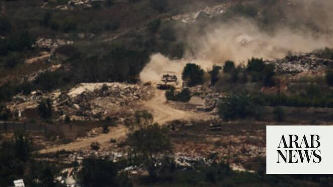

# Israel orders residents in southern Lebanon to leave, says killed 7 Hezbollah militants in area

Source: https://www.arabnews.com/node/2648665/middle-east
Captured source: https://www.arabnews.com/node/2648665/middle-east
Published: 2026-06-26T14:36:28+03:00
Modified: 2026-06-26T19:14:26+03:00
Author: Reuters

## Summary

BEIRUT: Israeli forces dropped leaflets over the southern Lebanese town of Mansouri ​on Friday ordering residents to leave, Lebanese state media reported, the first such order issued since the latest ceasefire between Israel and Hezbollah took effect. The Israeli military later said it killed Hezbollah militants who had operated near its so-called “security zone” in southern

## Image

## Video Or Embed URLs

- https://85ff9e74e466fb98e875a4b40a760a65.safeframe.googlesyndication.com/safeframe/1-0-45/html/container.html
- https://static.addtoany.com/menu/sm.25.html
- about:blank
- https://www.google.com/recaptcha/api2/aframe
- https://imasdk.googleapis.com/js/core/bridge3.773.0_en.html
- https://cm.g.doubleclick.net/partnerpixels?gdpr=0&us_privacy=1---&gpp_sid=-1&url=https%3A%2F%2Fwww.arabnews.com%2Fnode%2F2648665%2Fmiddle-east

## Text

https://arab.news/n8dh4

Lebanese ‌officials say Israeli troops are enforcing the zone’s northern boundary by ‌firing at anyone approaching it

BEIRUT: Israeli forces dropped leaflets over the southern Lebanese town of Mansouri ​on Friday ordering residents to leave, Lebanese state media reported, the first such order issued since the latest ceasefire between Israel and Hezbollah took effect.

The Israeli military later said it killed Hezbollah militants who had operated near its so-called “security zone” in southern Lebanon on Friday.

The military said in a statement it had “struck and eliminated seven Hezbollah terrorists who transferred weapons near the Security Zone in southern Lebanon,” adding that it would “continue to operate to remove threats.”

The latest attack comes amid a fragile ceasefire between Israel and Iran-backed Hezbollah in an offshoot of the Middle East war that the US and Iran are negotiating to bring to a definitive end.

Israel and Lebanon have been holding talks in Washington that include discussions on a US-backed proposal for Israeli forces to hand some of ‌the territory they ‌occupied in their war with ​Hezbollah ‌to ⁠Lebanon’s ​military.

Before the ⁠talks resumed this week, Israel and Hezbollah agreed to halt fire even as Israel kept troops in what it describes as a “buffer zone” aimed at thwarting attacks by the Iran-backed group on northern Israel.

Violence has persisted since the ceasefire, ⁠with Israel saying on Friday its troops ‌had struck and ‌killed what the military described as ​seven Hezbollah members who ‌were operating near the territory it is occupying. ‌Reuters could not confirm this.

A senior Lebanese military official said Israel had recently added the town of Mansouri, where the Israeli military dropped evacuation leaflets on Friday, ‌to its occupation zone. The official said Lebanese farmers had continued to enter ⁠and ⁠leave Mansouri, but had not been living there.

An Israeli military spokesperson said the military issued what it described as a “reminder” to the civilian population that “the area is within the security zone in which IDF soldiers operate. It’s a reminder not to be in the area so they won’t be harmed.”

Lebanese officials say Israeli troops are enforcing the zone’s northern boundary by firing at ​anyone approaching it, including ​civilians and Lebanese soldiers.
