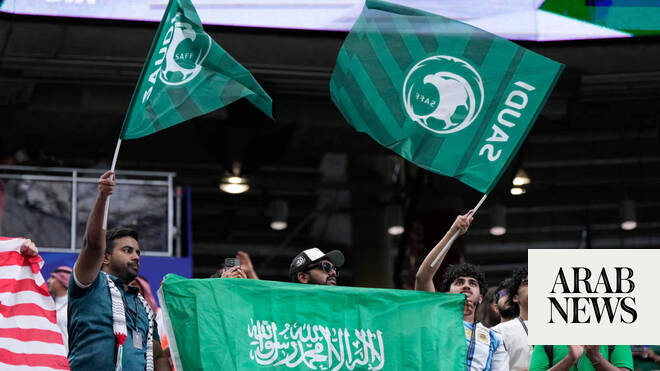

# Arab teams at World Cup 2026: Saudi Arabia and Iraq knocked out, Egypt draws with Iran

Source: https://www.arabnews.com/node/2648740/sport
Captured source: https://www.arabnews.com/node/2648740/sport
Published: 2026-06-27T07:15:35+03:00
Modified: 2026-06-27T14:01:49+03:00
Author: Agencies

## Summary

DUBAI: Saudi Arabia exited the World Cup at the group stage for the third tournament in a row, after a goalless draw with Cabo Verde at Houston Stadium on Friday. Cape Verde (0-0-3, 3 points) are now the smallest nation ever to reach the second phase, finishing second in the group above Saudi Arabia (0-1-2, 2 points) and Uruguay (0-1-2, 2 points), who lost 1-0 in Friday

## Image

## Video Or Embed URLs

- blob:https://www.arabnews.com/5be4316f-c546-4cec-863c-4a8a43453ac8
- https://imasdk.googleapis.com/js/core/bridge3.773.0_en.html
- https://3b4b4fa9180636466f8c555ca204fbcf.safeframe.googlesyndication.com/safeframe/1-0-45/html/container.html
- https://static.addtoany.com/menu/sm.25.html
- about:blank
- https://sync.teads.tv/wigo-no-slot
- https://ep2.adtrafficquality.google/sodar/sodar2/255/runner.html
- https://www.google.com/recaptcha/api2/aframe
- https://cm.g.doubleclick.net/partnerpixels?gdpr=0&us_privacy=1---&gpp_sid=-1&url=https%3A%2F%2Fwww.arabnews.com%2Fnode%2F2648740%2Fsport

## Text

https://arab.news/v555v

Saudi Arabia failed to advance for a sixth consecutive World Cup appearance after reaching the last 16 in their maiden tournament in 1994

Iraq, making their second World Cup appearance and first in 40 years, will go home without a point

DUBAI: Saudi Arabia exited the World Cup at the group stage for the third tournament in a row, after a goalless draw with Cabo Verde at Houston Stadium on Friday. For the latest updates, follow us @ArabNewsSport Cape Verde (0-0-3, 3 points) are now the smallest nation ever to reach the second phase, finishing second in the group above Saudi Arabia (0-1-2, 2 points) and Uruguay (0-1-2, 2 points), who lost 1-0 in Friday night’s other group game to Spain (2-0-1, 7 points). Saudi Arabia failed to advance for a sixth consecutive World Cup appearance after reaching the last 16 in their maiden tournament in 1994. Before Friday, Ghana and Ukraine were the last tournament debutants to progress from their group in 2006. Nuno ‌da Costa ran onto a throughball over the top from ‌in his own half, drove at two Saudi defenders, then laid the ball to his right into the path of Laros Duarte’s surging run. Goalkeeper Mohammed Al-Owais charged off his line and kept Duarte’s first-time effort out just barely with his ‌trailing leg. Cape Verde continued to threaten through da Costa in particular. Several minutes after Al-Owais’ save, he got ⁠around the ⁠corner but sent his effort wide from a tight angle. Then in second-half stoppage time, he missed narrowly wide on what looked like a clear chance, though the linesman’s flag eventually came up. Cape Verde had the better first half, but it was Saudi Arabia with the lone chance on goal, Mohamed Kanno’s header in stoppage time that Vozinha comfortably claimed. Cape Verde put their first effort on target three minutes into the second half when Jamiro Monteiro reached Ryan Mendes’ cross but sent only a tame effort at Al-Owais. The Saudis improved briefly after a double ​substitution, with Mohammed Abu Al- Shamat ​forcing Vozinha into an awkward-looking stop in the 67th minute, moments after his entrance.

For the latest updates, follow us @ArabNewsSport

Egypt became the second Arab team after Morocco to confirm progress to the 2026 World Cup Round of 32 after 1-1 draw with Iran at Seattle Stadium.

Egypt, ‌whose qualification ​for ‌the ⁠last-32 ​was already ⁠guaranteed, took the lead inside five minutes through Mahmoud Saber, before Ramin Rezaeian equalised from a tight angle in the 14th ⁠minute of a frantic ‌start. Iran's ‌Mehdi Taremi – who had ​a penalty ‌saved in the first ‌half – hit the crossbar with a late header before Shoja Khalilzadeh thought he had scored ‌a dramatic 93rd-minute winner, but it was ruled ⁠out ⁠for offside. The draw means Egypt finish second with five points, behind Belgium on goal difference. Iran are third on three points and must wait for confirmation that they will go through as one ​of the ​eight best third-placed teams.

Meanwhile, Senegal kept their World Cup ​knockout hopes alive in dominant fashion on Friday with a 5-0 victory over 10-man Iraq, who were eliminated from the tournament. Survival was on the line as both sides entered the match needing to win to stay in the hunt for one of the last eight spots in the round of 32. Senegal took an early lead through a deflected goal off Habib Diarra but failed to capitalize after Iraq defender Rebin Sulaka was sent off in the 13th minute for a foul on Sadio Mane following a VAR review. But Thiaw’s men took charge in the second half and began their goal fest when Ismaila Sarr scored his fourth career World Cup goal to become the country’s all-time leading scorer at the tournament. Down a ⁠man for most ⁠of the game, Iraq could not escape Senegal’s relentless pressure and the possibility of a comeback quickly slipped from their grasp. Zidane Iqbal displayed a great bit of skill to keep possession just outside his own box but Camara managed to come away with the ball, burst forward and lay a pass across the six-yard box for a sliding Sarr to poke home. Iraq, making their second World Cup appearance and first in 40 years, will go home without a point. “It was an amazing experience, but I want to apologize (to) our fans, (to) our nations,” defender Merchas Doski said. “These three games, we didn’t learn from our mistakes.” Iraq coach Graham Arnold said Sulaka’s “stupid” early red card made it even tougher for the team to perform ​against a top side like Senegal. “With 11 ​men, it would have been hard enough as it was, let alone having 10 men for that long,” Arnold said.
