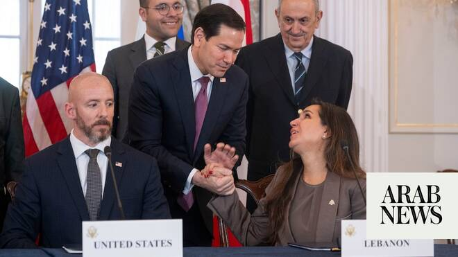

# Israel deal is not peace treaty but ‘process to end hostilities’ — Lebanese official

Source: https://www.arabnews.com/node/2648787/middle-east
Captured source: https://www.arabnews.com/node/2648787/middle-east
Published: 2026-06-27T17:11:53+03:00
Modified: 2026-06-27T17:11:53+03:00
Author: NAJIA HOUSSARI

## Summary

BEIRUT: The newly signed US-brokered framework with Israel does not amount to a peace agreement but is intended solely to end hostilities between the two countries, a senior Lebanese official told Arab News on Saturday.

## Image

## Video Or Embed URLs

- https://a784cf20cc122b31f73bfee7c472f219.safeframe.googlesyndication.com/safeframe/1-0-45/html/container.html
- https://static.addtoany.com/menu/sm.25.html
- about:blank
- https://imasdk.googleapis.com/js/core/bridge3.773.0_en.html
- https://www.google.com/recaptcha/api2/aframe
- https://sync.teads.tv/iframe?pid=253554&gdprIab=%7B%22type%22%3A%22AddEventListenerDoesNotApply%22%2C%22reason%22%3A0%2C%22status%22%3A0%2C%22consent%22%3A%22%22%2C%22apiVersion%22%3A2%2C%22cmpId%22%3A300%7D&fromFormat=true&env=js-web&auctid=2b4e7316-a7af-4bb7-a402-ec3697cfaa99&us_privacy=1---&1782605695618=
- https://cm.g.doubleclick.net/partnerpixels?gdpr=0&us_privacy=1---&gpp_sid=-1&url=https%3A%2F%2Fwww.arabnews.com%2Fnode%2F2648787%2Fmiddle-east

## Text

https://arab.news/9y395

Lebanon, the official added, remains committed to the Arab Peace Initiative launched by Saudi Arabia and adopted by the Arab League at the 2002 Beirut Summit

BEIRUT: The newly signed US-brokered framework with Israel does not amount to a peace agreement but is intended solely to end hostilities between the two countries, a senior Lebanese official told Arab News on Saturday.

Speaking after Lebanese and Israeli delegations signed the trilateral framework in Washington on Friday, the official, who has closely followed the negotiations, said the document should be understood as “a process to end the state of hostility, not a peace agreement.”

“It can be regarded as a non-aggression agreement,” the official said, stressing the framework did not alter Lebanon’s longstanding position on normalization with Israel.

Lebanon, the official added, remains committed to the Arab Peace Initiative launched by Saudi Arabia and adopted by the Arab League at the 2002 Beirut Summit, which conditions full Arab normalization with Israel on the establishment of an independent Palestinian state based on the 1967 borders and a just solution to the Palestinian refugee issue in line with international resolutions.

The trilateral framework was signed at the conclusion of four days of direct negotiations between Lebanese and Israeli delegations under US mediation in Washington.

According to the text released by the US State Department, the framework lays the groundwork for future agreements aimed at ending the conflict between the two countries, ensuring the sovereignty and security of both sides, and establishing peaceful neighborly relations.

The announcement drew mixed reactions across Lebanon, particularly from opponents of any engagement with Israel.

Hezbollah MP Hussein Al-Hajj Hassan avoided taking a definitive position, saying only: “Our future steps depend on the deliberations and consultations we are holding within the party and with our allies.”

Prime Minister Nawaf Salam, meanwhile, sought to present the framework as consistent with Lebanon’s existing commitments.

He said the agreement’s requirement that the Lebanese state extend its authority through the armed forces across the entire country reaffirms obligations already enshrined in the Taif Accord and later reinforced by UN Security Council Resolution 1701.

Salam added the November 2024 ceasefire agreement explicitly limits the right to bear arms in Lebanon to the country’s legitimate security forces. He said his government’s ministerial statement, on the basis of which it won parliament’s confidence, reaffirmed the same principle.

Hezbollah, however, signaled its opposition to the framework. Shortly after it was signed, Hezbollah MP Hassan Fadlallah said the Lebanese authorities “will not be able to enforce the agreement signed in Washington unless they proceed, with US backing, toward a civil war.”

Hundreds of Hezbollah supporters took to the streets on Friday night in protest against the framework agreement. They made their way through the roads of Beirut’s southern suburbs and main streets, blocking some of them with burning tires.

The Lebanese army used tear gas to disperse the protests near the government’s headquarters and on the road leading to Beirut-Rafic Hariri International Airport.

The official source said the protests were expected: “Those who accuse the state of having served US and Israeli interests through this framework agreement are right. Lebanon has no leverage. We are in a weak position and have nothing to negotiate with. We want to put an end to the state of hostility.”

The framework agreement will be submitted to the Cabinet for approval before the next stage, the source added. Hezbollah’s two ministers are expected to boycott the session, although the source said the process would ultimately proceed through political compromise.

Bilal Abdallah, an MP from the Democratic Gathering parliamentary bloc, urged a measured debate over the agreement: “Do we leave our country as a card in Iran’s hands, or do we seize the opportunity presented by the understandings taking shape across the region?”

Lebanese Forces MP Ziad Hawat called the framework agreement “a new step in the right direction.”

He said the time had come for Hezbollah to realize there was no going back to the pre–Oct. 7, 2023 era, to hand over its weapons to the legitimate authorities, and spare Lebanon and the Lebanese people further suffering.

In the 14-point framework agreement, Israel and Lebanon “affirm the right of each state to exist in peace, and their mutual desire to live in security as neighboring sovereign states.”

The agreement says the Lebanese Armed Forces will restore effective sovereign authority over all Lebanese territory, “pending the verified disarmament of non-state armed groups and dismantlement of associated infrastructure.”

In order to achieve this, Lebanon makes a specific request for the support of international and “particularly Arab partners, under the leadership of the US.”

A US-supported military coordination group will be established to help implement the framework.

As the LAF assumes control, the Israel Defense Forces will progressively withdraw from Lebanese territory.

The agreement further provides that the LAF will gradually assume full security responsibility in two initial pilot zones, with additional zones to be designated by mutual consent.

According to statements by Israeli officials, Israel will maintain its buffer zone within the Yellow Line in Lebanon until Hezbollah is disarmed and any threat from Lebanon to Israeli territory is eliminated.

However, Israeli Army Radio reported that the army will reduce its troop presence in southern Lebanon, withdraw some combat brigades, and raise their overall readiness level.

The Israeli government noted that, under the framework agreement, its military operations in Lebanon were conducted solely in response to attacks, threats, and hostile actions by non-state armed groups, mainly Hezbollah.

It stated that eliminating this threat through the disarmament and dismantling of these groups across Lebanon, together with additional security arrangements to be agreed upon by both countries, would eliminate any future need for military action or the presence of the IDF in Lebanon. Thus, the Israeli government declares that it has no territorial ambitions in Lebanon.

The Lebanese Embassy in Washington said that the agreement stipulates the implementation of two pilot zones, encompassing an Israeli withdrawal, the deployment of the Lebanese army, and the disarmament of non-state armed groups.

Regarding the two areas covered by the partial withdrawal, the first zone lies outside the Yellow Line, west of the Saluki Valley and south of the Litani River. The second lies north of the Litani River, with one section falling within the new Yellow Line and another outside it.

A Lebanese military source told Arab News that the towns of Zawtar al-Sharqiyah and Zawtar al-Gharbiyah are likely to serve as the pilot zones.
