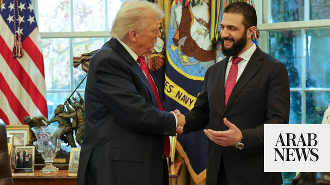

# Trump presses Syria to take on Hezbollah, raising alarm in Lebanon and Israel

Source: https://www.arabnews.com/node/2648868/middle-east
Captured source: https://www.arabnews.com/node/2648868/middle-east
Published: 2026-06-28T13:16:13+03:00
Modified: 2026-06-28T13:18:22+03:00
Author: AP

## Summary

BEIRUT: As the White House has soured on Israel’s war with Hezbollah in Lebanon, US President Donald Trump has shocked many in the region by pushing an alternative: Let Syria fight the Iran-backed militant group instead. He has suggested that the battle-hardened and Islamist-led insurgents who overthrew Syria’s autocratic President Bashar Assad a year and a half ago and formed

## Image

## Video Or Embed URLs

- https://static.addtoany.com/menu/sm.25.html
- about:blank
- https://imasdk.googleapis.com/js/core/bridge3.773.0_en.html
- https://www.google.com/recaptcha/api2/aframe
- https://sync.teads.tv/wigo-no-slot
- https://cm.g.doubleclick.net/partnerpixels?gdpr=0&us_privacy=1---&gpp_sid=-1&url=https%3A%2F%2Fwww.arabnews.com%2Fnode%2F2648868%2Fmiddle-east

## Text

https://arab.news/4ag5h

The White House has soured on Israel’s war with Hezbollah in Lebanon

US President Donald Trump has shocked many in the region by pushing an alternative: Let Syria fight the Iran-backed militant group instead

BEIRUT: As the White House has soured on Israel’s war with Hezbollah in Lebanon, US President Donald Trump has shocked many in the region by pushing an alternative: Let Syria fight the Iran-backed militant group instead. He has suggested that the battle-hardened and Islamist-led insurgents who overthrew Syria’s autocratic President Bashar Assad a year and a half ago and formed a new government would do a better job of rooting out Hezbollah than the Israeli army. Syrian President Ahmad Al-Sharaa has said he has no interest in doing so, and has asserted that Trump’s comments were misconstrued. But Trump has doubled down on the idea. Although it remains unclear how serious the White House is about the proposal, the prospect of a Syrian invasion has raised alarms in Lebanon — and also in Israel, which regards Al-Sharaa’s Islamist-led government with suspicion and has seized control of a strip of southern Syria since he took power. Syria has also become the site of rising tensions between Israel and Turkiye — a main backer of Al-Sharaa’s government — with each seeking to limit the other’s influence in the neighboring country. Top Israeli security officials convened a meeting on the subject on Wednesday, according to an official who spoke on the condition of anonymity because they were not authorized to speak to the media. Trump says Syria would ‘do a better job’ against Hezbollah On the sidelines of the G7 summit earlier this month, Trump complained that Israel’s war with Hezbollah is dragging on too long and “too many people are being killed.” More than 4,000 people have been killed by Israeli strikes in Lebanon since Hezbollah joined the wider Iran war with a March 2 attack on Israel, including hundreds of women and children. Israel says its strikes target Hezbollah and that it takes measures to protect civilians. “You don’t have to knock down an apartment house every time you’re looking for somebody, because there are a lot of people in those apartment houses and they’re not all Hezbollah,” Trump said. “I suggested to Israel to let Syria take care of Hezbollah. ‘Cause to be honest with you, I think they’d do a better job.” Days later, on the first day of US-Iran talks in Switzerland, Fox News’ Trey Yingst said that, during an interview, Trump had expressed disappointment that Israel can’t “put Hezbollah away” and said that he is “close to giving it to Syria” because he thinks Al-Sharaa would be more precise. The White House declined to comment and referred to Trump’s previous statements. Syria denies plans to intervene in Lebanon Syrian officials scrambled to do damage control. In a speech in Damascus on June 13, Al-Sharaa said, “There are people spreading rumors that Syria will intervene in Lebanon. This is not true. We are calling for a permanent end to the war and the strengthening of institutions and for there to be economic ties and a calming of the situation in Lebanon.” In a June 21 interview with the Emirati network Al Mashhad, Al-Sharaa said Trump’s remarks had been misunderstood. Trump “spoke about Syria’s role in finding a safe and peaceful solution, but the statement was misinterpreted as if Syria were going to invade Lebanon tomorrow morning,” Al-Sharaa said. He said Syria had “presented our vision for a solution to the United States, which is to stop the war and address the negative effects on Lebanon and Syria, and to find different economic, political and social solutions.” Syria’s leaders say they don’t want to settle scores with Hezbollah Hezbollah, along with Iran, intervened on the side of Assad during Syria’s 14-year civil war, while Al-Sharaa was the leader of an insurgent group seeking to overthrow him. But the new leaders in Damascus have said since taking power in December 2024 that they are focused on rebuilding the country, are not seeking to settle scores, and want to remain outside of any regional conflict. After Israel and the US launched their war against Iran — which triggered a wider regional conflict — Syria made a point of remaining on the sidelines. In the first weeks of the war, the Syrian military sent reinforcements to the border with Lebanon, which officials said aimed to stop cross-border weapons smuggling or any spillover of the conflict. At one point in March, Syria accused Hezbollah of launching artillery shells across the border toward Syrian army positions, which Hezbollah denied. The escalation stopped there. Turkish Foreign Minister Hakan Fidan told The Associated Press in March that Turkiye had interceded to defuse the tensions. Al-Sharaa told Al Mashhad that “the decision of (Hezbollah) to enter into the Syrian conflict was wrong,” but that he was willing to hold a “dialogue” with the militant group and even to mediate between different Lebanese factions as they debate the future of Hezbollah’s weapons. Trump’s proposal dredges up sectarian fears and memory of occupation In March, US envoy to Syria Tom Barrack denied reports that Washington had floated the idea of Syria intervening against Hezbollah. But since then, Trump has begun to make the call openly. Randa Slim, director of the Middle East Program at the Washington-based Stimson Center, said Trump’s proposal is, “at best, driven by a profound ignorance of the dynamics on the ground.” “Syria needs to focus on a myriad of complex and daunting challenges — not least rebuilding a shattered country and repatriating millions of refugees,” she said. “Syrian forces are far from a coherent military institution; they include thousands of foreign jihadi fighters of uncertain loyalty and discipline.” In the months after Assad’s fall in Syria, there were several eruptions of violence between groups loyal and opposed to Al-Sharaa that spiraled into sectarian revenge attacks, in which Sunni Islamist fighters affiliated with the new government carried out attacks on Alawite and Druze civilians. The attacks triggered fears of cross-border violence among Lebanon’s Shiite, Christian and Druze populations. Many Lebanese also have bitter memories of the decades of Syrian occupation of Lebanon, which began during the Lebanese civil war, initially at the request of Lebanese authorities and with the backing of Arab states, ending in 2005. The official who spoke anonymously said that Israel is also concerned about some signs that Syria could assume its old role in Lebanese politics. But the official said while Israel is closely watching developments between Syria and Lebanon, its main concern is Hezbollah.
