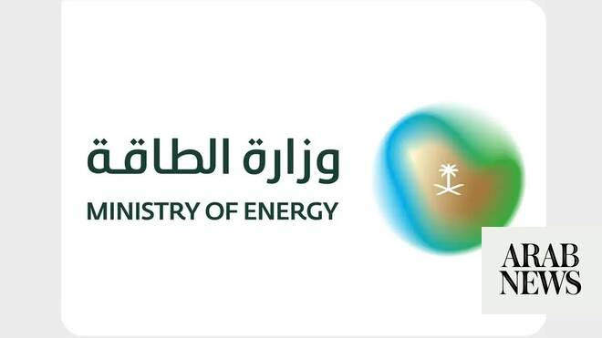

# Saudi Aramco helicopter crash kills 14

Source: https://www.arabnews.com/node/2648879/saudi-arabia
Captured source: https://www.arabnews.com/node/2648879/saudi-arabia
Published: 2026-06-28T14:46:40+03:00
Modified: 2026-06-28T17:55:27+03:00
Author: Arab News

## Summary

RIYADH: Fourteen people were killed on Sunday after ‌a ‌helicopter belonging ‌to ⁠Saudi Aramco crashed in Ras ⁠Tanura, ‌the ‌Saudi Press Agency ‌reported, adding ‌that the cause was unknown ⁠and ⁠an investigation is ongoing. An official source at the Ministry of Energy stated that on Sunday at 6:00 a.m. local time, a helicopter belonging to Saudi Aramco crashed in Ras Tanura.

## Image

## Video Or Embed URLs

- https://19e6dc57523aa9f414d83fd89f0178d4.safeframe.googlesyndication.com/safeframe/1-0-45/html/container.html
- https://static.addtoany.com/menu/sm.25.html
- about:blank
- https://imasdk.googleapis.com/js/core/bridge3.773.0_en.html
- https://www.google.com/recaptcha/api2/aframe
- https://sync.teads.tv/wigo-no-slot
- https://cm.g.doubleclick.net/partnerpixels?gdpr=0&us_privacy=1---&gpp_sid=-1&url=https%3A%2F%2Fwww.arabnews.com%2Fnode%2F2648879%2Fsaudi-arabia

## Text

https://arab.news/4pgz8

Cause unknown ⁠and investigation ongoing

Energy ministry extends its deepest condolences and sincere sympathies to the families of the victims

RIYADH: Fourteen people were killed on Sunday after ‌a ‌helicopter belonging ‌to ⁠Saudi Aramco crashed in Ras ⁠Tanura, ‌the ‌Saudi Press Agency ‌reported, adding ‌that the cause was unknown ⁠and ⁠an investigation is ongoing.

An official source at the Ministry of Energy stated that on Sunday at 6:00 a.m. local time, a helicopter belonging to Saudi Aramco crashed in Ras Tanura.

The accident resulted in the death of all 14 passengers onboard, all of whom were Saudi citizens.

“The energy ministry extends its deepest condolences and sincere sympathies to the families of the victims, praying that God grants them mercy and forgiveness and accepts them among the martyrs,” SPA added.
