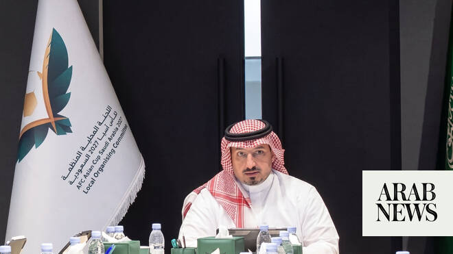

# Saudi Arabian Football Federation chief Yasser Al-Misehal resigns after World Cup group-stage exit

Source: https://www.arabnews.com/node/2648935/football
Captured source: https://www.arabnews.com/node/2648935/football
Published: 2026-06-29T04:19:12+03:00
Modified: 2026-06-29T04:28:34+03:00
Author: Arab News

## Summary

RIYADH: Yasser Al-Misehal resigned as president of the Board of Directors of the Saudi Arabian Football Federation (SAFF) on Monday, taking responsibility for the national team’s early exit from the FIFA World Cup 2026 and bringing an end to his seven-year tenure at the helm of Saudi football. In a statement posted on X, Al-Misehal said the Green Falcons’ failure to reach the

## Image

## Video Or Embed URLs

- https://d92cbf84b1a7fa36f462b7951d17d8d5.safeframe.googlesyndication.com/safeframe/1-0-45/html/container.html
- https://static.addtoany.com/menu/sm.25.html
- about:blank
- https://www.google.com/recaptcha/api2/aframe
- https://imasdk.googleapis.com/js/core/bridge3.773.0_en.html
- https://cm.g.doubleclick.net/partnerpixels?gdpr=0&us_privacy=1---&gpp_sid=-1&url=https%3A%2F%2Fwww.arabnews.com%2Fnode%2F2648935%2Ffootball

## Text

https://arab.news/p6wnb

Federation chief accepts responsibility after Saudi Arabia’s third straight group-stage exit at the World Cup

Resignation comes amid mounting criticism and calls for reform ahead of Asian Cup and 2034 World Cup

RIYADH: Yasser Al-Misehal resigned as president of the Board of Directors of the Saudi Arabian Football Federation (SAFF) on Monday, taking responsibility for the national team’s early exit from the FIFA World Cup 2026 and bringing an end to his seven-year tenure at the helm of Saudi football.

In a statement posted on X, Al-Misehal said the Green Falcons’ failure to reach the knockout stage had fallen far short of the ambitions of Saudi football and its supporters, and that he accepted full responsibility for the disappointing campaign.

He said stepping aside would allow for a new phase for Saudi football and confirmed that procedures would begin to open nominations for the election of a new board of directors in accordance with federation regulations.

Al-Misehal also expressed gratitude to King Salman and Crown Prince Mohammed bin Salman for their continued support of Saudi football, as well as to Sports Minister Prince Abdulaziz bin Turki Al-Faisal and members of the federation’s board.

The resignation follows mounting criticism of the federation after Saudi Arabia’s third consecutive group-stage exit at a World Cup.

The Green Falcons were eliminated after drawing 0-0 with tournament debutants Cabo Verde, capping a disappointing campaign in which they failed to win a match. A 1-1 draw against Uruguay had briefly raised hopes of qualification, but a heavy 4-0 defeat to European champions Spain left Saudi Arabia needing a victory in their final group game to advance.

Instead, the team produced a lackluster performance against Cabo Verde and exited in the opening round, extending a long-standing pattern of underachievement at football’s biggest tournament.

The Kingdom has now appeared in seven World Cups but has progressed beyond the group stage only once, reaching the last 16 on its debut appearance in the United States in 1994.

The latest elimination triggered a wave of criticism from supporters, former players and media figures, many of whom called for sweeping changes within Saudi football ahead of the AFC Asian Cup next year and the Kingdom’s hosting of the 2034 FIFA World Cup.

Former Al-Hilal president Prince Abdul Rahman bin Musaid described the team’s displays as deeply frustrating and said a new national team should begin to be built with an eye toward 2034.

Saudi coach and television analyst Ibrahim Al-Angari said the problems extended far beyond the results in the United States, citing shortcomings in player development, squad selection, technical decisions and long-term planning.

Sports journalist Battal Al-Qoos had also sharply criticized the federation’s record, saying Saudi national teams had suffered repeated failures during the current board’s seven-year tenure and calling for the leadership to step down.

Questions have also been raised about the impact of the Saudi Pro League’s rapid transformation into a global competition filled with international stars. Critics argue that young Saudi players have struggled to secure playing opportunities and development pathways, contributing to a shortage of top-class local talent and an overreliance on veteran captain Salem Al-Dawsari.

The federation also faced criticism for appointing coach Georgios Donis only weeks before the tournament following the departure of Herve Renard, a move many viewed as evidence of instability and inadequate long-term planning.

Saudi Arabia now turns its attention to the AFC Asian Cup, which it will host next year, with fans demanding significant improvements and a first continental title since 1996.

Al-Misehal said that although he was leaving office, he would continue serving Saudi sport in other capacities and remain supportive of efforts to elevate the Kingdom’s football ambitions.
