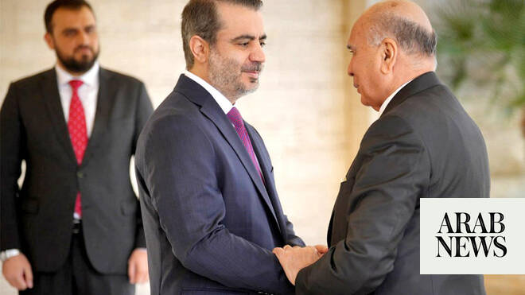

# Iraqi foreign minister makes first visit to Syria since Assad’s fall

Source: https://www.arabnews.com/node/2648988/middle-east
Captured source: https://www.arabnews.com/node/2648988/middle-east
Published: 2026-06-29T16:34:14+03:00
Modified: 2026-06-29T23:33:09+03:00
Author: SANAAFP

## Summary

BAGHDAD: Iraqi Deputy Prime Minister and Foreign Minister Fuad Hussein on Monday began his first trip to Syria since the December 2024 ouster of Bashar Assad. The visit seeks to “deepen joint cooperation in various political, security, economic and trade fields” and address regional and international Developments, according to a statement from Hussein’s office. His meetings

## Image

## Video Or Embed URLs

- https://6d35a50bced79f028f0920f7616f4a14.safeframe.googlesyndication.com/safeframe/1-0-45/html/container.html
- about:blank
- https://static.addtoany.com/menu/sm.25.html
- https://imasdk.googleapis.com/js/core/bridge3.774.0_en.html
- https://sync.teads.tv/wigo-no-slot
- https://www.google.com/recaptcha/api2/aframe
- https://cm.g.doubleclick.net/partnerpixels?gdpr=0&us_privacy=1---&gpp_sid=-1&url=https%3A%2F%2Fwww.arabnews.com%2Fnode%2F2648988%2Fmiddle-east

## Text

https://arab.news/baw6m

Fuad Hussein meets President Ahmad Al-Sharaa in Damascus

Both sides explore avenues to upgrade security coordination and intelligence sharing, bolstering regional stability

BAGHDAD: Iraqi Deputy Prime Minister and Foreign Minister Fuad Hussein on Monday began his first trip to Syria since the December 2024 ouster of Bashar Assad.

The visit seeks to “deepen joint cooperation in various political, security, economic and trade fields” and address regional and international Developments, according to a statement from Hussein’s office. His meetings will also explore “ways of strengthening coordination and consultation” on shared challenges, it added.

The two delegations agreed to establish a high committee for joint coordination, co-chaired by both foreign ministers, to ensure the consistent follow-up and execution of outcomes stemming from bilateral cooperation while streamlining joint initiatives.

Minister of Foreign Affairs and Expatriates Asaad Hassan Al-Shaibani received Hussein in Damascus. The high-level diplomatic meeting was held in the presence of the Syrian Energy Minister Mohammed Al-Bashir. During the session, both sides discussed practical mechanisms to strengthen bilateral relations and advance mutual cooperation across various sectors. The two ministers agreed to establish a high committee for joint coordination, co-chaired by both foreign ministers, to ensure the consistent follow-up and execution of outcomes stemming from bilateral cooperation while streamlining joint initiatives. The discussions also focused on energy infrastructure, specifically looking into mechanisms for oil transit and grid integration, alongside a project to rehabilitate oil pipelines extending from Iraq to Syria. Additionally, the ministers addressed frameworks for strategic cooperation in the sectors of water management and agriculture, which aims to enhance mutual food security, stimulate economic integration, and serve shared bilateral interests. Both sides explored avenues to upgrade security coordination and intelligence sharing, bolstering regional stability and supporting collaborative efforts to confront mutual security challenges. With its oil exports disrupted due to the Middle East war, Iraq in recent months has begun exporting limited amounts of oil through Syria. Hussein is the first senior Iraqi political figure to visit Damascus since the new authorities took power, though other Iraqi officials have done so. Iraqi intelligence chief Hamid Al-Shatri visited the month Assad was ousted, while Syria’s Foreign Minister Asaad Hassan Al-Shaibani made his first trip to Baghdad in March last year. In February this year, the United States completed the transfer of 5,700 Islamic State group detainees, including hundreds of foreigners, from Syria to Iraq, after they had been held in Kurdish-run jails in northeast Syria for years. In April, Iraq reopened a once-bustling border crossing with Syria more than a decade after it was closed to trade following the rise of Daesh. Three crossings between the countries are now operational. Iraqi authorities view the new crossing as strategic as it also helps link the country and Gulf states to Turkiye as part of a regional infrastructure development project.
