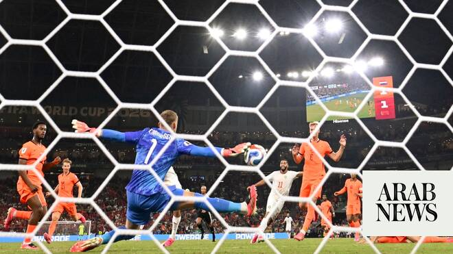

# Morocco survive penalty drama to down Netherlands and reach last 16

Source: https://www.arabnews.com/node/2649040/sport
Captured source: https://www.arabnews.com/node/2649040/sport
Published: 2026-06-30T07:08:53+03:00
Modified: 2026-06-30T10:41:13+03:00
Author: Mohammed Fayad

## Summary

RIYADH: Few would argue the match between the Netherlands and Morocco in the 2026 FIFA World Cup Round of 32 resembled anything but an early semifinal clash. Two top sides battled it out in Monterrey to conclude the day, with Morocco holding the Netherlands to a 1-1 draw after extra time before winning 3-2 on penalties.

## Image

## Video Or Embed URLs

- blob:https://www.arabnews.com/15b9329f-ec92-48d6-acbc-74f034dff686
- https://imasdk.googleapis.com/js/core/bridge3.774.0_en.html
- https://776f4419d206b8ff6abf66a4c17c42fb.safeframe.googlesyndication.com/safeframe/1-0-45/html/container.html
- https://static.addtoany.com/menu/sm.25.html
- about:blank
- https://www.google.com/recaptcha/api2/aframe
- https://cm.g.doubleclick.net/partnerpixels?gdpr=0&us_privacy=1---&gpp_sid=-1&url=https%3A%2F%2Fwww.arabnews.com%2Fnode%2F2649040%2Fsport

## Text

https://arab.news/j8zhv

Netherlands’ Gakpo scores before Diop’s injury-time equalizer

Ismael Saibari nets winning penalty after heroic Bounou save

RIYADH: Few would argue the match between the Netherlands and Morocco in the 2026 FIFA World Cup Round of 32 resembled anything but an early semifinal clash.

For the latest updates, follow us @ArabNewsSport

Two top sides battled it out in Monterrey to conclude the day, with Morocco holding the Netherlands to a 1-1 draw after extra time before winning 3-2 on penalties.

As opposed to the stale encounter between Canada and South Africa in the first Round of 32 game, the clash between Morocco and the Netherlands was played at a ferocious tempo, with shades of the Battle of Nuremberg between Portugal and the Netherlands in 2006 — albeit with fewer cards.

Within the first quarter of an hour, defender Chadi Riad had his shirt ripped on more than one occasion after confrontations with Brian Brobbey, while Ismael Saibari and Jan Paul van Hecke clashed as well.

Brobbey’s miss of a clear-cut chance in the 16th minute was flagged for offside, but it set the tone for the remainder of the half. Dutch goalkeeper Bart Verbruggen was called into action moments later, when he parried away Neil El-Aynaoui’s header from a corner off the goal line.

In the 21st minute, Saibari threaded Achraf Hakimi through on goal, only for his effort to be tipped away by Verbruggen.

Yassine Bounou was also called into action, denying Micky Van de Ven’s scorcher in the 40th minute, which was the Netherlands’ clearest opportunity of the half.

But it was just before halftime that Morocco felt they should have taken the lead.

In the third minute of first-half stoppage time, El-Aynaoui won possession in midfield, sparking a counterattack that saw Saibari slip Azzedine Ounahi through toward the penalty area. Ounahi, however, lifted his effort over Verbruggen’s goal.

Moments before the break, a free kick was delivered into the goal area, falling perfectly for Saibari. As he tried to avoid handling the ball, he pulled away at the last moment, missing a golden opportunity to tap into an open net.

The second half began without any substitutions, but with a few tactical tweaks from Morocco head coach Mohamed Ouahbi.

Ounahi now had greater freedom to roam across the pitch, filling in the gaps on the right when Brahim Diaz moved centrally, and dropping deeper to drag the Dutch midfielders out of position as Ayyoub Bouaddi or El-Aynaoui pushed forward.

The adjustment worked well for Morocco, were it not for their decision-making in the final third.

In the 52nd minute, Ounahi released Hakimi down the right flank with a clear sight of goal. The right back initially had a simple pass available to Saibari, who was darting into the box, but instead blasted his effort against the crossbar.

Ounahi found Hakimi again three minutes later with a perfectly weighted long ball, but Van de Ven produced an outstanding last-ditch tackle to deny the Moroccan fullback a shot on goal.

Morocco came to rue their missed chances moments after the hydration break.

In the 72nd minute, what seemed like a simple clearance from Verbruggen landed on Wout Weghorst’s head, who flicked it on toward Crysencio Summerville in acres of space. He was brought down by Mazraoui, but managed to slip a clever pass towards Cody Gakpo, who finished past Bounou to the shock of the Moroccan defense.

All the energy Morocco had before the goal seemed to switch off after Gakpo’s opener. Despite the five substitutions made by Ouahbi, the Atlas Lions were unable to threaten the Dutch defense as they had in the first 75 minutes.

But as the final seconds of regular time ticked down on the clock and the match entered stoppage time, Chemsdine Talbi had something to say.

He cut inside, delivering an incisive, dipping cross to the center of the box where Issa Diop powered home with a header to send the fans at Estadio BBVA into raptures.

The stadium erupted again moments before the final whistle, as Mazraoui made up for his inability to stop Summerville earlier with a clean, game-saving tackle in the box after the latter broke through on the counter again.

Extra time began with both teams looking to resettle after the chaos of the previous 15 minutes. It was Morocco that once again saw a golden chance missed.

It was Talbi at it again, this time driving into the Netherlands’ half from the left flank to find Saibari in the half-spaces. Soufiane Rahimi broke past the Dutch defense to receive a well-threaded pass right in front of Verbruggen, who produced one of the saves of the tournament from point-blank range in the 97th minute.

The match descended into a war of attrition shortly after. Neither side were willing to risk committing too many men forward, knowing the capabilities of their opponents in transition. The match would ultimately head to penalties.

Teun Koopmeiners scored the first penalty, sending it to the left of Bounou. El-Aynaoui struck the crossbar for Morocco's first attempt, but Justin Kluivert followed up by hitting the post himself.

Rahimi’s penalty was initially saved by Verbruggen, but fortune favored him as the ball trickled in behind the goalkeeper to level the score after two penalties apiece.

Weghorst converted his penalty with a powerful shot, before Talbi followed up with a similar effort that Verbruggen almost kept out.

But Quentin Timber blazed his effort wide for the Netherlands’ fourth kick, and captain Hakimi stepped up for a crucial next attempt. To the shock of the Moroccan fans, Hakimi struck the post with his own effort.

And yet, the contest rested in the hands of Bounou. A mesmerizing save to deny Summerville’s effort meant Morocco entered the final kick with the game in their hands.

Saibari was the man to bring it home for Morocco. He converted with class past Verbruggen to seal a 3-2 victory for the Atlas Lions on penalties.

Morocco now progress to the Round of 16, where they are set to face Canada on July 4 in Houston. The Atlas Lions’ dreams of another historic deep run remain intact.
